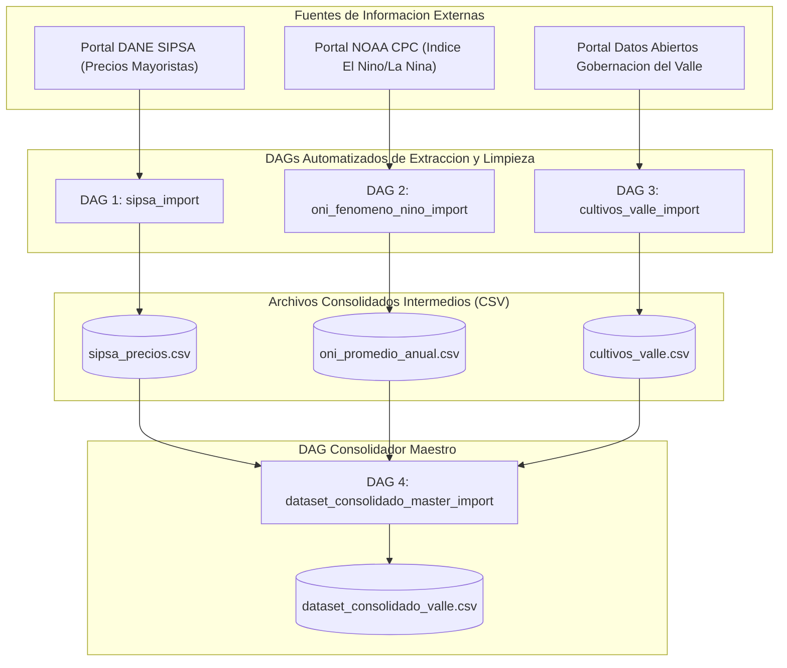
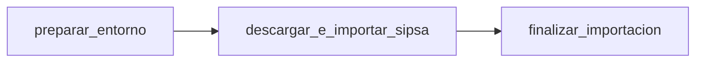
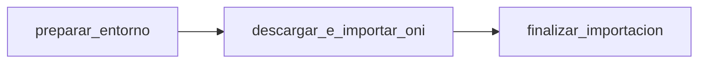
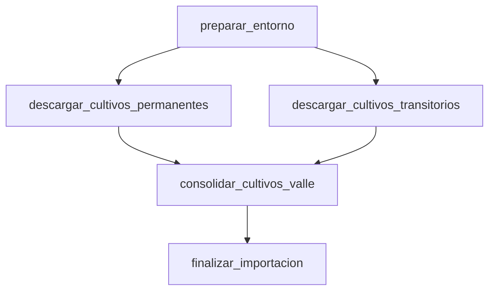
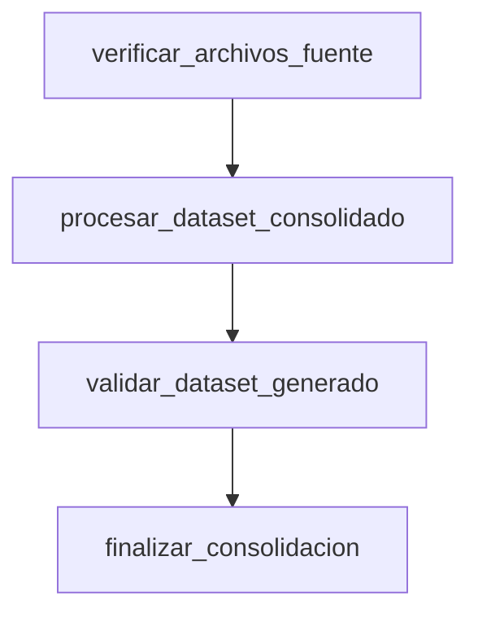

# DOCUMENTACIÓN DE DAGS DE APACHE AIRFLOW

Implementación de la Plataforma ValleDATA para la Gestión y Aprovechamiento de Datos Abiertos en el Departamento del Valle del Cauca  
**Documento:** Documentación de DAGs de Apache Airflow  
**Área Responsable:** Área de Datos - Proyecto Valle Data  
**Elaborado por:** Jhon Jairo Vallejo  
**Revisado por:** Juan Pablo Rios  
**Fecha de Actualización:** 29 de Julio de 2026  

## Control de Versiones

| Versión | Fecha | Descripción | Autor |
| :--- | :--- | :--- | :--- |
| 1.0 | 29 de Julio de 2026 | Creación de Documento | Jhon Jairo Vallejo |

---

## 1. Definiciones

Para facilitar la comprensión por parte de personal administrativo, directivo o usuarios sin formación en sistemas, a continuación se explican los conceptos principales utilizados en esta plataforma:

### ¿Qué es un DAG? (Receta Digital Automatizada)
Un **DAG** (por sus siglas en inglés *Directed Acyclic Graph* o *Grafo Acíclico Dirigido*) es, en palabras sencillas, una **receta digital automatizada**. Es una secuencia organizada de pasos que la computadora ejecuta automáticamente en un orden específico y a una hora determinada (por ejemplo, el primer día de cada mes a las 6:00 AM).

- **Sin Intervención Manual:** En lugar de que un funcionario tenga que ingresar a una página web, descargar un archivo Excel, abrirlo y copiar datos a otra plantilla, el **DAG** hace todo ese trabajo automáticamente en segundos.
- **Seguridad y Trazabilidad:** Si la receta falla en algún paso (por ejemplo, si la página del DANE está caída), el DAG reintenta automáticamente y envía una alerta, garantizando que los datos nunca se pierdan.

### ¿Qué es una Tarea (*Task*)?
Es cada uno de los pasos individuales dentro de la receta. Por ejemplo:
1. *Paso 1:* Crear la carpeta donde se guardarán los datos.
2. *Paso 2:* Descargar el archivo desde el portal oficial.
3. *Paso 3:* Limpiar y validar los datos.
4. *Paso 4:* Guardar la información en la base de datos central.

### ¿Qué es un Pipeline o Flujo de Procesamiento?
Es la "tubería" digital completa por donde viaja la información desde el sitio web externo donde nace hasta los informes y tableros donde los directivos toman decisiones.

---

## 2. Visión General del Sistema y Negocio

El sistema automatiza la recolección, limpieza y cruce analítico de tres fuentes estratégicas de información para el Departamento del Valle del Cauca:

1. **Precios Agrícolas Mayoristas (DANE SIPSA):** Precios por kilogramo reportados en la central de abastos de Cali (Cavasa).
2. **Indicador Climático Global (NOAA ONI):** Índice de temperatura del Océano Pacífico que identifica periodos del fenómeno de **El Niño** (sequía) o **La Niña** (lluvias).
3. **Evaluación Agropecuaria Municipal (Gobernación del Valle):** Producción agrícola (toneladas) y hectáreas cultivadas en los municipios del departamento.



---

## 3. Matriz Consolidada de DAGs

| ID del DAG | Nombre descriptivo | Conexión Airflow Utilizada | Frecuencia de Ejecución |
| :--- | :--- | :--- | :--- |
| `sipsa_import` | Importación de Precios Agrícolas DANE | `sipsa_dane` | Mensual (`@monthly`) |
| `oni_fenomeno_nino_import` | Descarga de Índice Climático ONI NOAA | `noaa_oni` | Mensual (`@monthly`) |
| `cultivos_valle_import` | Descarga de Cultivos del Valle | `gobernacion_valle` | Mensual (`@monthly`) |
| `dataset_consolidado_master_import` | Consolidador Maestro de Datos | N/A (Usa archivos CSV) | Mensual (`@monthly`) |

---

## 4. Especificación Técnica de los DAGs

---

### DAG 1: `sipsa_import` (Importación Precios SIPSA DANE)

- **ID DAG:** `sipsa_import`
- **Archivo de Código:** [sipsa_airflow_dag.py](file:///home/jjvallej/work/enigma/pyimport/dags/sipsa_airflow_dag.py)
- **Conexión:** `sipsa_dane` (`https://www.dane.gov.co`)

#### Flujo de Tareas (Diagrama)


#### Código Fuente del DAG
```python
from datetime import datetime, timedelta
from airflow import DAG
from airflow.operators.python import PythonOperator
from pyimport.sipsa import main as sipsa_main
from pyimport.connections import register_connections_in_airflow

default_args = {
    'owner': 'pyimport_team',
    'depends_on_past': False,
    'start_date': datetime(2026, 1, 1),
    'email_on_failure': False,
    'retries': 2,
    'retry_delay': timedelta(minutes=5),
}

with DAG(
    'sipsa_import',
    default_args=default_args,
    description='Descarga e importa precios agrícolas SIPSA (DANE) usando la conexión sipsa_dane',
    schedule_interval='@monthly',
    catchup=False,
    tags=['pyimport', 'sipsa', 'connection:sipsa_dane'],
) as dag:

    def setup_env():
        register_connections_in_airflow()

    task_setup = PythonOperator(task_id='preparar_entorno', python_callable=setup_env)
    task_import = PythonOperator(task_id='descargar_e_importar_sipsa', python_callable=sipsa_main)
    task_finish = PythonOperator(task_id='finalizar_importacion', python_callable=lambda: print("Finalizado"))

    task_setup >> task_import >> task_finish
```

---

### DAG 2: `oni_fenomeno_nino_import` (Descarga Índice Climático NOAA ONI)

- **ID DAG:** `oni_fenomeno_nino_import`
- **Archivo de Código:** [oni_valle_dag.py](file:///home/jjvallej/work/enigma/pyimport/dags/oni_valle_dag.py)
- **Conexión:** `noaa_oni` (`https://www.cpc.ncep.noaa.gov`)

#### Flujo de Tareas (Diagrama)


#### Código Fuente del DAG
```python
from datetime import datetime, timedelta
from airflow import DAG
from airflow.operators.python import PythonOperator
from pyimport.oni import main as oni_main
from pyimport.connections import register_connections_in_airflow

default_args = {
    'owner': 'pyimport_team',
    'depends_on_past': False,
    'start_date': datetime(2026, 1, 1),
    'retries': 2,
    'retry_delay': timedelta(minutes=5),
}

with DAG(
    'oni_fenomeno_nino_import',
    default_args=default_args,
    description='Descarga e procesa datos ONI de la NOAA usando la conexión noaa_oni',
    schedule_interval='@monthly',
    catchup=False,
    tags=['pyimport', 'oni', 'clima', 'connection:noaa_oni'],
) as dag:

    def setup_env():
        register_connections_in_airflow()

    task_setup = PythonOperator(task_id='preparar_entorno', python_callable=setup_env)
    task_import = PythonOperator(task_id='descargar_e_importar_oni', python_callable=oni_main)
    task_finish = PythonOperator(task_id='finalizar_importacion', python_callable=lambda: print("Finalizado"))

    task_setup >> task_import >> task_finish
```

---

### DAG 3: `cultivos_valle_import` (Descarga Cultivos Valle del Cauca)

- **ID DAG:** `cultivos_valle_import`
- **Archivo de Código:** [cultivos_valle_dag.py](file:///home/jjvallej/work/enigma/pyimport/dags/cultivos_valle_dag.py)
- **Conexión:** `gobernacion_valle` (`https://datosabiertos.valledelcauca.gov.co`)

#### Flujo de Tareas (Diagrama)


---

### DAG 4: `dataset_consolidado_master_import` (Consolidador Maestro)

- **ID DAG:** `dataset_consolidado_master_import`
- **Archivo de Código:** [consolidado_valle_dag.py](file:///home/jjvallej/work/enigma/pyimport/dags/consolidado_valle_dag.py)
- **Función:** Lee los tres archivos CSV intermedios, aplica fórmulas de ponderación y genera `dataset_consolidado_valle.csv`.

#### Flujo de Tareas (Diagrama)

