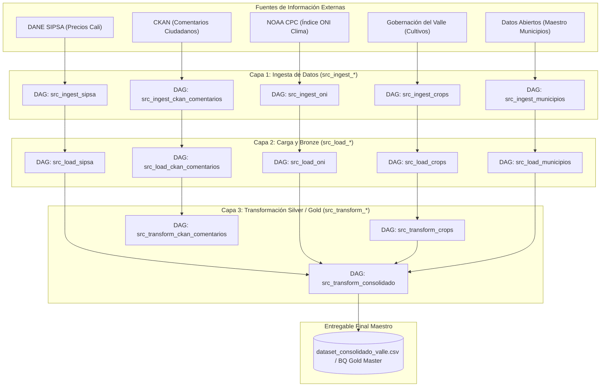

# DOCUMENTACIÓN DE DAGS DE APACHE AIRFLOW

Implementación de la Plataforma ValleDATA para la Gestión y Aprovechamiento de Datos Abiertos en el Departamento del Valle del Cauca  
**Documento:** Documentación Téchnica y Operativa de DAGs de Apache Airflow  
**Área Responsable:** Área de Datos - Proyecto Valle Data  
**Elaborado por:** Jhon Jairo Vallejo  
**Revisado por:** Juan Pablo Rios  
**Fecha de Actualización:** 25 de Agosto de 2026  

## Control de Versiones

| Versión | Fecha | Descripción | Autor |
| :--- | :--- | :--- | :--- |
| 1.0 | 29 de Julio de 2026 | Creación inicial del documento | Jhon Jairo Vallejo |
| 1.1 | 25 de Agosto de 2026 | Actualización integral a arquitectura Medallion (Ingest, Load, Transform - 13 DAGs), gestión de alarmas y compatibilidad Composer 2/3 | Jhon Jairo Vallejo |

---

## 1. Definiciones y Conceptos Fundamentales

Para facilitar la comprensión por parte de personal administrativo, directivo y auditores sin formación técnica especializada, a continuación se explican los conceptos clave de la arquitectura de automatización:

### ¿Qué es un DAG? (Receta Digital Automatizada)
Un **DAG** (por sus siglas en inglés *Directed Acyclic Graph* o *Grafo Acíclico Dirigido*) es una **receta digital automatizada**. Representa una secuencia organizada e ininterrumpida de tareas informáticas que la plataforma ejecuta automáticamente sin requerir intervención humana.

- **Operación Desatendida:** En lugar de requerir que un funcionario ingrese mensualmente a múltiples páginas web, descargue archivos Excel/CSV, aplique fórmulas y consolide datos manualmente, el DAG ejecuta todo el proceso en cuestión de segundos.
- **Seguridad y Resiliencia:** Si alguna etapa experimenta un fallo (por ejemplo, por indisponibilidad temporal del sitio web del DANE o la NOAA), el DAG ejecuta reintentos automáticos configurados y dispara alertas de fallo inmediatas al equipo de operaciones.

### Arquitectura de Procesamiento en 3 Capas (Medallion: Ingesta, Carga y Transformación)
Los DAGs de la plataforma ValleDATA están organizados bajo el patrón de diseño **Medallion**, garantizando la trazabilidad del dato desde su origen hasta su consumo ejecutivo:

1. **Capa Ingesta (`src_ingest_*` / Raw):** Descarga automatizada de archivos binarios y datasets sin procesar desde fuentes institucionales externas (DANE, NOAA, Gobernación del Valle, CKAN).
2. **Capa Carga (`src_load_*` / Bronze - Staging):** Limpieza estructural, normalización de codificación y formatos, y persistencia en tablas de almacenamiento intermedia (Staging / BigQuery Bronze).
3. **Capa Transformación (`src_transform_*` / Silver - Gold):** Cruce analítico, enriquecimiento con el maestro de municipios, análisis de sentimiento con Inteligencia Artificial y generación del **Dataset Consolidado Maestro**.

---

## 2. Visión General del Sistema y Flujo de Negocio

El sistema automatiza el procesamiento y enriquecimiento cruzado de 5 fuentes de datos estratégicas para el departamento del Valle del Cauca:

1. **Precios Agrícolas Mayoristas (DANE SIPSA):** Registro histórico y mensual de precios por kilogramo en la Central de Abastos de Cali (Cavasa).
2. **Indicador Climático Global (NOAA ONI):** Anomalías de temperatura superficial en el Océano Pacífico (Índice ONI v5) para categorizar periodos del fenómeno de **El Niño** (sequía) o **La Niña** (lluvias).
3. **Evaluación Agropecuaria Municipal (Gobernación del Valle):** Hectáreas sembradas, cosechadas y rendimiento agrícola en toneladas por hectárea por municipio.
4. **Maestro Oficial de Municipios (Datos Abiertos Colombia / DIVIPOLA):** Codificación y nomenclatura oficial de los 42 municipios del departamento.
5. **Comentarios y Participación Ciudadana (Plataforma CKAN Municipal):** Transcripción de opiniones e interacción ciudadana procesadas mediante modelos NLP de Análisis de Sentimiento.



---

## 3. Matriz Consolidada de los 13 DAGs de la Plataforma

A continuación se detalla la matriz completa de los 13 DAGs orquestados en Apache Airflow / Google Cloud Composer:

| # | ID del DAG | Archivo de Código | Capa / Etapa | Conexión / Fuente | Frecuencia | Descripción del Entregable |
| :--- | :--- | :--- | :--- | :--- | :--- | :--- |
| 1 | `src_ingest_sipsa` | [src_ingest_sipsa.py](file:///home/jjvallej/work/enigma/pyimport/dags/gdv_general_dbt_dag/dags_valledata/src_ingest_sipsa.py) | Ingesta (Raw) | `sipsa_dane` | Mensual | Descarga de anexos Excel mensuales de precios DANE. |
| 2 | `src_load_sipsa` | [src_load_sipsa.py](file:///home/jjvallej/work/enigma/pyimport/dags/gdv_general_dbt_dag/dags_valledata/src_load_sipsa.py) | Carga (Bronze) | Archivos Excel Ingestados | A demanda / Post-ingesta | Parseo y extracción de precios anuales Cali (`stg_sipsa`). |
| 3 | `src_ingest_oni` | [src_ingest_oni.py](file:///home/jjvallej/work/enigma/pyimport/dags/gdv_general_dbt_dag/dags_valledata/src_ingest_oni.py) | Ingesta (Raw) | `noaa_oni` | Mensual | Extracción HTML de anomalías de temperatura NOAA. |
| 4 | `src_load_oni` | [src_load_oni.py](file:///home/jjvallej/work/enigma/pyimport/dags/gdv_general_dbt_dag/dags_valledata/src_load_oni.py) | Carga (Bronze) | HTML Ingestado | A demanda / Post-ingesta | Promedios anuales de anomalía y clasificación climática (`stg_oni`). |
| 5 | `src_ingest_crops` | [src_ingest_crops.py](file:///home/jjvallej/work/enigma/pyimport/dags/gdv_general_dbt_dag/dags_valledata/src_ingest_crops.py) | Ingesta (Raw) | `gobernacion_valle` | Mensual | Descarga de CSVs de cultivos permanentes y transitorios. |
| 6 | `src_load_crops` | [src_load_crops.py](file:///home/jjvallej/work/enigma/pyimport/dags/gdv_general_dbt_dag/dags_valledata/src_load_crops.py) | Carga (Bronze) | CSVs Ingestados | A demanda / Post-ingesta | Normalización de hectáreas y rendimiento agrícola (`stg_crops`). |
| 7 | `src_transform_crops` | [src_transform_crops.py](file:///home/jjvallej/work/enigma/pyimport/dags/gdv_general_dbt_dag/dags_valledata/src_transform_crops.py) | Transformación (Silver) | Capa Bronze Cultivos | A demanda | Alias de compatibilidad para consolidado Silver agrícola. |
| 8 | `src_ingest_municipios` | [src_ingest_municipios.py](file:///home/jjvallej/work/enigma/pyimport/dags/gdv_general_dbt_dag/dags_valledata/src_ingest_municipios.py) | Ingesta (Raw) | `datos.gov.co` | Semestral / Anual | Extracción del catálogo de municipios del Valle del Cauca. |
| 9 | `src_load_municipios` | [src_load_municipios.py](file:///home/jjvallej/work/enigma/pyimport/dags/gdv_general_dbt_dag/dags_valledata/src_load_municipios.py) | Carga (Bronze) | CSV Municipios | A demanda / Post-ingesta | Estandarización DIVIPOLA y nombres municipales (`stg_municipios`). |
| 10 | `src_ingest_ckan_comentarios` | [src_ingest_ckan_comentarios.py](file:///home/jjvallej/work/enigma/pyimport/dags/gdv_general_dbt_dag/dags_valledata/src_ingest_ckan_comentarios.py) | Ingesta (Raw) | PostgreSQL / CKAN | Diaria / Mensual | Ingesta de comentarios y opiniones de la ciudadanía. |
| 11 | `src_load_ckan_comentarios` | [src_load_ckan_comentarios.py](file:///home/jjvallej/work/enigma/pyimport/dags/gdv_general_dbt_dag/dags_valledata/src_load_ckan_comentarios.py) | Carga (Bronze) | Comentarios Ingestados | A demanda / Post-ingesta | Unificación y depuración de comentarios (`bronze_comentarios`). |
| 12 | `src_transform_ckan_comentarios` | [src_transform_ckan_comentarios.py](file:///home/jjvallej/work/enigma/pyimport/dags/gdv_general_dbt_dag/dags_valledata/src_transform_ckan_comentarios.py) | Transformación (Silver) | Capa Bronze Comentarios | A demanda | Clasificación de sentimiento NLP VADER/pysentimiento (`silver_comentarios`). |
| 13 | `src_transform_consolidado` | [src_transform_consolidado.py](file:///home/jjvallej/work/enigma/pyimport/dags/gdv_general_dbt_dag/dags_valledata/src_transform_consolidado.py) | Transformación Maestro (Gold) | Capas Bronze/Silver | A demanda / Post-carga | Cruce Maestro: Cultivos + Precios SIPSA + Clima ONI + Municipios. |

---

## 4. Especificación Técnica por Grupo Funcional

---

### 4.1 Grupo 1: Pipeline de Precios Agrícolas SIPSA (DANE)

Comprende la descarga y estandarización de las series de precios de alimentos por kilogramo reportados en la plaza mayorista de Cali (Cavasa).

#### DAG 1: `src_ingest_sipsa`
- **Archivo Source:** [src_ingest_sipsa.py](file:///home/jjvallej/work/enigma/pyimport/dags/gdv_general_dbt_dag/dags_valledata/src_ingest_sipsa.py)
- **Conexión Utilizada:** `sipsa_dane` (`https://www.dane.gov.co`)
- **Etiquetas (`Tags`):** `valledata`, `sipsa`, `ingest`, `connection:sipsa_dane`
- **Estructura de Tareas:**
  ```mermaid
  graph LR
      A["run_ingest_sipsa"] --> B["Guardar Excel en data/raw/sipsa/"]
  ```

#### DAG 2: `src_load_sipsa`
- **Archivo Source:** [src_load_sipsa.py](file:///home/jjvallej/work/enigma/pyimport/dags/gdv_general_dbt_dag/dags_valledata/src_load_sipsa.py)
- **Conexión Utilizada:** Almacenamiento Local / BigQuery Bronze
- **Etiquetas (`Tags`):** `valledata`, `sipsa`, `load`, `bronze`
- **Entregable:** Matriz de precios promedios anuales por alimento en la central Cavasa.

---

### 4.2 Grupo 2: Pipeline del Índice Climático ONI (NOAA)

Descarga la serie histórica del Oceanic Niño Index (ONI v5) para la clasificación cuantitativa de periodos secos (El Niño) o lluviosos (La Niña).

#### DAG 3: `src_ingest_oni`
- **Archivo Source:** [src_ingest_oni.py](file:///home/jjvallej/work/enigma/pyimport/dags/gdv_general_dbt_dag/dags_valledata/src_ingest_oni.py)
- **Conexión Utilizada:** `noaa_oni` (`https://www.cpc.ncep.noaa.gov`)
- **Etiquetas (`Tags`):** `valledata`, `oni`, `ingest`, `connection:noaa_oni`

#### DAG 4: `src_load_oni`
- **Archivo Source:** [src_load_oni.py](file:///home/jjvallej/work/enigma/pyimport/dags/gdv_general_dbt_dag/dags_valledata/src_load_oni.py)
- **Conexión Utilizada:** Almacenamiento Local / BigQuery Bronze
- **Entregable:** Dataset `stg_oni` con promedios de anomalía de temperatura por año.

---

### 4.3 Grupo 3: Pipeline de Cultivos Agrícolas del Valle del Cauca

Descarga y procesa la producción agrícola municipal de cultivos permanentes y transitorios.

#### DAG 5: `src_ingest_crops`
- **Archivo Source:** [src_ingest_crops.py](file:///home/jjvallej/work/enigma/pyimport/dags/gdv_general_dbt_dag/dags_valledata/src_ingest_crops.py)
- **Conexión Utilizada:** `gobernacion_valle` (`https://datosabiertos.valledelcauca.gov.co`)
- **Etiquetas (`Tags`):** `valledata`, `cultivos`, `ingest`, `connection:gobernacion_valle`

#### DAG 6: `src_load_crops`
- **Archivo Source:** [src_load_crops.py](file:///home/jjvallej/work/enigma/pyimport/dags/gdv_general_dbt_dag/dags_valledata/src_load_crops.py)
- **Entregable:** Tabla `stg_crops` consolidada en BigQuery Bronze.

#### DAG 7: `src_transform_crops`
- **Archivo Source:** [src_transform_crops.py](file:///home/jjvallej/work/enigma/pyimport/dags/gdv_general_dbt_dag/dags_valledata/src_transform_crops.py)
- **Función:** Proporciona un alias de transformación e integración para la capa Silver agrícola.

---

### 4.4 Grupo 4: Pipeline del Maestro de Municipios del Valle

Garantiza la integridad territorial y estandarización de códigos DIVIPOLA de los 42 municipios del departamento.

#### DAG 8: `src_ingest_municipios`
- **Archivo Source:** [src_ingest_municipios.py](file:///home/jjvallej/work/enigma/pyimport/dags/gdv_general_dbt_dag/dags_valledata/src_ingest_municipios.py)
- **Fuente:** Portal Datos Abiertos Colombia (`datos.gov.co` / dataset `iryd-wvq5`)

#### DAG 9: `src_load_municipios`
- **Archivo Source:** [src_load_municipios.py](file:///home/jjvallej/work/enigma/pyimport/dags/gdv_general_dbt_dag/dags_valledata/src_load_municipios.py)
- **Entregable:** Tabla `stg_municipios` normalizada con nombres y códigos oficiales.

---

### 4.5 Grupo 5: Pipeline de Retroalimentación y Comentarios CKAN

Recolecta y analiza las opiniones ciudadanas registradas en los portales de datos abiertos.

#### DAG 10: `src_ingest_ckan_comentarios`
- **Archivo Source:** [src_ingest_ckan_comentarios.py](file:///home/jjvallej/work/enigma/pyimport/dags/gdv_general_dbt_dag/dags_valledata/src_ingest_ckan_comentarios.py)

#### DAG 11: `src_load_ckan_comentarios`
- **Archivo Source:** [src_load_ckan_comentarios.py](file:///home/jjvallej/work/enigma/pyimport/dags/gdv_general_dbt_dag/dags_valledata/src_load_ckan_comentarios.py)

#### DAG 12: `src_transform_ckan_comentarios`
- **Archivo Source:** [src_transform_ckan_comentarios.py](file:///home/jjvallej/work/enigma/pyimport/dags/gdv_general_dbt_dag/dags_valledata/src_transform_ckan_comentarios.py)
- **Tecnología NLP:** Clasificación mediante la librería `pysentimiento` y VADER en calificaciones Positivo, Neutro y Negativo.

---

### 4.6 Grupo 6: Pipeline Consolidador Maestro Gold

Ejecuta la consolidación integral y cruce analítico de todas las fuentes.

#### DAG 13: `src_transform_consolidado`
- **Archivo Source:** [src_transform_consolidado.py](file:///home/jjvallej/work/enigma/pyimport/dags/gdv_general_dbt_dag/dags_valledata/src_transform_consolidado.py)
- **Conexión / Requisitos:** Requiere las capas Bronze cargadas por `src_load_crops`, `src_load_sipsa` y `src_load_oni`.
- **Estructura de Tareas:**
  ```mermaid
  graph TD
      A["preparar_entorno_consolidado"] --> B["cruce_cultivos_precios_clima"]
      B --> C["generar_csv_master"]
      C --> D["cargar_bigquery_gold"]
  ```
- **Entregables:**
  - `data/dataset_consolidado_valle.csv`
  - Tabla de BigQuery / Storage Gold: `consolidado_master`

---

## 5. Gestión de Alarmas, Resiliencia y Compatibilidad Airflow 2/3

> [!NOTE]
> **Seguridad y Notificación de Fallos:** Todos los DAGs de la plataforma integran el módulo común `src_common.py`. En caso de error inesperado o caída de la red externa, la función `on_failure_callback` captura el contexto exacto de la falla y despacha una alerta automática vía Webhook / Email.

### Arquitectura de Resiliencia Operativa (`src_common.py`)

1. **Alarma Automatizada (`run_with_airflow_alarm`):** Envuelve la ejecución de la lógica principal para capturar excepciones y notificar sin perder la traza del error.
2. **Fallback para Entornos Locales y Pruebas Unitarias:** Si las dependencias de Airflow o el motor de BaseHook no se encuentran activos (por ejemplo durante la ejecución de `pytest`), el sistema conmuta a un motor dinámico local sin detener la ejecución.
3. **Compatibilidad Dual Composer 2 y Composer 3:** Soporta la sintaxis de decoradores de Composer 2 (`airflow.decorators`) y la nueva API declarativa de Airflow 3 / Composer 3 (`airflow.sdk`).

---

## 6. Guía de Operación, Despliegue y Mantenimiento

### 1. Ejecución desde Consola CLI de `pyimport`

Para disparar cualquiera de los DAGs directamente desde la línea de comandos en la máquina local o servidor:

```bash
cd /home/jjvallej/work/enigma/pyimport
.venv/bin/pyimport --script src_ingest_sipsa
.venv/bin/pyimport --script src_load_sipsa
.venv/bin/pyimport --script src_transform_consolidado
```

### 2. Ejecución de Pruebas Unitarias Automatizadas (`pytest`)

Para verificar la validez sintáctica y la correcta importación de los 13 DAGs en el entorno de pruebas:

```bash
cd /home/jjvallej/work/enigma/pyimport
.venv/bin/pytest
```

**Resultado de Validación Verificado:** `38 passed` (38 pruebas unitarias aprobadas satisfactoriamente).
