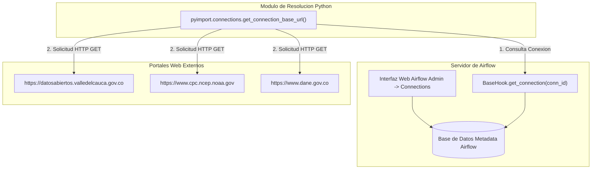

# DOCUMENTACIÓN DE CONEXIONES EN AIRFLOW INSTITUCIONALES

Implementación de la Plataforma ValleDATA para la Gestión y Aprovechamiento de Datos Abiertos en el Departamento del Valle del Cauca  
**Documento:** Documentación de Conexiones en Airflow Institucionales  
**Área Responsable:** Área de Datos - Proyecto Valle Data  
**Elaborado por:** Jhon Jairo Vallejo  
**Revisado por:** Juan Pablo Rios  
**Fecha de Actualización:** 29 de Julio de 2026  

## Control de Versiones

| Versión | Fecha | Descripción | Autor |
| :--- | :--- | :--- | :--- |
| 1.0 | 29 de Julio de 2026 | Creación de Documento | Jhon Jairo Vallejo |

---

## 1. Definiciones y Explicación para Personal No Técnico

### ¿Qué es una Conexión en Airflow? (Puente de Comunicación Digital)
Imagine que la plataforma **ValleDATA** necesita comunicarse periódicamente con otras entidades del estado (como el DANE o la Gobernación del Valle del Cauca) y agencias internacionales (como la NOAA).

En lugar de que un usuario ingrese manualmente una dirección web y contraseñas cada vez que necesita descargar un archivo, Airflow utiliza **Conexiones**.

- **El Puente Digital:** Una conexión en Airflow es una **ficha de acceso guardada en un casillero seguro**. Registra la dirección web oficial (*Host*) y el tipo de protocolo (*HTTP*), de modo que el sistema sepa exactamente a dónde acudir sin intervención humana.
- **Seguridad y Centralización:** Si un sitio web cambia su dirección de acceso, los ingenieros solo deben actualizar la conexión en un solo lugar en la pantalla de administración de Airflow, y todos los programas de descarga seguirán funcionando automáticamente.

---

## 2. Resumen de Conexiones a Sitios Externos

En este sistema, se han configurado **3 conexiones institucionales de tipo HTTP** hacia los portales oficiales de datos públicos:

---

## 3. Matriz Consolidada de Conexiones Institucionales

| ID Conexión (`Connection ID`) | Tipo (`Connection Type`) | Host Base (`Host`) | Entidad Propietaria | DAG Asociado |
| :--- | :--- | :--- | :--- | :--- |
| `gobernacion_valle` | `http` | `https://datosabiertos.valledelcauca.gov.co` | Gobernación del Valle del Cauca | `cultivos_valle_import` |
| `noaa_oni` | `http` | `https://www.cpc.ncep.noaa.gov` | NOAA (Estados Unidos) | `oni_fenomeno_nino_import` |
| `sipsa_dane` | `http` | `https://www.dane.gov.co` | DANE (Colombia) | `sipsa_import` |

---

## 4. Fichas Técnicas Detalladas de cada Conexión

---

### 4.1 Conexión `gobernacion_valle`

- **Connection ID:** `gobernacion_valle`
- **Tipo de Conexión:** `http`
- **Host Base:** `https://datosabiertos.valledelcauca.gov.co`
- **Entidad Responsable:** Gobernación del Valle del Cauca (Colombia) - Portal Oficial de Datos Abiertos.
- **Protocolo y Seguridad:** HTTPS (Puerto 443), Acceso público de lectura sin requerimiento de credenciales o API Key.

#### Propósito Operativo y de Negocio
Permite la extracción automatizada de los datasets de evaluación agropecuaria municipal en el departamento del Valle del Cauca. Esta conexión proporciona la base de datos de producción agrícola (superficie sembrada, cosechada y rendimiento en toneladas por hectárea).

---

### 4.2 Conexión `noaa_oni`

- **Connection ID:** `noaa_oni`
- **Tipo de Conexión:** `http`
- **Host Base:** `https://www.cpc.ncep.noaa.gov`
- **Entidad Responsable:** National Oceanic and Atmospheric Administration (NOAA - EE.UU.) / Climate Prediction Center (CPC).
- **Protocolo y Seguridad:** HTTPS (Puerto 443), Acceso público con cabecera `User-Agent` HTTP configurada.

#### Propósito Operativo y de Negocio
Permite la extracción de la tabla histórica del **Índice Oceánico del Niño (ONI v5)**. Este indicador mide las anomalías de temperatura superficial en el Océano Pacífico (Región Niño 3.4), permitiendo clasificar cuantitativamente los periodos bajo el fenómeno de **El Niño**, **La Niña** o estado **Neutro**.

---

### 4.3 Conexión `sipsa_dane`

- **Connection ID:** `sipsa_dane`
- **Tipo de Conexión:** `http`
- **Host Base:** `https://www.dane.gov.co`
- **Entidad Responsable:** Departamento Administrativo Nacional de Estadística (DANE - Colombia).
- **Protocolo y Seguridad:** HTTPS (Puerto 443), Acceso público para descarga de archivos binarios Excel (.xls / .xlsx).

#### Propósito Operativo y de Negocio
Suministra los precios mensuales mayoristas por kilogramo reportados en la Central de Abastos de Cali (Cavasa). Permite auditar la variación y comportamiento de precios de los alimentos en relación con los cultivos regionales y el clima.

---

## 5. Arquitectura de Comunicación y Resolución Dinámica

---

## 6. Guía de Administración y Mantenimiento

### Crear o Editar Conexiones en la UI de Airflow
1. Ingresa a la consola de Airflow (`http://airflow.localhost:6563`).
2. Ve al menú **Admin** -> **Connections**.
3. Haz clic en el botón azul **+ Add Connection**.
4. Diligencia los campos:
   - **Connection Id:** `gobernacion_valle` / `noaa_oni` / `sipsa_dane`
   - **Connection Type:** `HTTP`
   - **Host:** La URL base correspondiente (ej. `https://www.dane.gov.co`)
5. Haz clic en **Save**.
