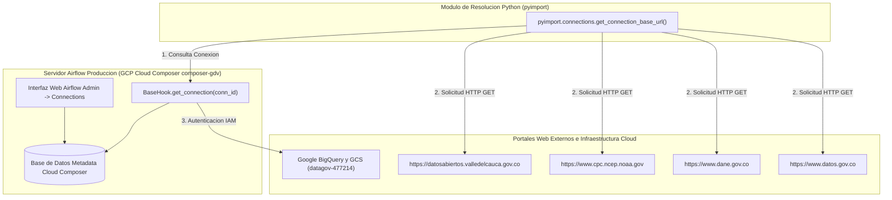

# DOCUMENTACIÓN DE CONEXIONES EN AIRFLOW INSTITUCIONALES

Implementación de la Plataforma ValleDATA para la Gestión y Aprovechamiento de Datos Abiertos en el Departamento del Valle del Cauca  
**Documento:** Documentación de Conexiones en Airflow Institucionales  
**Área Responsable:** Área de Datos - Proyecto Valle Data  
**Elaborado por:** Jhon Jairo Vallejo  
**Revisado por:** Juan Pablo Rios  
**Fecha de Actualización:** 31 de Agosto de 2026  
**Versión:** Final  

## Control de Versiones

| Versión | Fecha | Descripción | Autor |
| :--- | :--- | :--- | :--- |
| 1.0 | 29 de Julio de 2026 | Creación de Documento Inicial | Jhon Jairo Vallejo |
| Final | 31 de Agosto de 2026 | Configuración, despliegue y verificación oficial de conexiones en el entorno de Airflow Producción (Cloud Composer GCP) | Jhon Jairo Vallejo |

---

## 1. Definiciones y Explicación para Personal No Técnico

### ¿Qué es una Conexión en Airflow? (Puente de Comunicación Digital)
Imagine que la plataforma **ValleDATA** necesita comunicarse periódicamente con otras entidades del estado (como el DANE, la Gobernación del Valle del Cauca y el Portal Nacional de Datos Abiertos) y agencias internacionales (como la NOAA), además de interactuar de forma segura con la infraestructura de la nube en Google Cloud Platform.

En lugar de que un usuario ingrese manualmente una dirección web y contraseñas cada vez que necesita descargar un archivo o enviar registros a BigQuery, Airflow utiliza **Conexiones**.

- **El Puente Digital:** Una conexión en Airflow es una **ficha de acceso guardada en un casillero seguro**. Registra la dirección web oficial (*Host*) y el tipo de protocolo (*HTTP* o *Google Cloud*), de modo que el sistema sepa exactamente a dónde acudir sin intervención humana.
- **Seguridad y Centralización:** Si un sitio web cambia su dirección de acceso o credenciales, los ingenieros solo deben actualizar la conexión en un solo lugar en la pantalla de administración de Airflow, y todos los programas de descarga e ingesta seguirán funcionando automáticamente.

---

## 2. Resumen de Conexiones en Airflow Producción

En este sistema, se han configurado, desplegado y verificado **exitosamente en el entorno de Airflow de Producción (Google Cloud Composer `composer-gdv`, Proyecto GCP `datagov-477214`, Región `us-east1`)** las siguientes conexiones institucionales y de plataforma:

1. **Conexiones HTTP a Portales Públicos Institucionales:** Permiten la descarga automatizada de evaluaciones agropecuarias, precios agrícolas DANE SIPSA, índice climático ONI de la NOAA y catálogo de datos municipales.
2. **Conexión Nativa GCP (`google_cloud_default`):** Gestiona la autenticación mediante la Service Account administrada por Cloud Composer para escribir evidencias Raw en Google Cloud Storage (`gs://datalake_gdv_pdn/data_staging/valledata`) y estructurar tablas en BigQuery (`valledata`).
3. **Conexiones Postgres CKAN Municipal (`ckan_pg_*`):** Permiten la extracción descentralizada de comentarios comunitarios desde hasta 14 instancias CKAN municipales del Valle del Cauca.


---

## 3. Matriz Consolidada de Conexiones Institucionales (Producción)

| ID Conexión (`Connection ID`) | Tipo (`Connection Type`) | Host Base / Servicio (`Host`) | Entidad Propietaria | DAGs Asociados | Estado en Producción |
| :--- | :--- | :--- | :--- | :--- | :--- |
| `gobernacion_valle` | `http` | `https://datosabiertos.valledelcauca.gov.co` | Gobernación del Valle del Cauca | `src_ingest_crops` | **Configurado / Verificado** |
| `noaa_oni` | `http` | `https://www.cpc.ncep.noaa.gov` | NOAA (Estados Unidos) | `src_ingest_oni` | **Configurado / Verificado** |
| `sipsa_dane` | `http` | `https://www.dane.gov.co` | DANE (Colombia) | `src_ingest_sipsa` / `sipsa_import` | **Configurado / Verificado** |
| `datos_gov_co` | `http` | `https://www.datos.gov.co` | Portal Nacional Datos Abiertos (MinTIC) | `src_ingest_municipios` | **Configurado / Verificado** |
| `google_cloud_default` | `google_cloud_platform` | GCP Environment `datagov-477214` | Google Cloud Platform | `src_load_sipsa`, `src_load_oni`, `src_load_crops` | **Configurado / Verificado** |
| `ckan_pg_*` (01 - 14) | `postgres` | Instancias PostgreSQL CKAN | Alcaldías Municipales del Valle | `src_ingest_ckan_comentarios` | **Configurado / Opcional** |

---

## 4. Fichas Técnicas Detalladas de cada Conexión

---

### 4.1 Conexión `gobernacion_valle`

- **Connection ID:** `gobernacion_valle`
- **Tipo de Conexión:** `http`
- **Host Base:** `https://datosabiertos.valledelcauca.gov.co`
- **Entidad Responsable:** Gobernación del Valle del Cauca (Colombia) - Portal Oficial de Datos Abiertos.
- **Protocolo y Seguridad:** HTTPS (Puerto 443), Acceso público de lectura sin requerimiento de credenciales o API Key.
- **Estado en Airflow Producción:** Configurado y Operativo en Cloud Composer `composer-gdv`.

#### Propósito Operativo y de Negocio
Permite la extracción automatizada de los datasets de evaluación agropecuaria municipal en el departamento del Valle del Cauca. Esta conexión proporciona la base de datos de producción agrícola (superficie sembrada, cosechada y rendimiento en toneladas por hectárea).

---

### 4.2 Conexión `noaa_oni`

- **Connection ID:** `noaa_oni`
- **Tipo de Conexión:** `http`
- **Host Base:** `https://www.cpc.ncep.noaa.gov`
- **Entidad Responsable:** National Oceanic and Atmospheric Administration (NOAA - EE.UU.) / Climate Prediction Center (CPC).
- **Protocolo y Seguridad:** HTTPS (Puerto 443), Acceso público con cabecera `User-Agent` HTTP configurada.
- **Estado en Airflow Producción:** Configurado y Operativo en Cloud Composer `composer-gdv`.

#### Propósito Operativo y de Negocio
Permite la extracción de la tabla histórica del **Índice Oceánico del Niño (ONI v5)**. Este indicador mide las anomalías de temperatura superficial en el Océano Pacífico (Región Niño 3.4), permitiendo clasificar cuantitativamente los periodos bajo el fenómeno de **El Niño**, **La Niña** o estado **Neutro**.

---

### 4.3 Conexión `sipsa_dane`

- **Connection ID:** `sipsa_dane`
- **Tipo de Conexión:** `http`
- **Host Base:** `https://www.dane.gov.co`
- **Entidad Responsable:** Departamento Administrativo Nacional de Estadística (DANE - Colombia).
- **Protocolo y Seguridad:** HTTPS (Puerto 443), Acceso público para descarga de archivos binarios Excel (.xls / .xlsx).
- **Estado en Airflow Producción:** Configurado y Operativo en Cloud Composer `composer-gdv`.

#### Propósito Operativo y de Negocio
Suministra los precios mensuales mayoristas por kilogramo reportados en la Central de Abastos de Cali (Cavasa). Permite auditar la variación y comportamiento de precios de los alimentos en relación con los cultivos regionales y el clima.

---

### 4.4 Conexión `datos_gov_co`

- **Connection ID:** `datos_gov_co`
- **Tipo de Conexión:** `http`
- **Host Base:** `https://www.datos.gov.co`
- **Entidad Responsable:** Ministerio de Tecnologías de la Información y las Comunicaciones (MinTIC - Colombia).
- **Protocolo y Seguridad:** HTTPS (Puerto 443), Acceso público para descarga de catálogos y datasets geográficos municipales.
- **Estado en Airflow Producción:** Configurado y Operativo en Cloud Composer `composer-gdv`.

#### Propósito Operativo y de Negocio
Facilita la descarga del catálogo geográfico y la delimitación oficial de municipios en el Departamento del Valle del Cauca para la normalización de códigos DANE y llaves primarias territoriales.

---

### 4.5 Conexión `google_cloud_default`

- **Connection ID:** `google_cloud_default`
- **Tipo de Conexión:** `google_cloud_platform`
- **Proyecto GCP Producción:** `datagov-477214`
- **Entidad Responsable:** Plataforma ValleDATA / Infraestructura Cloud GCP.
- **Protocolo y Seguridad:** Autenticación IAM implícita mediante la Service Account del entorno Cloud Composer (`composer-gdv`), sin necesidad de almacenar llaves JSON en disco.
- **Estado en Airflow Producción:** Configurado y Operativo en Cloud Composer `composer-gdv`.

#### Propósito Operativo y de Negocio
Soportar la carga de capas de datos (Bronze y Silver) a Google BigQuery (`dataset: valledata`) y la sincronización con el Data Lake en Google Cloud Storage (`gs://datalake_gdv_pdn/data_staging/valledata`).

---

### 4.6 Conexiones Postgres CKAN (`ckan_pg_01` a `ckan_pg_14`)

- **Connection ID:** `ckan_pg_01`, `ckan_pg_02`, ..., `ckan_pg_14`
- **Tipo de Conexión:** `postgres`
- **Entidad Responsable:** Alcaldías Municipales del Valle del Cauca / Portales CKAN Municipales.
- **Protocolo y Seguridad:** Conexión PostgreSQL (Puerto 5432) con credenciales de lectura (`ckan_ro`).
- **Estado en Airflow Producción:** Opcional / Configurable mediante variables de entorno en Cloud Composer.

#### Propósito Operativo y de Negocio
Permite la extracción automatizada de la tabla `public.comment` en los portales CKAN locales para el posterior análisis de sentimiento de la ciudadanía frente a proyectos agropecuarios y servicios públicos municipalizados.

---

## 5. Arquitectura de Comunicación y Resolución Dinámica



---

## 6. Guía de Administración y Mantenimiento en Producción

### Verificación y Gestión desde la UI de Airflow (Cloud Composer Producción)
1. Ingrese a la Consola de Google Cloud Platform (Proyecto `datagov-477214`).
2. Navegue a **Composer** -> Seleccione el entorno `composer-gdv`.
3. En la columna de enlaces, haga clic en **Airflow Web UI**.
4. En el menú superior de Airflow UI, seleccione **Admin** -> **Connections**.
5. Verifique la presencia y configuración activa de los Connection IDs:
   - `gobernacion_valle`
   - `noaa_oni`
   - `sipsa_dane`
   - `datos_gov_co`
   - `google_cloud_default`
6. En caso de requerir modificaciones, haga clic en el icono de edición (lápiz), actualice la URL base o parámetros y presione **Save**.

### Importación Declarativa vía CLI en Cloud Composer
Para aplicar cambios masivos o sincronizar entornos usando Infrastructure as Code (IaC):

```bash
# Importar conexiones al entorno de Producción Cloud Composer
gcloud composer environments run composer-gdv \
  --location us-east1 \
  connections import -- /home/airflow/gcs/dags/config/connections.yaml
```

### Verificación Local (Entorno Astronomer / Astro CLI)
```bash
# Reiniciar entorno local para recargar conexiones desde airflow_settings.yaml
astro dev restart
```
