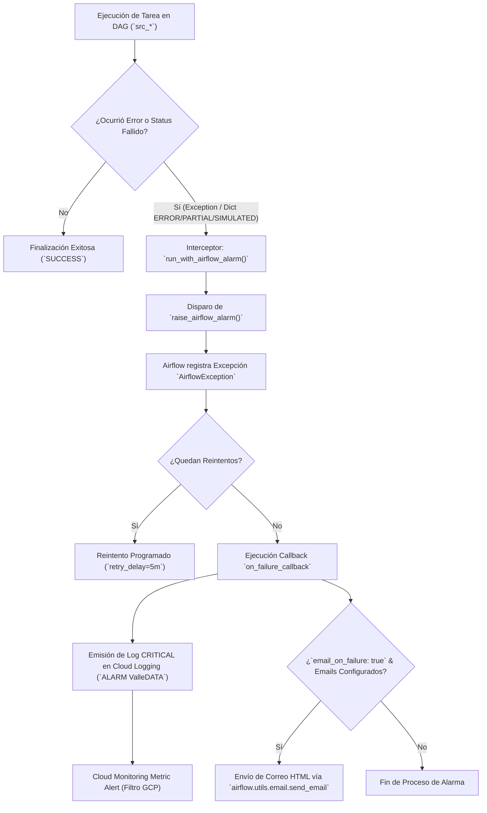

# MATRIZ DE EVENTOS Y ALARMAS DE DAGS DE APACHE AIRFLOW

Implementación de la Plataforma ValleDATA para la Gestión y Aprovechamiento de Datos Abiertos en el Departamento del Valle del Cauca  
**Documento:** Matriz de Eventos y Alarmas de DAGs de Apache Airflow  
**Área Responsable:** Área de Datos - Proyecto Valle Data  
**Elaborado por:** Jhon Jairo Vallejo  
**Revisado por:** Juan Pablo Rios  
**Versión:** Final  
**Fecha de Actualización:** 10 de Septiembre de 2026  
**Entorno de Orquestación:** Apache Airflow / Google Cloud Composer 2 & 3  
**Módulo Core de Alarmas:** [src_common.py](file:///home/jjvallej/work/enigma/pyimport/src/pyimport/src_common.py) (`airflow_failure_alarm`, `run_with_airflow_alarm`, `raise_if_failed`)

## Control de Versiones

| Versión | Fecha | Descripción | Autor |
| :--- | :--- | :--- | :--- |
| 1.0.0 | 31 de Agosto de 2026 | Matriz inicial de eventos de alarma (13 DAGs Medallion), códigos ALT-*, severidades y correo jhon.jairo.vallejo@gmail.com. | Jhon Jairo Vallejo |
| Final | 10 de Septiembre de 2026 | Versión Final actualizada con la arquitectura completa de 15 DAGs de Apache Airflow, integrando la capa GIS Espacial (`src_transform_spatial`), el Orquestador Maestro (`src_orchestrator_master`) y los nuevos códigos de evento ALT-TRF-004 y ALT-ORC-001. | Jhon Jairo Vallejo |

---

## 1. Visión General del Sistema de Alarmas

El sistema de alarmas de la plataforma ValleDATA provee una arquitectura centralizada y resiliente para detectar, clasificar, notificar y registrar cualquier fallo u anomalía operativa durante la ejecución de los **15 DAGs** del pipeline Medallion y Orquestador Maestro.



### Resumen de los 15 DAGs de la Plataforma

| ID del DAG | Capa Medallion | Frecuencia | Producto Generado (`Output`) |
| :--- | :--- | :--- | :--- |
| `src_ingest_sipsa` | Ingesta (Raw) | Mensual | `data/raw/sipsa/anex_mensual_*.xlsx` |
| `src_load_sipsa` | Carga (Bronze) | A demanda | Tabla `stg_sipsa` / Precios promedios anuales Cali |
| `src_ingest_oni` | Ingesta (Raw) | Mensual | `data/raw/oni_v5.html` |
| `src_load_oni` | Carga (Bronze) | A demanda | Tabla `stg_oni` / `oni_promedio_anual.csv` |
| `src_ingest_crops` | Ingesta (Raw) | Mensual | `data/raw/cultivos_permanentes.csv` y `transitorios.csv` |
| `src_load_crops` | Carga (Bronze) | A demanda | Tabla `stg_crops` / `cultivos_valle.csv` |
| `src_transform_crops` | Transformación (Silver) | A demanda | Alias de transformación consolidada agrícola |
| `src_ingest_municipios` | Ingesta (Raw) | Semestral | `data/raw/municipios_valle.csv` |
| `src_load_municipios` | Carga (Bronze) | A demanda | Tabla `stg_municipios` normalizada |
| `src_ingest_ckan_comentarios` | Ingesta (Raw) | Diaria / Mensual | `data/raw/ckan_comentarios.json` |
| `src_load_ckan_comentarios` | Carga (Bronze) | A demanda | Tabla `bronze_comentarios` |
| `src_transform_ckan_comentarios` | Transformación (Silver) | A demanda | Tabla `silver_comentarios` (Clasificación NLP Sentimiento) |
| `src_transform_consolidado` | Transformación (Silver / Gold Master) | A demanda | `dataset_consolidado_valle.csv` / BigQuery Silver Master |
| `src_transform_spatial` | Transformación GIS (Gold Geo) | A demanda | Tabla `gold_cultivos_valle_geo` / `municipios_valle_poligonos.geojson` (Polígonos WKT, Haversine Cavasa, Pisos Térmicos) |
| `src_orchestrator_master` | Orquestación Maestro | A demanda / Programado | Orquestación end-to-end secuencial/paralela de las 5 fases del pipeline |

---

## 2. Configuración Global de Alarmas (`config.yaml`)

El comportamiento de las alarmas se parametriza globalmente y por entorno en `config.yaml` bajo la clave `airflow_alerts`:

```yaml
airflow_alerts:
  enabled: true
  email_on_failure: true
  emails:
    - "jhon.jairo.vallejo@gmail.com"
  retries: 1
  retry_delay_minutes: 5
  fail_statuses:
    - ERROR
    - PARTIAL
    - FAILED
```

---

## 3. Matriz Principal de Eventos de Alarma

A continuación se detalla la matriz de eventos clasificada por código de alarma, capa del pipeline, condición de disparo, severidad, DAGs afectados, canales de notificación y guía de mitigación operativa:

| Código Evento | Capa / Dominio | Condición de Disparo / Causa Raíz | Estado / Excepción | Severidad | DAGs y Tareas Afectadas | Canales de Notificación | Acción Automática Airflow | Procedimiento de Mitigación / Remediación |
| :--- | :--- | :--- | :--- | :--- | :--- | :--- | :--- | :--- |
| **ALT-ING-001** | Ingesta (Raw) | Timeout o fallo de conexión HTTP al descargar anexos SIPSA desde DANE | `HTTPError`, `URLError`, `status=ERROR` | **CRÍTICO** | `src_ingest_sipsa`<br/>(`execute_ingest`) | • Cloud Logging CRITICAL<br/>• Email SMTP<br/>• Airflow Task FAILED | Reintento (1 retriable, 5 min) | Verificar disponibilidad del portal `dane.gov.co`, validar URL del anexo y conexión `sipsa_dane`. |
| **ALT-ING-002** | Ingesta (Raw) | Fallo en la descarga del HTML del Índice ONI v5 desde NOAA CPC | `HTTPError`, `TimeoutError`, `status=ERROR` | **ALTO** | `src_ingest_oni`<br/>(`execute_ingest`) | • Cloud Logging CRITICAL<br/>• Email SMTP<br/>• Airflow Task FAILED | Reintento (1 retriable, 5 min) | Comprobar endpoint `cpc.ncep.noaa.gov` y conectividad del egress de Composer. |
| **ALT-ING-003** | Ingesta (Raw) | Error al descargar CSVs de cultivos permanentes/transitorios de Gobernación | `HTTPError`, `FileNotFoundError`, `status=ERROR` | **ALTO** | `src_ingest_crops`<br/>(`execute_ingest`) | • Cloud Logging CRITICAL<br/>• Email SMTP<br/>• Airflow Task FAILED | Reintento (1 retriable, 5 min) | Revisar identificadores de recurso en CKAN Gobernación y conexión `gobernacion_valle`. |
| **ALT-ING-004** | Ingesta (Raw) | Falla al consultar catálogo de municipios en Datos Abiertos (`datos.gov.co`) | `HTTPError`, `status=ERROR` | **MEDIO** | `src_ingest_municipios`<br/>(`execute_ingest`) | • Cloud Logging CRITICAL<br/>• Email SMTP<br/>• Airflow Task FAILED | Reintento (1 retriable, 5 min) | Validar disponibilidad de API Socrata/CSV en `datos.gov.co` (Dataset ID `iryd-wvq5`). |
| **ALT-ING-005** | Ingesta (Raw) | Fallo de conexión PostgreSQL a instancias CKAN de comentarios municipales | `OperationalError`, `SQLAlchemyError`, `status=ERROR` | **CRÍTICO** | `src_ingest_ckan_comentarios`<br/>(`execute_ingest`) | • Cloud Logging CRITICAL<br/>• Email SMTP<br/>• Airflow Task FAILED | Reintento (1 retriable, 5 min) | Verificar estado del arreglo de conexiones `ckan_comentarios` y credenciales de BD. |
| **ALT-ING-006** | Ingesta (Raw) | Descarga incompleta o archivo corrupto (Respuesta soft-404 HTML en DANE) | `status=PARTIAL`, `ValueError` | **ALTO** | `src_ingest_sipsa`, `src_ingest_crops` | • Cloud Logging CRITICAL<br/>• Email SMTP<br/>• Airflow Task FAILED | Marca falla tras agotar reintentos | Inspeccionar los archivos en `data/raw/` para detectar respuestas HTML ficticias del servidor web. |
| **ALT-LOD-001** | Carga (Bronze) | Error de permisos IAM / ADC al escribir en Cloud Storage Bucket | `Forbidden`, `NotFound`, `GCSUploadError` | **CRÍTICO** | Todos los DAGs `src_load_*` | • Cloud Logging CRITICAL<br/>• Email SMTP<br/>• Airflow Task FAILED | Falla inmediata tras reintentos | Verificar permisos de la Service Account de Composer sobre el bucket `gs://datalake_gdv_pdn`. |
| **ALT-LOD-002** | Carga (Bronze) | Fallo al insertar registros o crear tablas staging en BigQuery Bronze | `GoogleCloudError`, `BigQueryError` | **CRÍTICO** | `src_load_sipsa`, `src_load_oni`, `src_load_crops`, `src_load_municipios` | • Cloud Logging CRITICAL<br/>• Email SMTP<br/>• Airflow Task FAILED | Reintento (1 retriable, 5 min) | Inspeccionar esquema del dataset `valledata` en BigQuery y cuotas del proyecto GCP. |
| **ALT-LOD-003** | Carga (Bronze) | Detección de respuesta `status=SIMULATED` durante ejecución en Composer | `AirflowException("status=SIMULATED en Composer")` | **CRÍTICO** | Todos los DAGs `src_load_*` | • Cloud Logging CRITICAL<br/>• Email SMTP<br/>• Airflow Task FAILED | Reintento (1 retriable, 5 min) | La carga real a BigQuery fue omitida o falló la conexión nativa GCP en Cloud Composer. Validar `google_cloud_default`. |
| **ALT-LOD-004** | Carga (Bronze) | Incompatibilidad de tipos de datos o corrupción en parseo de CSV a Dataframe | `TypeError`, `ValueError`, `KeyError` | **ALTO** | `src_load_sipsa`, `src_load_crops`, `src_load_ckan_comentarios` | • Cloud Logging CRITICAL<br/>• Email SMTP<br/>• Airflow Task FAILED | Reintento (1 retriable, 5 min) | Revisar cambios de formato en las fuentes raw o ajustar lógica de parseo pandas en `src_load_*`. |
| **ALT-TRF-001** | Transformación (Silver) | Error en modelo de Clasificación de Sentimiento NLP (pysentimiento / VADER) | `ImportError`, `RuntimeError`, `status=ERROR` | **MEDIO** | `src_transform_ckan_comentarios`<br/>(`execute_transform`) | • Cloud Logging CRITICAL<br/>• Email SMTP<br/>• Airflow Task FAILED | Reintento (1 retriable, 5 min) | Verificar instalación de dependencias NLP en la imagen de Composer y memoria del Worker. |
| **ALT-TRF-002** | Transformación (Gold) | Fallo en el cruce de llaves (Año, Municipio, Cultivo, Semestre) en Consolidado Maestro | `MergeError`, `KeyError`, `status=ERROR` | **CRÍTICO** | `src_transform_consolidado`, `src_transform_crops` | • Cloud Logging CRITICAL<br/>• Email SMTP<br/>• Airflow Task FAILED | Reintento (1 retriable, 5 min) | Validar integridad de las tablas Bronze (`stg_sipsa`, `stg_oni`, `stg_crops`). |
| **ALT-TRF-003** | Transformación (Gold) | Generación de dataset consolidado con 0 registros (Data Quality Anomaly) | `ValueError("Consolidado vacío")`, `status=ERROR` | **CRÍTICO** | `src_transform_consolidado` | • Cloud Logging CRITICAL<br/>• Email SMTP<br/>• Airflow Task FAILED | Falla inmediata | Auditar la coincidencia de rangos de años entre SIPSA (2012+), ONI y Cultivos. |
| **ALT-TRF-004** | Transformación GIS (Gold) | Fallo en generación de polígonos WKT/GeoJSON, centroides WGS84 o cálculo de distancia a Cavasa | `ValueError`, `KeyError`, `BigQueryError`, `status=ERROR` | **CRÍTICO** | `src_transform_spatial`<br/>(`execute_transform`) | • Cloud Logging CRITICAL<br/>• Email SMTP<br/>• Airflow Task FAILED | Reintento (1 retriable, 5 min) | Verificar integridad de coordenadas municipales y conectividad BigQuery Gold (`gold_cultivos_valle_geo`). |
| **ALT-ORC-001** | Orquestación Maestro | Fallo o timeout en disparo/espera de DAGs hijos vía `TriggerDagRunOperator` | `AirflowException`, `DagRunNotFound`, `status=ERROR` | **CRÍTICO** | `src_orchestrator_master`<br/>(`trigger_*`) | • Cloud Logging CRITICAL<br/>• Email SMTP<br/>• Airflow Task FAILED | Reintento (1 retriable, 5 min) | Revisar logs del DAG hijo que falló en la UI de Airflow y validar estado del scheduler. |
| **ALT-SYS-001** | Infraestructura | Excepción de runtime no capturada durante la ejecución de tareas de Python | `AirflowException`, `Exception` no controlada | **CRÍTICO** | Todos los 15 DAGs de la plataforma | • Cloud Logging CRITICAL<br/>• Email SMTP<br/>• Airflow Task FAILED | Reintento (1 retriable, 5 min) | Revisar traceback detallado en los logs de la TaskInstance en la UI de Airflow. |
| **ALT-SYS-002** | Infraestructura | Agotamiento definitivo de reintentos (`try_number > retries`) | `AirflowTaskTimeout`, `AirflowException` | **CRÍTICO** | Todos los 15 DAGs de la plataforma | • Cloud Logging CRITICAL<br/>• Email SMTP<br/>• Airflow Task FAILED | Interrupción de pipeline downstream | Intervención manual del equipo de soporte. Revisar recursos de la instancia Airflow. |
| **ALT-SYS-003** | Infraestructura | Fallo al enviar notificación por correo SMTP (`send_email`) | `OSError`, `SMTPException` (Capturada silenciosamente) | **BAJO** | Callback `airflow_failure_alarm` | • Log de advertencia `⚠️ [ALARM] No se pudo notificar...` | Continuación del estado FAILED de Airflow | Verificar configuración de servidor SMTP en `airflow.cfg` / Cloud Composer Environment Variables. |
| **ALT-SYS-004** | Infraestructura | Incompatibilidad de SDK Airflow (Composer 2 vs Composer 3 import SDK) | `ImportError` (Manejado con fallback) | **MEDIO** | Todos los 15 DAGs (`@dag`, `@task`) | • Log de advertencia/debug | Conmutación automática a `airflow.decorators` | Asegurar uso del bloque `try... import airflow.sdk ... except... import airflow.decorators`. |

---

## 4. Estructura y Formato de los Mensajes de Alerta

### 4.1. Formato de Log Crítico (Cloud Logging)
Cuando una tarea falla, `airflow_failure_alarm` emite un registro con nivel `CRITICAL` en el logger `valledata.airflow_alarm`:

```text
🚨 ALARM ValleDATA | dag=src_ingest_sipsa | task=run_ingest_sipsa | run_id=manual__2026-08-28T20:00:00+00:00 | try=1 | error=HTTPError 503: Service Unavailable
```

### 4.2. Plantilla de Correo Electrónico (HTML)
Si la opción `email_on_failure` está activa y se registran correos en `airflow_alerts.emails`, Airflow envía una notificación con el siguiente formato:

- **Asunto:** `[ALARM] ValleDATA falló: src_ingest_sipsa.run_ingest_sipsa`
- **Cuerpo HTML:**
```html
<h3>Alarma de pipeline ValleDATA</h3>
<p>
  <b>DAG:</b> src_ingest_sipsa<br/>
  <b>Task:</b> run_ingest_sipsa<br/>
  <b>Run:</b> manual__2026-08-28T20:00:00+00:00<br/>
  <b>Try:</b> 1<br/>
  <b>Error:</b> ALARM ValleDATA | execute_ingest falló: HTTPError 503: Service Unavailable
</p>
<pre>
urllib.error.HTTPError: HTTP Error 503: Service Unavailable
  at urllib.request.urlopen(...)
  at src_ingest_sipsa.py:94
</pre>
```

---

## 5. Regla de Alerta en Google Cloud Monitoring (Cloud Logging Metric)

Para activar alertas automáticas en Google Cloud Platform (GCP) enviando notificaciones a PagerDuty, Slack o SMS cuando ocurra cualquier evento de esta matriz, utilice la siguiente consulta en **Cloud Logging / Log Router**:

```query
resource.type="cloud_composer_environment"
logName:"valledata.airflow_alarm"
severity>=CRITICAL
textPayload=~"ALARM ValleDATA"
```

---

## 6. Pruebas y Verificación del Sistema de Alarmas

El correcto funcionamiento de los callbacks y excepciones de alarma está validado mediante la suite de pruebas unitarias automatizadas (`pytest`):

```bash
# Ejecutar verificación completa de DAGs y módulos de alarmas
.venv/bin/pytest tests/test_dag.py tests/test_municipios.py tests/test_oni.py tests/test_cultivos.py tests/test_consolidate.py tests/test_spatial.py
```

Las pruebas confirman que:
1. `get_airflow_dag_kwargs()` incluye el callback `on_failure_callback = airflow_failure_alarm`.
2. `run_with_airflow_alarm()` convierte cualquier error de ejecución o diccionario con status `ERROR`/`FAILED`/`SIMULATED` en un `AirflowException` interceptable.
