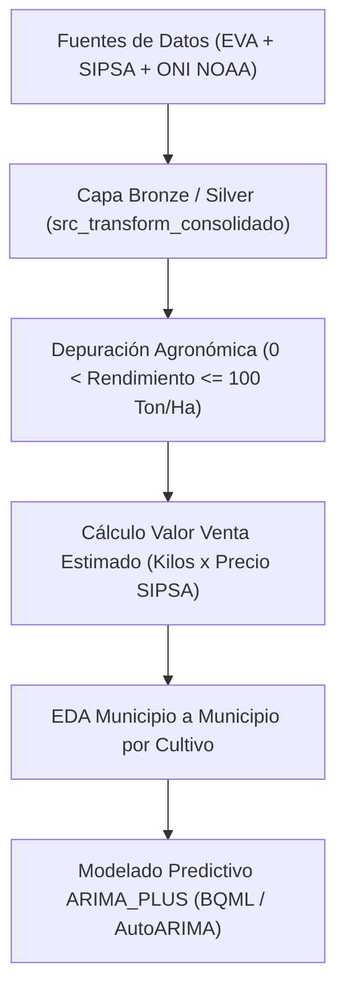

# ANÁLISIS EXPLORATORIO DE DATOS (EDA) AGRÍCOLA Y MODELADO PREDICTIVO

**Plataforma ValleDATA — Gobernación del Valle del Cauca**  
**Documento:** Informe Técnico de Análisis Exploratorio de Datos (EDA) Agrícola Municipio a Municipio (2015-2024) y Pronósticos BQML  
**Área Responsable:** Área de Datos - Proyecto ValleDATA  
**Elaborado por:** Jhon Jairo Vallejo  
**Revisado por:** Juan Pablo Rios  
**Versión:** 1.0  
**Fecha de Actualización:** 26 de Agosto de 2026  

---

## Control de Versiones

| Versión | Fecha | Descripción | Autor |
| :--- | :--- | :--- | :--- |
| 1.0 | 26 de Agosto de 2026 | Creación del documento técnico oficial del EDA Agrícola municipio a municipio y pronósticos ARIMA_PLUS | Jhon Jairo Vallejo |

---

## 1. Introducción y Metodología del EDA Agrícola

El presente informe consolida el **Análisis Exploratorio de Datos (EDA)** realizado sobre el comportamiento agrícola departamental del Valle del Cauca durante el decenio 2015-2024.

La metodología adopta un enfoque **municipio a municipio**, estudiando dentro de cada territorio sus diversos cultivos en lugar de hacer agregaciones globales abstractas. Esto permite capturar la heterogeneidad geográfica, microclimática y topográfica del departamento (desde los cultivos agroindustriales del valle geográfico del Río Cauca hasta la producción frutícola y hortícola de ladera).

### Reglas de Depuración y Métricas Calculadas:
1. **Filtro Agronómico de Rendimiento:** $0 < \text{Rendimiento (Ton/Ha)} \le 100$, descartando ceros e inconsistencias por errores de digitación en las evaluaciones agropecuarias.
2. **Valor Venta Estimado ($COP$):**
   $$\text{valor\_venta} = (\text{produccion\_toneladas} \times 1,000) \times \text{precio\_promedio\_anual\_sipsa}$$
3. **Cruce Multivariable:** Integración del índice de variabilidad climática **ONI** (El Niño $> +0.5^\circ\text{C}$, La Niña $\le -0.5^\circ\text{C}$) proporcionado por la NOAA.

---

## 2. Valor de Venta Estimado por Parejas Municipio - Cultivo

El análisis de ingresos brutos acumulados ($COP$) permite identificar las parejas `(municipio - cultivo)` con mayor dinamismo económico en el departamento.

### Principales Hallazgos Económicos:
- **Liderazgo Agroindustrial y Frutícola:** Municipios como **Tuluá**, **Candelaria**, **Palmira**, **Sevilla** y **Dagua** destacan en la generación de valor agrícola bruto.
- **Diversificación por Municipio:** En municipios de ladera como **Sevilla** y **Versalles**, el Plátano, el Café y el Aguacate generan los mayores ingresos acumulados, mientras que en municipios llanos como **Palmira** y **Candelaria** predominan cultivos de gran escala y hortalizas de ciclo corto.

---

## 3. Dispersión y Comportamiento Agrícola Municipio a Municipio

### 3.1 Kilos Cosechados vs. Valor de Venta Estimado por Municipio y Cultivo

La relación entre el volumen físico producido ($\text{kilos}$) y el ingreso monetario generado ($\text{millones COP}$) refleja la estructura de escala y valor agregado por producto.

---

### 3.2 Rendimiento Agrícola (Ton/Ha) vs. Precio Mayorista SIPSA ($/Kg)

Se evalúa la interacción entre la eficiencia biológica del cultivo ($\text{Ton/Ha}$) y la cotización mayorista en el mercado SIPSA (DANE).

- **Comportamiento Agronómico:** Cultivos con altos rendimientos volumétricos (ej. Plátano o Tomate en Tuluá) registran precios por kilo moderados pero estables, mientras que frutas de ladera (ej. Granadilla, Maracuyá en Sevilla) presentan menor rendimiento pero cotizaciones más elevadas por kilo.

---

### 3.3 Hectáreas Cosechadas vs. Producción Total en Toneladas

Evaluación de la respuesta volumétrica de producción frente a la superficie cosechada por municipio.

---

## 4. Sensibilidad e Impacto del Índice Climático ONI (El Niño / La Niña)

El fenómeno ENOS (El Niño - Oscilación del Sur) impacta directamente los rendimientos agrícolas departamentales. El índice **ONI** (Oceanic Niño Index) permite cuantificar este impacto.

### Principales Hallazgos Climáticos:
- **Vulnerabilidad de Laderas:** Municipios como **Dagua** y **Versalles** experimentan contracciones en el rendimiento durante fases severas de El Niño ($\text{ONI} > +1.0^\circ\text{C}$) en hortalizas sensibles como el Tomate y la Habichuela.
- **Resiliencia en Frutales Permanentes:** Cultivos permanentes como el Aguacate y el Plátano muestran menor dispersión en rendimiento frente a fluctuaciones térmicas moderadas.

---

## 5. Matrices de Correlación Multivariable Municipio a Municipio

Para comprender la estructura interna de los datos, se calcularon las matrices de correlación de Pearson sobre las variables agrícolas, de mercado y climáticas.

### 5.1 Matriz de Correlación Global de Pearson

---

### 5.2 Matrices de Correlación Interna por Municipio Principal

- **Análisis por Municipio:**
  - En **Palmira** y **Tuluá**, existe una alta correlación positiva ($r > 0.85$) entre hectáreas cosechadas y valor de venta.
  - El índice ONI presenta correlaciones negativas moderadas con el rendimiento en cultivos hortalizos de ciclo corto.

---

## 6. Modelado Predictivo ARIMA_PLUS y Pronósticos a 3 Años (2025-2027)

Utilizando la librería `pmdarima` y el algoritmo de BigQuery ML `ARIMA_PLUS`, se entrenaron modelos de series de tiempo para cada combinación `(municipio - cultivo)`.

### Criterios de Selección y Evaluación Out-of-Sample:
1. **Filtro de Ajuste $R^2 \ge 0.70$:** Se seleccionaron únicamente los modelos con alta capacidad explicativa histórica.
2. **Intervalos de Confianza:** Proyección a 3 años (2025, 2026, 2027) con bandas del 80% de confianza.

---

## 7. Conclusiones y Recomendaciones Institucionales

1. **Planificación Territorial Agrícola:**  
   La Gobernación del Valle del Cauca debe focalizar la asistencia técnica considerando las vocaciones específicas encontradas municipio a municipio (frutales de ladera en Sevilla/Versalles vs hortalizas en Tuluá/Palmira).

2. **Mitigación del Riesgo Climático:**  
   Implementar distritos de riego y alertas tempranas basadas en el índice ONI para proteger cultivos de alta volatilidad (Tomate, Habichuela) en municipios con alta fricción hídrica.

3. **Uso de la Infraestructura de Datos:**  
   Aprovechar el dataset generado (`data/eda_resumen_municipio_producto.csv`) y los modelos predictivos BQML para alimentar tableros ejecutivos en la plataforma **ValleDATA**.
