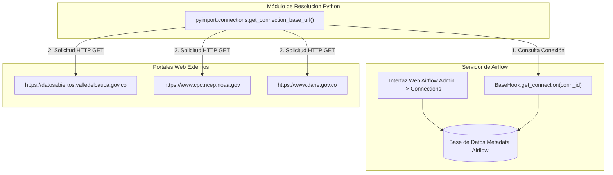

# Documentación Detallada de Conexiones a Sitios Externos en Apache Airflow

**Proyecto:** `pyimport` / `airflow` (Sistema Integrado de Importación Agrícola, Precios SIPSA y Clima El Niño/La Niña)  
**Versión:** 1.0.0  
**Fecha:** Julio 2026  
**Consola Web de Airflow:** `http://airflow.localhost:6563/connections`

---

## 1. Resumen de Conexiones a Sitios Externos

Las **Conexiones en Apache Airflow** actúan como la capa de abstracción y seguridad para gestionar los accesos a servicios web, bases de datos y APIs externas.

En este sistema, se han configurado **3 conexiones de tipo HTTP** hacia sitios web oficiales para la descarga automatizada de datos sobre agricultura, precios de alimentos e indicadores climáticos:


---

## 2. Matriz Consolidada de Conexiones

| ID Conexión (`Connection ID`) | Tipo (`Connection Type`) | Host Base (`Host`) | Entidad Propietaria | DAG Asociado |
| :--- | :--- | :--- | :--- | :--- |
| `gobernacion_valle` | `http` | `https://datosabiertos.valledelcauca.gov.co` | Gobernación del Valle del Cauca | `cultivos_valle_import` |
| `noaa_oni` | `http` | `https://www.cpc.ncep.noaa.gov` | NOAA (Estados Unidos) | `oni_fenomeno_nino_import` |
| `sipsa_dane` | `http` | `https://www.dane.gov.co` | DANE (Colombia) | `sipsa_import` |

---

## 3. Fichas Técnicas Detalladas de cada Conexión

---

### 3.1 Conexión `gobernacion_valle`

- **Connection ID:** `gobernacion_valle`
- **Tipo de Conexión:** `http`
- **Host Base:** `https://datosabiertos.valledelcauca.gov.co`
- **Entidad Responsable:** Gobernación del Valle del Cauca (Colombia) - Portal Oficial de Datos Abiertos.
- **Protocolo y Seguridad:** HTTPS (Puerto 443), Acceso público de lectura sin requerimiento de credenciales o API Key.

#### Propósito Operativo y de Negocio
Permite la extracción automatizada de los datasets de evaluación agropecuaria municipal en el departamento del Valle del Cauca. Esta conexión proporciona la base de datos de producción agrícola (superficie sembrada, cosechada y rendimiento en toneladas por hectárea).

#### Recurso y Endpoints Consumidos
```
1. Cultivos Permanentes:
   https://datosabiertos.valledelcauca.gov.co/dataset/55a3d384-fec1-4267-8541-7d62a3fc9223/resource/7c578f9f-094d-4e6e-b1db-2f5e3bde32c9/download/cultivos_permanentes.csv

2. Cultivos Transitorios:
   https://datosabiertos.valledelcauca.gov.co/dataset/16a0cede-1b2f-4db8-8a42-ca10d0223cee/resource/f0ed7211-5ab5-4fa0-885d-e343cc906f2c/download/cultivos_transitorios.csv
```

#### Integración en Código
- **DAG:** `cultivos_valle_import` ([cultivos_valle_dag.py](file:///home/jjvallej/work/enigma/pyimport/dags/cultivos_valle_dag.py))
- **Módulo Python:** [cultivos.py](file:///home/jjvallej/work/enigma/pyimport/src/pyimport/cultivos.py) mediante las funciones `get_cultivos_permanentes_url()` y `get_cultivos_transitorios_url()`.

---

### 3.2 Conexión `noaa_oni`

- **Connection ID:** `noaa_oni`
- **Tipo de Conexión:** `http`
- **Host Base:** `https://www.cpc.ncep.noaa.gov`
- **Entidad Responsable:** National Oceanic and Atmospheric Administration (NOAA - EE.UU.) / Climate Prediction Center (CPC).
- **Protocolo y Seguridad:** HTTPS (Puerto 443), Acceso público con cabecera `User-Agent` HTTP configurada.

#### Propósito Operativo y de Negocio
Permite la extracción de la tabla histórica del **Índice Oceánico del Niño (ONI v5)**. Este indicador mide las anomalías de temperatura superficial en el Océano Pacífico (Región Niño 3.4), permitiendo clasificar cuantitativamente los periodos bajo el fenómeno de **El Niño**, **La Niña** o estado **Neutro**.

#### Recurso y Endpoints Consumidos
```
https://www.cpc.ncep.noaa.gov/products/analysis_monitoring/ensostuff/ONI_v5.php
```

#### Integración en Código
- **DAG:** `oni_fenomeno_nino_import` ([oni_valle_dag.py](file:///home/jjvallej/work/enigma/pyimport/dags/oni_valle_dag.py))
- **Módulo Python:** [oni.py](file:///home/jjvallej/work/enigma/pyimport/src/pyimport/oni.py) mediante la función `get_oni_url()`.

---

### 3.3 Conexión `sipsa_dane`

- **Connection ID:** `sipsa_dane`
- **Tipo de Conexión:** `http`
- **Host Base:** `https://www.dane.gov.co`
- **Entidad Responsable:** Departamento Administrativo Nacional de Estadística (DANE - Colombia).
- **Protocolo y Seguridad:** HTTPS (Puerto 443), Acceso público para descarga de archivos binarios Excel (.xls / .xlsx).

#### Propósito Operativo y de Negocio
Suministra los precios mensuales mayoristas por kilogramo reportados en la Central de Abastos de Cali (Cavasa). Permite auditar la variación y comportamiento de precios de los alimentos en relación con los cultivos regionales y el clima.

#### Recurso y Endpoints Consumidos (Patrones Históricos)
```
1. https://www.dane.gov.co/files/investigaciones/agropecuario/sipsa/anex_mensual_{mes}_{anio}.xls
2. https://www.dane.gov.co/files/investigaciones/agropecuario/sipsa/anex_mensual_{mes}_{anio}.xlsx
3. https://www.dane.gov.co/files/investigaciones/agropecuario/sipsa/anexo_mensual_SIPSA_mayoristas_{mes}_{anio}.xlsx
4. https://www.dane.gov.co/files/operaciones/SIPSA/anex-SIPSAMensual-{mes}{anio}.xlsx
```

#### Integración en Código
- **DAG:** `sipsa_import` ([sipsa_airflow_dag.py](file:///home/jjvallej/work/enigma/pyimport/dags/sipsa_airflow_dag.py))
- **Módulo Python:** [sipsa.py](file:///home/jjvallej/work/enigma/pyimport/src/pyimport/sipsa.py) mediante la función `get_sipsa_url_templates()`.

---

## 4. Arquitectura de Comunicación y Resolución Dinámica



---

## 5. Infraestructura como Código (IaC)

Para garantizar la reproducibilidad entre entornos (Desarrollo, Staging, Producción), las conexiones están configuradas en dos archivos declarativos:

### 1. `connections.yaml` (Airflow CLI Estándar)
```yaml
sipsa_dane:
  conn_type: http
  host: https://www.dane.gov.co
  description: "Conexión HTTP al portal DANE SIPSA para descarga de anexos mensuales de precios"

noaa_oni:
  conn_type: http
  host: https://www.cpc.ncep.noaa.gov
  description: "Conexión HTTP al portal NOAA CPC para consulta del índice El Niño/La Niña (ONI)"

gobernacion_valle:
  conn_type: http
  host: https://datosabiertos.valledelcauca.gov.co
  description: "Conexión HTTP al portal de Datos Abiertos de la Gobernación del Valle del Cauca"
```

### 2. `airflow_settings.yaml` (Astronomer / Astro CLI Local)
```yaml
airflow:
  connections:
    - conn_id: sipsa_dane
      conn_type: http
      conn_host: https://www.dane.gov.co
    - conn_id: noaa_oni
      conn_type: http
      conn_host: https://www.cpc.ncep.noaa.gov
    - conn_id: gobernacion_valle
      conn_type: http
      conn_host: https://datosabiertos.valledelcauca.gov.co
```

---

## 6. Guía de Administración y Mantenimiento

### Crear o Editar Conexiones en la UI de Airflow
1. Ingress a la consola de Airflow (`http://airflow.localhost:6563`).
2. Ve al menú **Admin** -> **Connections**.
3. Haz clic en el botón azul **+ Add Connection**.
4. Diligencia los campos:
   - **Connection Id:** `gobernacion_valle` / `noaa_oni` / `sipsa_dane`
   - **Connection Type:** `HTTP`
   - **Host:** La URL base correspondiente (ej. `https://www.dane.gov.co`)
5. Haz clic en **Save**.

### Importar o Exportar por Línea de Comandos (CLI)
- **Importar conexiones en servidor Airflow:**
  ```bash
  airflow connections import connections.yaml
  ```
- **Aplicar cambios en desarrollo local Astronomer:**
  ```bash
  astro dev restart
  ```
