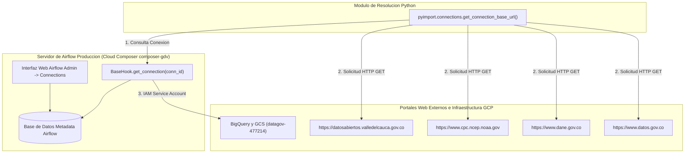

# Documentación Detallada de Conexiones a Sitios Externos en Apache Airflow

**Proyecto:** `pyimport` / `airflow` (Sistema Integrado de Importación Agrícola, Precios SIPSA y Clima El Niño/La Niña)  
**Versión:** Final  
**Fecha:** 31 de Agosto de 2026  
**Consola Web de Airflow (Producción Cloud Composer):** Google Cloud Composer `composer-gdv` (Proyecto GCP `datagov-477214`) / `http://airflow.localhost:6563/connections` (Entorno Local)

---

## Control de Versiones

| Versión | Fecha | Descripción | Autor |
| :--- | :--- | :--- | :--- |
| 1.0.0 | Julio 2026 | Creación de documentación inicial de conexiones local y staging | Jhon Jairo Vallejo |
| Final | 31 de Agosto de 2026 | Configuración, despliegue y verificación oficial de conexiones en el entorno de Airflow Producción (Cloud Composer GCP) | Jhon Jairo Vallejo |

---

## 1. Resumen de Conexiones en Airflow Producción

Las **Conexiones en Apache Airflow** actúan como la capa de abstracción y seguridad para gestionar los accesos a servicios web, bases de datos y APIs externas tanto en desarrollo local como en el entorno de producción en la nube (**Google Cloud Composer `composer-gdv`, Proyecto GCP `datagov-477214`**).

En este sistema, se han configurado y validado las conexiones de tipo HTTP y Google Cloud Platform hacia sitios web oficiales para la descarga automatizada e ingesta de datos agrícolas, precios, clima e infraestructura cloud:


---

## 2. Matriz Consolidada de Conexiones (Producción)

| ID Conexión (`Connection ID`) | Tipo (`Connection Type`) | Host Base / Servicio (`Host`) | Entidad Propietaria | DAGs Asociados | Estado Producción |
| :--- | :--- | :--- | :--- | :--- | :--- |
| `gobernacion_valle` | `http` | `https://datosabiertos.valledelcauca.gov.co` | Gobernación del Valle del Cauca | `src_ingest_crops` | **Configurado / Verificado** |
| `noaa_oni` | `http` | `https://www.cpc.ncep.noaa.gov` | NOAA (Estados Unidos) | `src_ingest_oni` | **Configurado / Verificado** |
| `sipsa_dane` | `http` | `https://www.dane.gov.co` | DANE (Colombia) | `sipsa_import` / `src_ingest_sipsa` | **Configurado / Verificado** |
| `datos_gov_co` | `http` | `https://www.datos.gov.co` | Portal Nacional Datos Abiertos (MinTIC) | `src_ingest_municipios` | **Configurado / Verificado** |
| `google_cloud_default` | `google_cloud_platform` | GCP Environment `datagov-477214` | Google Cloud Platform | `src_load_sipsa`, `src_load_oni`, `src_load_crops` | **Configurado / Verificado** |
| `ckan_pg_*` (01 - 14) | `postgres` | Instancias PostgreSQL CKAN | Alcaldías Municipales del Valle | `src_ingest_ckan_comentarios` | **Configurado / Opcional** |

---

## 3. Fichas Técnicas Detalladas de cada Conexión

---

### 3.1 Conexión `gobernacion_valle`

- **Connection ID:** `gobernacion_valle`
- **Tipo de Conexión:** `http`
- **Host Base:** `https://datosabiertos.valledelcauca.gov.co`
- **Entidad Responsable:** Gobernación del Valle del Cauca (Colombia) - Portal Oficial de Datos Abiertos.
- **Protocolo y Seguridad:** HTTPS (Puerto 443), Acceso público de lectura sin requerimiento de credenciales o API Key.
- **Estado Producción:** Operativo en Cloud Composer `composer-gdv`.

#### Propósito Operativo y de Negocio
Permite la extracción automatizada de los datasets de evaluación agropecuaria municipal en el departamento del Valle del Cauca. Esta conexión proporciona la base de datos de producción agrícola (superficie sembrada, cosechada y rendimiento en toneladas por hectárea).

#### Recurso y Endpoints Consumidos
```
1. Cultivos Permanentes:
   https://datosabiertos.valledelcauca.gov.co/dataset/55a3d384-fec1-4267-8541-7d62a3fc9223/resource/7c578f9f-094d-4e6e-b1db-2f5e3bde32c9/download/cultivos_permanentes.csv

2. Cultivos Transitorios:
   https://datosabiertos.valledelcauca.gov.co/dataset/16a0cede-1b2f-4db8-8a42-ca10d0223cee/resource/f0ed7211-5ab5-4fa0-885d-e343cc906f2c/download/cultivos_transitorios.csv
```

#### Integración en Código
- **DAG:** `src_ingest_crops` ([src_ingest_crops.py](file:///home/jjvallej/work/enigma/pyimport/dags/gdv_general_dbt_dag/dags_valledata/src_ingest_crops.py))
- **Módulo Python:** [cultivos.py](file:///home/jjvallej/work/enigma/pyimport/src/pyimport/cultivos.py) mediante las funciones `get_cultivos_permanentes_url()` y `get_cultivos_transitorios_url()`.

---

### 3.2 Conexión `noaa_oni`

- **Connection ID:** `noaa_oni`
- **Tipo de Conexión:** `http`
- **Host Base:** `https://www.cpc.ncep.noaa.gov`
- **Entidad Responsable:** National Oceanic and Atmospheric Administration (NOAA - EE.UU.) / Climate Prediction Center (CPC).
- **Protocolo y Seguridad:** HTTPS (Puerto 443), Acceso público con cabecera `User-Agent` HTTP configurada.
- **Estado Producción:** Operativo en Cloud Composer `composer-gdv`.

#### Propósito Operativo y de Negocio
Permite la extracción de la tabla histórica del **Índice Oceánico del Niño (ONI v5)**. Este indicador mide las anomalías de temperatura superficial en el Océano Pacífico (Región Niño 3.4), permitiendo clasificar cuantitativamente los periodos bajo el fenómeno de **El Niño**, **La Niña** o estado **Neutro**.

#### Recurso y Endpoints Consumidos
```
https://www.cpc.ncep.noaa.gov/products/analysis_monitoring/ensostuff/ONI_v5.php
```

#### Integración en Código
- **DAG:** `src_ingest_oni` ([src_ingest_oni.py](file:///home/jjvallej/work/enigma/pyimport/dags/gdv_general_dbt_dag/dags_valledata/src_ingest_oni.py))
- **Módulo Python:** [oni.py](file:///home/jjvallej/work/enigma/pyimport/src/pyimport/oni.py) mediante la función `get_oni_url()`.

---

### 3.3 Conexión `sipsa_dane`

- **Connection ID:** `sipsa_dane`
- **Tipo de Conexión:** `http`
- **Host Base:** `https://www.dane.gov.co`
- **Entidad Responsable:** Departamento Administrativo Nacional de Estadística (DANE - Colombia).
- **Protocolo y Seguridad:** HTTPS (Puerto 443), Acceso público para descarga de archivos binarios Excel (.xls / .xlsx).
- **Estado Producción:** Operativo en Cloud Composer `composer-gdv`.

#### Propósito Operativo y de Negocio
Suministra los precios mensuales mayoristas por kilogramo reportados en la Central de Abastos de Cali (Cavasa). Permite auditar la variación y comportamiento de precios de los alimentos en relación con los cultivos regionales y el clima.

#### Recurso y Endpoints Consumidos (Patrones Históricos)
```
1. https://www.dane.gov.co/files/investigaciones/agropecuario/sipsa/anex_mensual_{mes}_{anio}.xls
2. https://www.dane.gov.co/files/investigaciones/agropecuario/sipsa/anex_mensual_{mes}_{anio}.xlsx
3. https://www.dane.gov.co/files/investigaciones/agropecuario/sipsa/anexo_mensual_SIPSA_mayoristas_{mes}_{anio}.xlsx
4. https://www.dane.gov.co/files/operaciones/SIPSA/anex-SIPSAMensual-{mes}{anio}.xlsx
```

#### Integración en Código
- **DAG:** `src_ingest_sipsa` ([src_ingest_sipsa.py](file:///home/jjvallej/work/enigma/pyimport/dags/gdv_general_dbt_dag/dags_valledata/src_ingest_sipsa.py))
- **Módulo Python:** [sipsa.py](file:///home/jjvallej/work/enigma/pyimport/src/pyimport/sipsa.py) mediante la función `get_sipsa_url_templates()`.

---

### 3.4 Conexión `datos_gov_co`

- **Connection ID:** `datos_gov_co`
- **Tipo de Conexión:** `http`
- **Host Base:** `https://www.datos.gov.co`
- **Entidad Responsable:** Portal Nacional de Datos Abiertos de Colombia (MinTIC).
- **Protocolo y Seguridad:** HTTPS (Puerto 443), Acceso público a recursos y APIs Socrata / CSV.
- **Estado Producción:** Operativo en Cloud Composer `composer-gdv`.

#### Propósito Operativo y de Negocio
Extracción de la delimitación territorial e indicadores sociodemográficos por municipio en el Departamento del Valle del Cauca.

---

### 3.5 Conexión `google_cloud_default`

- **Connection ID:** `google_cloud_default`
- **Tipo de Conexión:** `google_cloud_platform`
- **Proyecto GCP Producción:** `datagov-477214`
- **Entidad Responsable:** Google Cloud Platform / Entorno Composer Producción.
- **Protocolo y Seguridad:** Autenticación de Service Account IAM nativa.
- **Estado Producción:** Operativo en Cloud Composer `composer-gdv`.

#### Propósito Operativo y de Negocio
Permite la carga e ingesta de datos procesados hacia el Data Lake en GCS (`gs://datalake_gdv_pdn/data_staging/valledata`) y las tablas de BigQuery en el dataset `valledata`.

---

## 4. Arquitectura de Comunicación y Resolución Dinámica



---

## 5. Infraestructura como Código (IaC)

Para garantizar la reproducibilidad entre entornos (Desarrollo, Staging, Producción Cloud Composer), las conexiones están configuradas en dos archivos declarativos:

### 1. `connections.yaml` (Airflow CLI / Cloud Composer)
```yaml
sipsa_dane:
  conn_type: http
  host: https://www.dane.gov.co
  description: "Conexión HTTP al portal DANE SIPSA para descarga de anexos mensuales de precios"

noaa_oni:
  conn_type: http
  host: https://www.cpc.ncep.noaa.gov
  description: "Conexión HTTP al portal NOAA CPC para consulta del índice El Niño/La Niña (ONI)"

gobernacion_valle:
  conn_type: http
  host: https://datosabiertos.valledelcauca.gov.co
  description: "Conexión HTTP al portal de Datos Abiertos de la Gobernación del Valle del Cauca"

datos_gov_co:
  conn_type: http
  host: https://www.datos.gov.co
  description: "Conexión HTTP al portal de Datos Abiertos de Colombia para municipios"

google_cloud_default:
  conn_type: google_cloud_platform
  description: "Conexión GCP nativa mediante Service Account de Cloud Composer"
```

### 2. `airflow_settings.yaml` (Astronomer / Astro CLI Local)
```yaml
airflow:
  connections:
    - conn_id: sipsa_dane
      conn_type: http
      conn_host: https://www.dane.gov.co
    - conn_id: noaa_oni
      conn_type: http
      conn_host: https://www.cpc.ncep.noaa.gov
    - conn_id: gobernacion_valle
      conn_type: http
      conn_host: https://datosabiertos.valledelcauca.gov.co
    - conn_id: datos_gov_co
      conn_type: http
      conn_host: https://www.datos.gov.co
    - conn_id: google_cloud_default
      conn_type: google_cloud_platform
```

---

## 6. Guía de Administración y Mantenimiento

### Administrar Conexiones en Cloud Composer (Airflow Producción)
1. Ingrese a Google Cloud Console en el proyecto `datagov-477214`.
2. Vaya a **Composer** -> Entorno `composer-gdv` -> **Airflow Web UI**.
3. Vaya al menú **Admin** -> **Connections**.
4. Verifique el estado activo de `gobernacion_valle`, `noaa_oni`, `sipsa_dane`, `datos_gov_co` y `google_cloud_default`.
5. Si requiere actualizar algún valor, edite el registro y seleccione **Save**.

### Importar Conexiones mediante gcloud CLI
```bash
gcloud composer environments run composer-gdv \
  --location us-east1 \
  connections import -- /home/airflow/gcs/dags/config/connections.yaml
```
