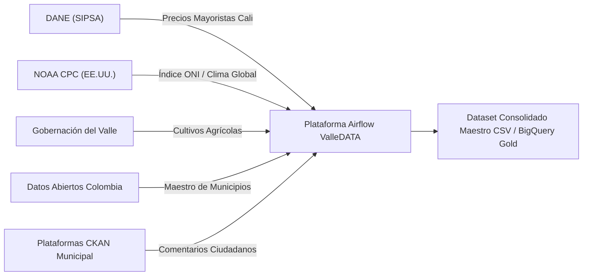

# Documentación Oficial de DAGs y Conexiones de Airflow

**Proyecto:** `pyimport` / `airflow` (Plataforma ValleDATA: Sistema Integrado de Cultivos, Precios SIPSA, Clima ONI y Comentarios Ciudadanos)  
**Versión:** 1.1.0  
**Fecha de Actualización:** 25 de Agosto de 2026  
**Entorno de Orquestación:** Apache Airflow / Google Cloud Composer / Astronomer (Astro CLI)

---

## Tabla de Contenidos

1. [Sección 1: Visión de Negocio y Ejecutiva (Personal Administrativo)](#sección-1-visión-de-negocio-y-ejecutiva-personal-administrativo)
   - [Resumen Ejecutivo](#resumen-ejecutivo)
   - [Fuentes de Información Externas](#fuentes-de-información-externas)
   - [Matriz Resumen de Conexiones de Airflow](#matriz-resumen-de-conexiones-de-airflow)
   - [Resumen de los 13 DAGs de la Plataforma](#resumen-de-los-13-dags-de-la-plataforma)
2. [Sección 2: Vista de Conexiones en Airflow](#sección-2-vista-de-conexiones-en-airflow)
   - [Ubicación en la Interfaz Web (Admin -> Connections)](#ubicación-en-la-interfaz-web-admin---connections)
   - [Archivos de Configuración (`connections.yaml` & `airflow_settings.yaml`)](#archivos-de-configuración-connectionsyaml--airflow_settingsyaml)
   - [Mecanismo de Fallback y Seguridad](#mecanismo-de-fallback-y-seguridad)
3. [Sección 3: Especificación Técnica de DAGs por Capa Medallion](#sección-3-especificación-técnica-de-dags-por-capa-medallion)
   - [Diagrama de Arquitectura del Sistema (Ingest, Load, Transform)](#diagrama-de-arquitectura-del-sistema-ingest-load-transform)
   - [Capa Ingesta (DAGs `src_ingest_*`)](#capa-ingesta-dags-src_ingest_)
   - [Capa Carga / Bronze (DAGs `src_load_*`)](#capa-carga--bronze-dags-src_load_)
   - [Capa Transformación / Gold (DAGs `src_transform_*`)](#capa-transformación--gold-dags-src_transform_)
4. [Sección 4: Alarmas, Resiliencia y Compatibilidad Airflow 2/3](#sección-4-alarmas-resiliencia-y-compatibilidad-airflow-23)
   - [Módulo de Alarmas y Excepciones (`src_common.py`)](#módulo-de-alarmas-y-excepciones-src_commonpy)
   - [Soporte Dual Composer 2 y Composer 3](#soporte-dual-composer-2-y-composer-3)
5. [Sección 5: Guía de Operación, Despliegue y Mantenimiento](#sección-5-guía-de-operación-despliegue-y-mantenimiento)
   - [Comandos de Inicialización y Reinicio Astro CLI](#comandos-de-inicialización-y-reinicio-astro-cli)
   - [Ejecución desde CLI `pyimport`](#ejecución-desde-cli-pyimport)
   - [Ejecución de Pruebas Unitarias Automatizadas](#ejecución-de-pruebas-unitarias-automatizadas)

---

## Sección 1: Visión de Negocio y Ejecutiva (Personal Administrativo)

### Resumen Ejecutivo

El sistema de pipelines en Apache Airflow tiene como objetivo automatizar la recopilación, procesamiento y cruce analítico de información estratégica relacionada con el sector agrícola y la participación ciudadana en el departamento del Valle del Cauca.

Este sistema permite auditar y predecir el impacto de fenómenos climáticos globales (*El Niño* y *La Niña*) sobre los volúmenes de producción agrícola regional y los precios de los alimentos en la Central Mayorista de Cali (Cavasa / SIPSA DANE), integrando además el análisis de sentimiento sobre la retroalimentación de la ciudadanía en la plataforma de datos abiertos.

---

### Fuentes de Información Externas

El sistema se conecta automáticamente a cinco fuentes oficiales de datos públicos e institucionales:



1. **DANE - SIPSA (Sistema de Información de Precios del Sector Agropecuario):** Precios mensuales de alimentos reportados por kilogramo en la plaza mayorista Cavasa de Cali.
2. **NOAA CPC (Climate Prediction Center - EE.UU.):** Anomalías mensuales de temperatura en la superficie del Océano Pacífico (Índice ONI v5) para categorizar años con fenómeno de *El Niño*, *La Niña* o *Neutro*.
3. **Gobernación del Valle del Cauca (Portal Datos Abiertos):** Hectáreas sembradas, cosechadas y rendimiento (toneladas por hectárea) para cultivos permanentes y transitorios por municipio.
4. **Datos Abiertos Colombia (`datos.gov.co`):** Catálogo oficial de municipios del Valle del Cauca con códigos DIVIPOLA.
5. **Plataforma CKAN Municipal:** Registros de opiniones y comentarios de la ciudadanía procesados con modelos de Inteligencia Artificial de Análisis de Sentimiento.

---

### Matriz Resumen de Conexiones de Airflow

| ID de Conexión (`Conn ID`) | Tipo | Host / URL Base | Entidad Propietaria | Propósito y Uso en Negocio |
| :--- | :--- | :--- | :--- | :--- |
| `sipsa_dane` | `http` | `https://www.dane.gov.co` | DANE (Colombia) | Descarga automática de anexos en Excel de precios mensuales de alimentos. |
| `noaa_oni` | `http` | `https://www.cpc.ncep.noaa.gov` | NOAA (Estados Unidos) | Extracción de la tabla histórica del Índice Oceánico del Niño (ONI v5). |
| `gobernacion_valle` | `http` | `https://datosabiertos.valledelcauca.gov.co` | Gobernación del Valle | Descarga de datasets CSV de cultivos permanentes y transitorios municipales. |

---

### Resumen de los DAGs de la Plataforma

| ID del DAG | Capa Medallion | Frecuencia | Estado / Observación | Producto Generado (`Output`) |
| :--- | :--- | :--- | :--- | :--- |
| `src_ingest_sipsa` | Ingesta (Raw) | Mensual | Activo | `data/raw/sipsa/anex_mensual_*.xlsx` |
| `src_load_sipsa` | Carga (Bronze) | A demanda | Activo | Tabla `stg_sipsa` / Precios promedios anuales Cali |
| `src_ingest_oni` | Ingesta (Raw) | Mensual | Activo | `data/raw/oni_v5.html` |
| `src_load_oni` | Carga (Bronze) | A demanda | Activo | Tabla `stg_oni` / `oni_promedio_anual.csv` |
| `src_ingest_crops` | Ingesta (Raw) | Mensual | Activo | `data/raw/cultivos_permanentes.csv` y `transitorios.csv` |
| `src_load_crops` | Carga (Bronze) | A demanda | Activo | Tabla `stg_crops` / `cultivos_valle.csv` |
| `src_transform_crops` | Transformación (Silver) | A demanda | Activo | Alias de transformación consolidada agrícola |
| `src_ingest_municipios` | Ingesta (Raw) | Semestral | Activo | `data/raw/municipios_valle.csv` |
| `src_load_municipios` | Carga (Bronze) | A demanda | Activo | Tabla `stg_municipios` normalizada |
| `src_ingest_ckan_comentarios` | Ingesta (Raw) | Diaria / Mensual | Plantilla | `data/raw/ckan_comentarios.json` |
| `src_load_ckan_comentarios` | Carga (Bronze) | A demanda | Plantilla | Tabla `bronze_comentarios` |
| `src_transform_ckan_comentarios` | Transformación (Silver) | A demanda | Plantilla | Tabla `silver_comentarios` (Clasificación NLP Sentimiento) |
| `src_transform_consolidado` | Transformación (Gold) | A demanda | Activo | `dataset_consolidado_valle.csv` / BigQuery Gold Master |
| `src_importacion_sentimiento` | Pipeline Sentimiento | Diaria (`@daily`) | **Deshabilitado / Pausado** (`is_paused_upon_creation=True`) | Ejecuta Ingesta -> Bronze -> Silver de Comentarios CKAN |
| `src_importacion_cultivos` | Orquestador Medallón | Anual (`@yearly`) | Activo | Ejecuta ordenadamente Cultivos -> Precios -> ONI -> Geografía -> Silver -> Capa Gold GIS |


---

## Sección 2: Vista de Conexiones en Airflow

### Ubicación en la Interfaz Web (Admin -> Connections)

En la consola de Apache Airflow, el personal administrativo o de desarrollo puede consultar y editar el listado de conexiones navegando en el menú superior a **Admin -> Connections**:

```
 ┌───────────────────────────────────────────────────────────┐
 ├─ DAGs   Runs   Jobs   Audit Logs   [Admin ▾]   Docs       │
 └──────────────────────────────────────┬────────────────────┘
                                        ├─ Variables
                                        ├─ Connections  <-- (Aquí se visualizan)
                                        └─ Pools
```

Al abrir **Connections**, se muestra la lista de endpoints registrados:

| Conn Id | Conn Type | Host | Description |
| :--- | :--- | :--- | :--- |
| `gobernacion_valle` | HTTP | `https://datosabiertos.valledelcauca.gov.co` | Conexión HTTP al portal de Datos Abiertos de la Gobernación del Valle |
| `noaa_oni` | HTTP | `https://www.cpc.ncep.noaa.gov` | Conexión HTTP al portal NOAA CPC para consulta del índice ONI |
| `sipsa_dane` | HTTP | `https://www.dane.gov.co` | Conexión HTTP al portal DANE SIPSA para descarga de anexos de precios |

---

### Archivos de Configuración (`connections.yaml` & `airflow_settings.yaml`)

Para mantener la infraestructura como código, las conexiones están respaldadas en dos archivos declarativos:

#### 1. Archivo Estándar de Airflow: `connections.yaml`
Permite importar las conexiones usando el comando CLI nativo de Airflow (`airflow connections import connections.yaml`):

```yaml
sipsa_dane:
  conn_type: http
  host: https://www.dane.gov.co
  description: "Conexión HTTP al portal DANE SIPSA para descarga de anexos mensuales de precios"

noaa_oni:
  conn_type: http
  host: https://www.cpc.ncep.noaa.gov
  description: "Conexión HTTP al portal NOAA CPC para consulta del índice El Niño/La Niña (ONI)"

gobernacion_valle:
  conn_type: http
  host: https://datosabiertos.valledelcauca.gov.co
  description: "Conexión HTTP al portal de Datos Abiertos de la Gobernación del Valle del Cauca"
```

#### 2. Archivo para Desarrollo Local Astronomer: `airflow_settings.yaml`
Utilizado por el entorno Astro CLI (`http://airflow.localhost:6563`):

```yaml
airflow:
  connections:
    - conn_id: sipsa_dane
      conn_type: http
      conn_host: https://www.dane.gov.co
    - conn_id: noaa_oni
      conn_type: http
      conn_host: https://www.cpc.ncep.noaa.gov
    - conn_id: gobernacion_valle
      conn_type: http
      conn_host: https://datosabiertos.valledelcauca.gov.co
```

---

### Mecanismo de Fallback y Seguridad

> [!NOTE]
> **Resiliencia Operativa**: El módulo interno `connections.py` consulta primero la base de datos de Airflow mediante `BaseHook.get_connection(conn_id)`. Si Airflow no está activo o la conexión no ha sido creada en el entorno de pruebas, el sistema conmuta automáticamente (*fallback*) al host por defecto sin interrumpir la ejecución del código.

---

## Sección 3: Especificación Técnica de DAGs por Capa Medallion

### Diagrama de Arquitectura del Sistema (Ingest, Load, Transform)

```mermaid
graph TD
    subgraph Capa Ingesta (Raw)
        I1["src_ingest_sipsa"]
        I2["src_ingest_oni"]
        I3["src_ingest_crops"]
        I4["src_ingest_municipios"]
        I5["src_ingest_ckan_comentarios"]
    end

    subgraph Capa Carga (Bronze)
        L1["src_load_sipsa"]
        L2["src_load_oni"]
        L3["src_load_crops"]
        L4["src_load_municipios"]
        L5["src_load_ckan_comentarios"]
    end

    subgraph Capa Transformacion (Silver / Gold)
        T1["src_transform_crops"]
        T2["src_transform_ckan_comentarios"]
        T3["src_transform_consolidado"]
    end

    I1 --> L1 --> T3
    I2 --> L2 --> T3
    I3 --> L3 --> T1 --> T3
    I4 --> L4 --> T3
    I5 --> L5 --> T2
```

---

### Capa Ingesta (DAGs `src_ingest_*`)

#### 1. `src_ingest_sipsa`
- **Archivo:** [src_ingest_sipsa.py](file:///home/jjvallej/work/enigma/pyimport/dags/gdv_general_dbt_dag/dags_valledata/src_ingest_sipsa.py)
- **Conexión:** `sipsa_dane`
- **Etiquetas:** `valledata`, `sipsa`, `ingest`, `connection:sipsa_dane`
- **Código:**
```python
@dag(
    dag_id="src_ingest_sipsa",
    description="Etapa Ingest Precios SIPSA (Descarga Anexos DANE)",
    start_date=datetime(2000, 1, 1),
    schedule=None,
    catchup=False,
    tags=["valledata", "sipsa", "ingest", "connection:sipsa_dane"],
    **get_airflow_dag_kwargs(),
)
def ingest_sipsa_dag():
    @task(task_id="run_ingest_sipsa")
    def execute_ingest() -> dict[str, object]:
        return run_with_airflow_alarm(run_ingest_sipsa)

    execute_ingest()
```

#### 2. `src_ingest_oni`
- **Archivo:** [src_ingest_oni.py](file:///home/jjvallej/work/enigma/pyimport/dags/gdv_general_dbt_dag/dags_valledata/src_ingest_oni.py)
- **Conexión:** `noaa_oni`
- **Etiquetas:** `valledata`, `oni`, `ingest`, `connection:noaa_oni`

#### 3. `src_ingest_crops`
- **Archivo:** [src_ingest_crops.py](file:///home/jjvallej/work/enigma/pyimport/dags/gdv_general_dbt_dag/dags_valledata/src_ingest_crops.py)
- **Conexión:** `gobernacion_valle`
- **Etiquetas:** `valledata`, `cultivos`, `ingest`, `connection:gobernacion_valle`

#### 4. `src_ingest_municipios`
- **Archivo:** [src_ingest_municipios.py](file:///home/jjvallej/work/enigma/pyimport/dags/gdv_general_dbt_dag/dags_valledata/src_ingest_municipios.py)
- **Fuente:** `datos.gov.co`

#### 5. `src_ingest_ckan_comentarios`
- **Archivo:** [src_ingest_ckan_comentarios.py](file:///home/jjvallej/work/enigma/pyimport/dags/gdv_general_dbt_dag/dags_valledata/src_ingest_ckan_comentarios.py)
- **Fuente:** Instancias CKAN municipal

---

### Capa Carga / Bronze (DAGs `src_load_*`)

#### 6. `src_load_sipsa`
- **Archivo:** [src_load_sipsa.py](file:///home/jjvallej/work/enigma/pyimport/dags/gdv_general_dbt_dag/dags_valledata/src_load_sipsa.py)
- **Etiquetas:** `valledata`, `sipsa`, `load`, `bronze`

#### 7. `src_load_oni`
- **Archivo:** [src_load_oni.py](file:///home/jjvallej/work/enigma/pyimport/dags/gdv_general_dbt_dag/dags_valledata/src_load_oni.py)
- **Etiquetas:** `valledata`, `oni`, `load`, `bronze`

#### 8. `src_load_crops`
- **Archivo:** [src_load_crops.py](file:///home/jjvallej/work/enigma/pyimport/dags/gdv_general_dbt_dag/dags_valledata/src_load_crops.py)
- **Etiquetas:** `valledata`, `cultivos`, `load`, `bronze`

#### 9. `src_load_municipios`
- **Archivo:** [src_load_municipios.py](file:///home/jjvallej/work/enigma/pyimport/dags/gdv_general_dbt_dag/dags_valledata/src_load_municipios.py)
- **Etiquetas:** `valledata`, `municipios`, `load`, `bronze`

#### 10. `src_load_ckan_comentarios`
- **Archivo:** [src_load_ckan_comentarios.py](file:///home/jjvallej/work/enigma/pyimport/dags/gdv_general_dbt_dag/dags_valledata/src_load_ckan_comentarios.py)
- **Etiquetas:** `valledata`, `ckan`, `comentarios`, `load`

---

### Capa Transformación / Gold (DAGs `src_transform_*`)

#### 11. `src_transform_crops`
- **Archivo:** [src_transform_crops.py](file:///home/jjvallej/work/enigma/pyimport/dags/gdv_general_dbt_dag/dags_valledata/src_transform_crops.py)
- **Descripción:** Alias de compatibilidad del consolidado Silver agrícola.

#### 12. `src_transform_ckan_comentarios`
- **Archivo:** [src_transform_ckan_comentarios.py](file:///home/jjvallej/work/enigma/pyimport/dags/gdv_general_dbt_dag/dags_valledata/src_transform_ckan_comentarios.py)
- **Descripción:** Análisis de sentimiento NLP (pysentimiento / VADER) sobre comentarios.

#### 13. `src_transform_consolidado` (Consolidador Maestro Gold)
- **Archivo:** [src_transform_consolidado.py](file:///home/jjvallej/work/enigma/pyimport/dags/gdv_general_dbt_dag/dags_valledata/src_transform_consolidado.py)
- **Etiquetas:** `valledata`, `consolidado`, `transform`, `silver`
- **Código:**
```python
@dag(
    dag_id="src_transform_consolidado",
    description="Único Silver: cultivos+SIPSA+ONI por año/municipio/cultivo/semestre",
    start_date=datetime(2000, 1, 1),
    schedule=None,
    catchup=False,
    tags=["valledata", "consolidado", "transform", "silver"],
    **get_airflow_dag_kwargs(),
)
def transform_consolidado_dag():
    @task(task_id="run_transform_consolidado")
    def execute_transform() -> dict[str, object]:
        return run_with_airflow_alarm(run_transform_consolidado)

    execute_transform()
```

#### 14. `src_importacion_sentimiento`
- **Archivo:** [src_importacion_sentimiento.py](file:///home/jjvallej/work/enigma/pyimport/dags/gdv_general_dbt_dag/dags_valledata/src_importacion_sentimiento.py)
- **Frecuencia:** Diaria (`@daily`)
- **Estado Inicial:** **Pausado / Deshabilitado** (`is_paused_upon_creation=True`) por problemas de conectividad con la red / PostgreSQL CKAN.
- **Etiquetas:** `valledata`, `sentimiento`, `ckan`, `diario`, `deshabilitado`
- **Propósito:** Ejecuta secuencialmente la ingesta, carga bronze y transformación silver de los comentarios de sentimiento CKAN.

#### 15. `src_importacion_cultivos`
- **Archivo:** [src_importacion_cultivos.py](file:///home/jjvallej/work/enigma/pyimport/dags/gdv_general_dbt_dag/dags_valledata/src_importacion_cultivos.py)
- **Frecuencia:** Anual (`@yearly`)
- **Estado Inicial:** Activo
- **Etiquetas:** `valledata`, `cultivos`, `sipsa`, `oni`, `municipios`, `gold`, `anual`
- **Propósito:** Orquestador Maestro anual que dispara ordenadamente los DAGs dependientes hasta llegar a la Capa Gold GIS:
  1. **Cultivos** (`src_ingest_crops` -> `src_load_crops` -> `src_transform_crops`)
  2. **Índice de Precios** (`src_ingest_sipsa` -> `src_load_sipsa`)
  3. **ONI / Clima** (`src_ingest_oni` -> `src_load_oni`)
  4. **Distribución Geográfica** (`src_ingest_municipios` -> `src_load_municipios`)
  5. **Consolidado Silver** (`src_transform_consolidado`)
  6. **Capa Gold Espacial** (`src_transform_spatial`)

---


## Sección 4: Alarmas, Resiliencia y Compatibilidad Airflow 2/3

### Módulo de Alarmas y Excepciones (`src_common.py`)

Todos los DAGs utilizan el helper centralizado `src_common.py`:
- `get_airflow_dag_kwargs()`: Suministra reintentos (`retries`), intervalo entre reintentos y la función callback `on_failure_callback`.
- `run_with_airflow_alarm()`: Captura y registra errores garantizando que no se silencie ninguna falla operativa.

> [!TIP]
> **Matriz Oficial de Eventos de Alarmas**: Consulte el documento completo de especificación de alarmas, códigos de falla (`ALT-ING-*`, `ALT-LOD-*`, `ALT-TRF-*`, `ALT-SYS-*`), severidades y guías de remediación en [MATRIZ_DE_EVENTOS_ALARMAS_DAGS.md](file:///home/jjvallej/work/enigma/pyimport/MATRIZ_DE_EVENTOS_ALARMAS_DAGS.md).

### Soporte Dual Composer 2 y Composer 3

Para asegurar total portabilidad entre entornos legacy y modernos:
```python
try:
    from airflow.sdk import dag as _af_dag, task as _af_task
except ImportError:
    from airflow.decorators import dag as _af_dag, task as _af_task
```

---

## Sección 5: Guía de Operación, Despliegue y Mantenimiento

### Comandos de Inicialización y Reinicio Astro CLI

```bash
cd /home/jjvallej/work/enigma/airflow
astro dev restart
```

### Ejecución desde CLI `pyimport`

```bash
cd /home/jjvallej/work/enigma/pyimport
.venv/bin/pyimport --script src_ingest_sipsa
.venv/bin/pyimport --script src_load_sipsa
.venv/bin/pyimport --script src_transform_consolidado
```

### Ejecución de Pruebas Unitarias Automatizadas

```bash
cd /home/jjvallej/work/enigma/pyimport
.venv/bin/pytest
```

**Resultado de Pruebas:** 38 passed.
