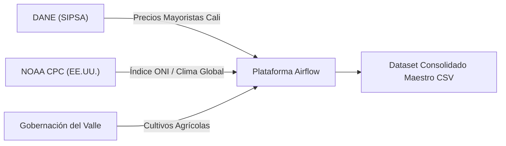
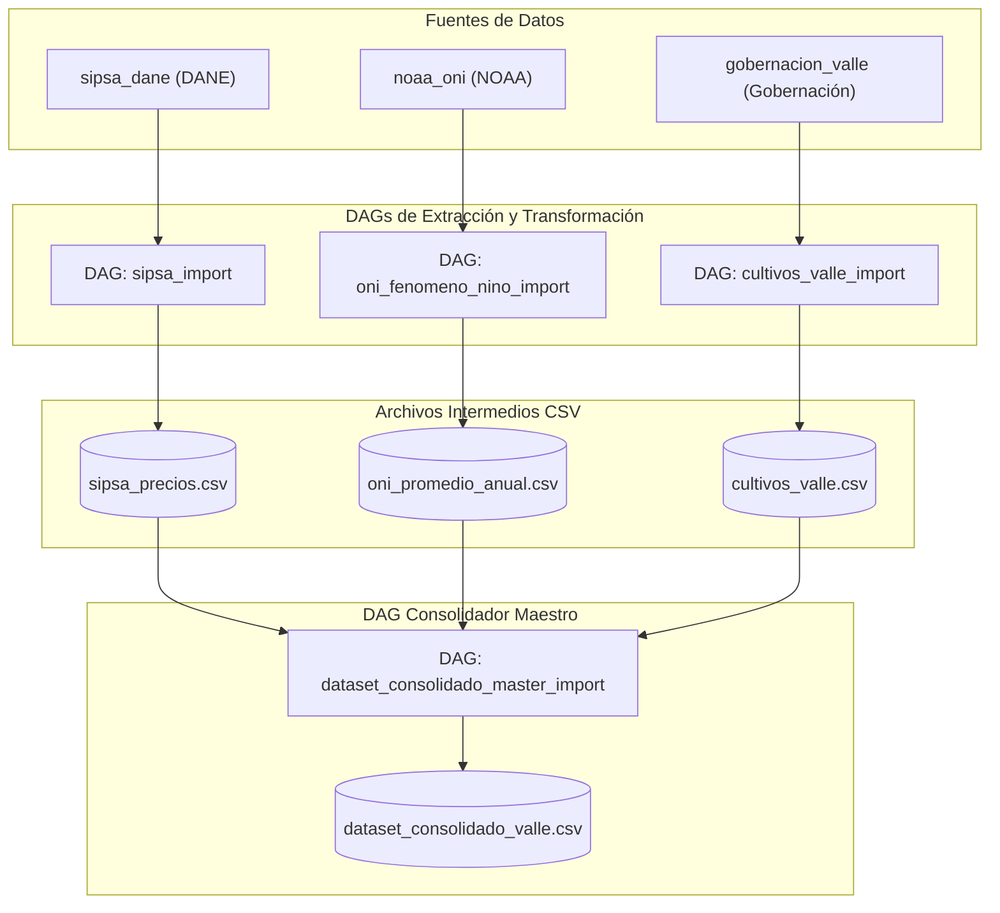
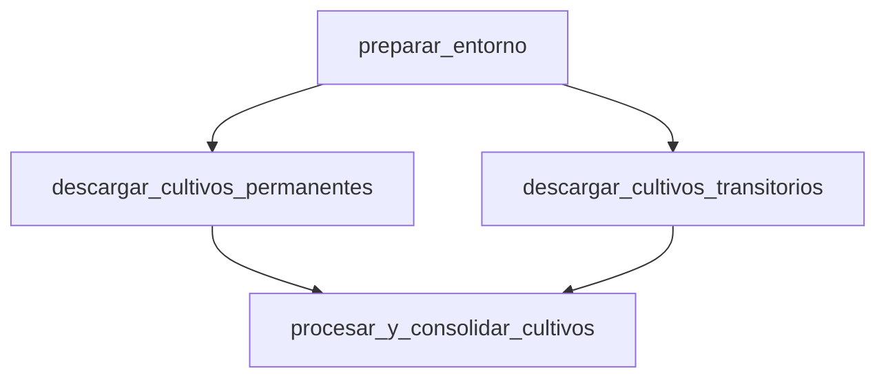
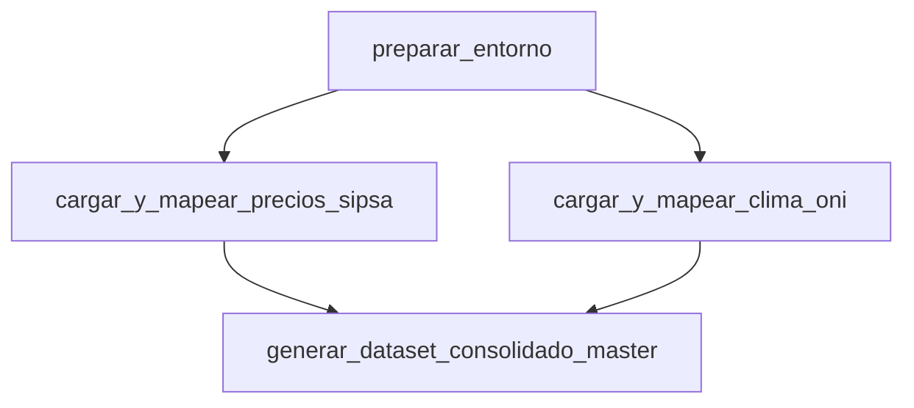

# Documentación Oficial de DAGs y Conexiones de Airflow

**Proyecto:** `pyimport` / `airflow` (Sistema Integrado de Importación Agrícola, Precios SIPSA y Clima El Niño/La Niña)  
**Versión:** 1.0.0  
**Fecha:** Julio 2026  
**Entorno de Orquestación:** Apache Airflow / Astronomer (Astro CLI)

---

## Tabla de Contenidos

1. [Sección 1: Visión de Negocio y Ejecutiva (Personal Administrativo)](#sección-1-visión-de-negocio-y-ejecutiva-personal-administrativo)
   - [Resumen Ejecutivo](#resumen-ejecutivo)
   - [Fuentes de Información Externas](#fuentes-de-información-externas)
   - [Matriz Resumen de Conexiones de Airflow](#matriz-resumen-de-conexiones-de-airflow)
   - [Resumen de los DAGs y Entregables](#resumen-de-los-dags-y-entregables)
2. [Sección 2: Vista de Conexiones en Airflow](#sección-2-vista-de-conexiones-en-airflow)
   - [Ubicación en la Interfaz Web (Admin -> Connections)](#ubicación-en-la-interfaz-web-admin---connections)
   - [Archivos de Configuración (`connections.yaml` & `airflow_settings.yaml`)](#archivos-de-configuración-connectionsyaml--airflow_settingsyaml)
   - [Mecanismo de Fallback y Seguridad](#mecanismo-de-fallback-y-seguridad)
3. [Sección 3: Especificación Técnica de DAGs (Personal de Desarrollo)](#sección-3-especificación-técnica-de-dags-personal-de-desarrollo)
   - [Diagrama de Arquitectura del Sistema](#diagrama-de-arquitectura-del-sistema)
   - [DAG 1: `sipsa_import` (Importación Precios SIPSA DANE)](#dag-1-sipsa_import-importación-precios-sipsa-dane)
   - [DAG 2: `oni_fenomeno_nino_import` (Indicador ONI NOAA)](#dag-2-oni_fenomeno_nino_import-indicador-oni-noaa)
   - [DAG 3: `cultivos_valle_import` (Cultivos Agrícolas Valle del Cauca)](#dag-3-cultivos_valle_import-cultivos-agrícolas-valle-del-cauca)
   - [DAG 4: `dataset_consolidado_master_import` (Consolidación Maestra)](#dag-4-dataset_consolidado_master_import-consolidación-maestra)
4. [Sección 4: Guía de Operación, Despliegue y Mantenimiento](#sección-4-guía-de-operación-despliegue-y-mantenimiento)
   - [Comandos de Inicialización y Reinicio](#comandos-de-inicialización-y-reinicio)
   - [Ejecución de Pruebas Unitarias](#ejecución-de-pruebas-unitarias)

---

## Sección 1: Visión de Negocio y Ejecutiva (Personal Administrativo)

### Resumen Ejecutivo

El sistema de pipelines en Apache Airflow tiene como objetivo automatizar la recopilación, procesamiento y cruce analítico de información estratégica relacionada con el sector agrícola en el departamento del Valle del Cauca.

Este sistema permite auditar y predecir el impacto de fenómenos climáticos globales (*El Niño* y *La Niña*) sobre los volúmenes de producción agrícola regional y los precios de los alimentos en la Central Mayorista de Cali (Cavasa / SIPSA DANE).

---

### Fuentes de Información Externas

El sistema se conecta automáticamente a tres fuentes oficiales de datos de acceso público:



1. **DANE - SIPSA (Sistema de Información de Precios del Sector Agropecuario)**:
   - *Datos:* Precios mensuales de alimentos reportados por kilogramo en la plaza mayorista de Cali.
2. **NOAA CPC (Climate Prediction Center - EE.UU.)**:
   - *Datos:* Anomalías mensuales de temperatura en la superficie del Océano Pacífico (Índice ONI v5) para categorizar años con fenómeno de *El Niño*, *La Niña* o *Neutro*.
3. **Gobernación del Valle del Cauca (Portal Datos Abiertos)**:
   - *Datos:* Hectáreas sembradas, cosechadas y rendimiento (toneladas por hectárea) para cultivos permanentes y transitorios por municipio.

---

### Matriz Resumen de Conexiones de Airflow

Las conexiones representan los puentes de comunicación configurados en Apache Airflow. A continuación se describe la función administrativa de cada una:

| ID de Conexión (`Conn ID`) | Tipo | Host / URL Base | Entidad Propietaria | Propósito y Uso en Negocio |
| :--- | :--- | :--- | :--- | :--- |
| `sipsa_dane` | `http` | `https://www.dane.gov.co` | DANE (Colombia) | Descarga automática de anexos en Excel de precios mensuales de alimentos. |
| `noaa_oni` | `http` | `https://www.cpc.ncep.noaa.gov` | NOAA (Estados Unidos) | Extracción de la tabla histórica del Índice Oceánico del Niño (ONI v5). |
| `gobernacion_valle` | `http` | `https://datosabiertos.valledelcauca.gov.co` | Gobernación del Valle | Descarga de datasets CSV de cultivos permanentes y transitorios municipales. |

---

### Resumen de los DAGs y Entregables

| ID del DAG | Nombre Descriptivo | Frecuencia Sugerida | Producto Generado (`Output`) |
| :--- | :--- | :--- | :--- |
| `sipsa_import` | Importación SIPSA Precios | Mensual | `data/sipsa_precios.csv` |
| `oni_fenomeno_nino_import` | Indicador Clima ONI NOAA | Trimestral / Anual | `data/oni_promedio_anual.csv` |
| `cultivos_valle_import` | Cultivos Agrícolas Valle | Anual | `data/cultivos_valle.csv` |
| `dataset_consolidado_master_import` | Consolidación Maestra | A demanda / Post-importación | `data/dataset_consolidado_valle.csv` |

---

## Sección 2: Vista de Conexiones en Airflow

### Ubicación en la Interfaz Web (Admin -> Connections)

En la consola de Apache Airflow, el personal administrativo o de desarrollo puede consultar y editar el listado de conexiones navegando en el menú superior a **Admin -> Connections**:

```
 ┌───────────────────────────────────────────────────────────┐
 ├─ DAGs   Runs   Jobs   Audit Logs   [Admin ▾]   Docs       │
 └──────────────────────────────────────┬────────────────────┘
                                        ├─ Variables
                                        ├─ Connections  <-- (Aquí se visualizan)
                                        └─ Pools
```

Al abrir **Connections**, se muestra la lista de endpoints registrados:

| Conn Id | Conn Type | Host | Description |
| :--- | :--- | :--- | :--- |
| `gobernacion_valle` | HTTP | `https://datosabiertos.valledelcauca.gov.co` | Conexión HTTP al portal de Datos Abiertos de la Gobernación del Valle |
| `noaa_oni` | HTTP | `https://www.cpc.ncep.noaa.gov` | Conexión HTTP al portal NOAA CPC para consulta del índice ONI |
| `sipsa_dane` | HTTP | `https://www.dane.gov.co` | Conexión HTTP al portal DANE SIPSA para descarga de anexos de precios |

---

### Archivos de Configuración (`connections.yaml` & `airflow_settings.yaml`)

Para mantener la infraestructura como código, las conexiones están respaldadas en dos archivos declarativos:

#### 1. Archivo Estándar de Airflow: `connections.yaml`
Permite importar las conexiones usando el comando CLI nativo de Airflow (`airflow connections import connections.yaml`):

```yaml
sipsa_dane:
  conn_type: http
  host: https://www.dane.gov.co
  description: "Conexión HTTP al portal DANE SIPSA para descarga de anexos mensuales de precios"

noaa_oni:
  conn_type: http
  host: https://www.cpc.ncep.noaa.gov
  description: "Conexión HTTP al portal NOAA CPC para consulta del índice El Niño/La Niña (ONI)"

gobernacion_valle:
  conn_type: http
  host: https://datosabiertos.valledelcauca.gov.co
  description: "Conexión HTTP al portal de Datos Abiertos de la Gobernación del Valle del Cauca"
```

#### 2. Archivo para Desarrollo Local Astronomer: `airflow_settings.yaml`
Utilizado por el entorno Astro CLI (`http://airflow.localhost:6563`):

```yaml
airflow:
  connections:
    - conn_id: sipsa_dane
      conn_type: http
      conn_host: https://www.dane.gov.co
    - conn_id: noaa_oni
      conn_type: http
      conn_host: https://www.cpc.ncep.noaa.gov
    - conn_id: gobernacion_valle
      conn_type: http
      conn_host: https://datosabiertos.valledelcauca.gov.co
```

---

### Mecanismo de Fallback y Seguridad

> [!NOTE]
> **Resiliencia Operativa**: El módulo interno `connections.py` consulta primero la base de datos de Airflow mediante `BaseHook.get_connection(conn_id)`. Si Airflow no está activo o la conexión no ha sido creada, el sistema conmuta automáticamente (*fallback*) al host por defecto sin interrumpir la ejecución de los scripts.

---

## Sección 3: Especificación Técnica de DAGs (Personal de Desarrollo)

### Diagrama de Arquitectura del Sistema



---

### DAG 1: `sipsa_import` (Importación Precios SIPSA DANE)

- **ID DAG:** `sipsa_import`
- **Archivo:** [sipsa_airflow_dag.py](file:///home/jjvallej/work/enigma/pyimport/dags/sipsa_airflow_dag.py)
- **Conexión Utilizada:** `sipsa_dane`
- **Etiquetas:** `pyimport`, `sipsa`, `connection:sipsa_dane`
- **Parámetros:**
  - `start`: Periodo inicial (por defecto `"2015-02"`)
  - `end`: Periodo final (por defecto `"2026-06"`)

#### Grafo de Dependencias del DAG


#### Código Fuente del DAG (`sipsa_airflow_dag.py`)

```python
from __future__ import annotations

from datetime import datetime
from pathlib import Path
import sys

PROJECT_ROOT = Path(__file__).resolve().parents[1]
DAGS_DIR = Path(__file__).resolve().parent
SRC_DIR = PROJECT_ROOT / "src"
for p in (str(DAGS_DIR), str(SRC_DIR), str(PROJECT_ROOT)):
    if p not in sys.path:
        sys.path.insert(0, p)

from airflow.decorators import dag, task

from pyimport.airflow_adapter import (
    download_attachments,
    extract_and_process_prices,
    generate_consolidated_csv,
)
from pyimport.connections import register_connections_in_airflow


@dag(
    dag_id="sipsa_import",
    description="Descarga, extrae y consolida anexos mensuales SIPSA (DANE) mediante la conexión sipsa_dane",
    start_date=datetime(2024, 1, 1),
    schedule=None,
    catchup=False,
    tags=["pyimport", "sipsa", "connection:sipsa_dane"],
    params={
        "start": "2015-02",
        "end": "2026-06",
    },
)
def sipsa_import_pipeline():

    @task(task_id="preparar_entorno")
    def preparar_entorno(**context: object) -> dict[str, str]:
        """1. Resuelve configuración de rutas, asegura conexiones en Airflow UI y prepara carpetas."""
        register_connections_in_airflow()
        params = context.get("params") or {}
        base_dir = PROJECT_ROOT / "data"
        download_dir = params.get("download_dir") or str(base_dir / "raw")
        output = params.get("output") or str(base_dir / "sipsa_precios.csv")

        Path(download_dir).mkdir(parents=True, exist_ok=True)
        Path(output).parent.mkdir(parents=True, exist_ok=True)

        return {
            "start": str(params.get("start", "2015-02")),
            "end": str(params.get("end", "2026-06")),
            "download_dir": download_dir,
            "output": output,
        }

    @task(task_id="descargar_anexos_sipsa")
    def descargar_anexos(config: dict[str, str]) -> dict[str, list[str]]:
        """2. Descarga los anexos mensuales Excel de la página del DANE."""
        return download_attachments(
            start_period=config["start"],
            end_period=config["end"],
            download_dir=config["download_dir"],
        )

    @task(task_id="extraer_y_procesar_precios")
    def extraer_precios(download_info: dict[str, list[str]]) -> list[dict[str, str]]:
        """3. Lee los archivos Excel y extrae las filas de alimentos y precios."""
        files = download_info.get("downloaded", [])
        return extract_and_process_prices(files)

    @task(task_id="generar_csv_consolidado")
    def generar_csv(
        rows_data: list[dict[str, str]], config: dict[str, str]
    ) -> dict[str, object]:
        """4. Consolida y escribe los registros en el archivo CSV final."""
        result = generate_consolidated_csv(rows_data, config["output"])
        print(f"✅ Proceso completado. Filas escritas: {result['rows']}")
        print(f"📄 Archivo CSV generado en: {result['output']}")
        return result

    # Conexión del flujo de tareas en Airflow
    config = preparar_entorno()
    download_info = descargar_anexos(config)
    rows = extraer_precios(download_info)
    generar_csv(rows, config)


dag = sipsa_import_pipeline()
```

---

### DAG 2: `oni_fenomeno_nino_import` (Indicador ONI NOAA)

- **ID DAG:** `oni_fenomeno_nino_import`
- **Archivo:** [oni_valle_dag.py](file:///home/jjvallej/work/enigma/pyimport/dags/oni_valle_dag.py)
- **Conexión Utilizada:** `noaa_oni`
- **Etiquetas:** `pyimport`, `oni`, `noaa`, `nino`, `nina`, `connection:noaa_oni`

#### Grafo de Dependencias del DAG


#### Código Fuente del DAG (`oni_valle_dag.py`)

```python
from __future__ import annotations

from datetime import datetime
from pathlib import Path
import sys

PROJECT_ROOT = Path(__file__).resolve().parents[1]
DAGS_DIR = Path(__file__).resolve().parent
SRC_DIR = PROJECT_ROOT / "src"
for p in (str(DAGS_DIR), str(SRC_DIR), str(PROJECT_ROOT)):
    if p not in sys.path:
        sys.path.insert(0, p)

from airflow.decorators import dag, task

from pyimport.connections import register_connections_in_airflow
from pyimport.oni import (
    NOAA_ONI_URL,
    download_oni_html,
    process_and_generate_oni_csv,
)


@dag(
    dag_id="oni_fenomeno_nino_import",
    description="Descarga datos de El Niño/La Niña (NOAA ONI v5) usando la conexión noaa_oni y compila un CSV con el promedio por año",
    start_date=datetime(2024, 1, 1),
    schedule=None,
    catchup=False,
    tags=["pyimport", "oni", "noaa", "nino", "nina", "connection:noaa_oni"],
)
def oni_valle_pipeline():

    @task(task_id="preparar_entorno")
    def preparar_entorno(**context: object) -> dict[str, str]:
        """1. Prepara las carpetas de trabajo, asegura conexiones en Airflow UI y define rutas."""
        register_connections_in_airflow()
        params = context.get("params") or {}
        base_dir = PROJECT_ROOT / "data"
        raw_dir = base_dir / "raw"
        output_file = params.get("output") or str(base_dir / "oni_promedio_anual.csv")

        raw_dir.mkdir(parents=True, exist_ok=True)
        Path(output_file).parent.mkdir(parents=True, exist_ok=True)

        return {
            "html_file": str(raw_dir / "oni_v5.html"),
            "output_file": str(output_file),
        }

    @task(task_id="descargar_html_oni")
    def descargar_oni(config: dict[str, str]) -> str:
        """2. Descarga la página HTML con la tabla del índice ONI de la NOAA."""
        dest = Path(config["html_file"])
        download_oni_html(NOAA_ONI_URL, dest)
        return str(dest)

    @task(task_id="procesar_y_calcular_promedios")
    def calcular_promedios(html_file: str, config: dict[str, str]) -> dict[str, object]:
        """3 y 4. Parsea el HTML, calcula el promedio anual de anomalía de temperatura y genera el CSV."""
        result = process_and_generate_oni_csv(
            html_path=Path(html_file),
            output_path=Path(config["output_file"]),
        )
        print("✅ Procesamiento completado.")
        print(f"   - Años procesados: {result['years_processed']}")
        print(f"📄 CSV generado en: {result['output']}")
        return result

    # Definición de dependencias y flujo de tareas
    config = preparar_entorno()
    html_file = descargar_oni(config)
    calcular_promedios(html_file, config)


dag = oni_valle_pipeline()
```

---

### DAG 3: `cultivos_valle_import` (Cultivos Agrícolas Valle del Cauca)

- **ID DAG:** `cultivos_valle_import`
- **Archivo:** [cultivos_valle_dag.py](file:///home/jjvallej/work/enigma/pyimport/dags/cultivos_valle_dag.py)
- **Conexión Utilizada:** `gobernacion_valle`
- **Etiquetas:** `pyimport`, `cultivos`, `valle`, `connection:gobernacion_valle`

#### Grafo de Dependencias del DAG



#### Código Fuente del DAG (`cultivos_valle_dag.py`)

```python
from __future__ import annotations

from datetime import datetime
from pathlib import Path
import sys

PROJECT_ROOT = Path(__file__).resolve().parents[1]
DAGS_DIR = Path(__file__).resolve().parent
SRC_DIR = PROJECT_ROOT / "src"
for p in (str(DAGS_DIR), str(SRC_DIR), str(PROJECT_ROOT)):
    if p not in sys.path:
        sys.path.insert(0, p)

from airflow.decorators import dag, task

from pyimport.connections import register_connections_in_airflow
from pyimport.cultivos import (
    CULTIVOS_PERMANENTES_URL,
    CULTIVOS_TRANSITORIOS_URL,
    download_cultivo_dataset,
    import_and_consolidate_cultivos,
)


@dag(
    dag_id="cultivos_valle_import",
    description="Descarga y consolida cultivos permanentes y transitorios del Valle del Cauca mediante la conexión gobernacion_valle",
    start_date=datetime(2024, 1, 1),
    schedule=None,
    catchup=False,
    tags=["pyimport", "cultivos", "valle", "connection:gobernacion_valle"],
)
def cultivos_valle_pipeline():

    @task(task_id="preparar_entorno")
    def preparar_entorno(**context: object) -> dict[str, str]:
        """1. Prepara las carpetas de trabajo, asegura conexiones en Airflow UI y define rutas."""
        register_connections_in_airflow()
        params = context.get("params") or {}
        base_dir = PROJECT_ROOT / "data"
        raw_dir = base_dir / "raw"
        output_file = params.get("output") or str(base_dir / "cultivos_valle.csv")

        raw_dir.mkdir(parents=True, exist_ok=True)
        Path(output_file).parent.mkdir(parents=True, exist_ok=True)

        return {
            "permanentes_file": str(raw_dir / "cultivos_permanentes.csv"),
            "transitorios_file": str(raw_dir / "cultivos_transitorios.csv"),
            "output_file": str(output_file),
        }

    @task(task_id="descargar_cultivos_permanentes")
    def descargar_permanentes(config: dict[str, str]) -> str:
        """2. Descarga el CSV de cultivos permanentes del Valle del Cauca."""
        dest = Path(config["permanentes_file"])
        download_cultivo_dataset(CULTIVOS_PERMANENTES_URL, dest)
        return str(dest)

    @task(task_id="descargar_cultivos_transitorios")
    def descargar_transitorios(config: dict[str, str]) -> str:
        """3. Descarga el CSV de cultivos transitorios del Valle del Cauca."""
        dest = Path(config["transitorios_file"])
        download_cultivo_dataset(CULTIVOS_TRANSITORIOS_URL, dest)
        return str(dest)

    @task(task_id="procesar_y_consolidar_cultivos")
    def consolidar_cultivos(
        perm_path: str, trans_path: str, config: dict[str, str]
    ) -> dict[str, object]:
        """4. Lee, normaliza y consolida ambos datasets en cultivos_valle.csv."""
        result = import_and_consolidate_cultivos(
            permanentes_path=Path(perm_path),
            transitorios_path=Path(trans_path),
            output_path=Path(config["output_file"]),
        )
        print(f"✅ Consolidación completada.")
        print(f"   - Filas permanentes: {result['permanentes_rows']}")
        print(f"   - Filas transitorios: {result['transitorios_rows']}")
        print(f"   - Total filas escritas: {result['total_rows']}")
        print(f"📄 CSV consolidado en: {result['output']}")
        return result

    # Definición de dependencias y flujo de tareas
    config = preparar_entorno()
    perm_file = descargar_permanentes(config)
    trans_file = descargar_transitorios(config)
    consolidar_cultivos(perm_file, trans_file, config)


dag = cultivos_valle_pipeline()
```

---

### DAG 4: `dataset_consolidado_master_import` (Consolidación Maestra)

- **ID DAG:** `dataset_consolidado_master_import`
- **Archivo:** [consolidado_valle_dag.py](file:///home/jjvallej/work/enigma/pyimport/dags/consolidado_valle_dag.py)
- **Etiquetas:** `pyimport`, `consolidado`, `valle`, `sipsa`, `oni`

#### Grafo de Dependencias del DAG



#### Código Fuente del DAG (`consolidado_valle_dag.py`)

```python
from __future__ import annotations

from datetime import datetime
from pathlib import Path
import sys

PROJECT_ROOT = Path(__file__).resolve().parents[1]
DAGS_DIR = Path(__file__).resolve().parent
SRC_DIR = PROJECT_ROOT / "src"
for p in (str(DAGS_DIR), str(SRC_DIR), str(PROJECT_ROOT)):
    if p not in sys.path:
        sys.path.insert(0, p)

from airflow.decorators import dag, task

from pyimport.consolidate import (
    build_sipsa_annual_prices,
    consolidate_all_datasets,
    load_oni_data,
)


@dag(
    dag_id="dataset_consolidado_master_import",
    description="Consolida los datos de Cultivos del Valle, Precios SIPSA (Cali) y Fenómeno El Niño (NOAA ONI)",
    start_date=datetime(2024, 1, 1),
    schedule=None,
    catchup=False,
    tags=["pyimport", "consolidado", "valle", "sipsa", "oni"],
)
def consolidado_master_pipeline():

    @task(task_id="preparar_entorno")
    def preparar_entorno(**context: object) -> dict[str, str]:
        """1. Define las rutas de entrada de los 3 archivos y la ruta del CSV consolidado maestro de salida."""
        params = context.get("params") or {}
        base_dir = PROJECT_ROOT / "data"

        cultivos_file = params.get("cultivos_file") or str(base_dir / "cultivos_valle.csv")
        sipsa_file = params.get("sipsa_file") or str(base_dir / "sipsa_precios.csv")
        oni_file = params.get("oni_file") or str(base_dir / "oni_promedio_anual.csv")
        output_file = params.get("output") or str(base_dir / "dataset_consolidado_valle.csv")

        Path(output_file).parent.mkdir(parents=True, exist_ok=True)

        return {
            "cultivos_file": cultivos_file,
            "sipsa_file": sipsa_file,
            "oni_file": oni_file,
            "output_file": output_file,
        }

    @task(task_id="cargar_y_mapear_precios_sipsa")
    def cargar_precios(config: dict[str, str]) -> int:
        """2. Carga y precalcula los promedios anuales de precios en SIPSA."""
        prices = build_sipsa_annual_prices(Path(config["sipsa_file"]))
        print(f"✅ Promedios de precios SIPSA cargados para {len(prices)} combinaciones (año, producto).")
        return len(prices)

    @task(task_id="cargar_y_mapear_clima_oni")
    def cargar_clima(config: dict[str, str]) -> int:
        """3. Carga los registros del fenómeno El Niño por año."""
        oni_data = load_oni_data(Path(config["oni_file"]))
        print(f"✅ Indicadores de clima ONI cargados para {len(oni_data)} años.")
        return len(oni_data)

    @task(task_id="generar_dataset_consolidado_master")
    def generar_master(
        prices_count: int, oni_count: int, config: dict[str, str]
    ) -> dict[str, object]:
        """4. Cruza cultivos_valle con los precios promedio SIPSA y los datos de clima ONI por año."""
        result = consolidate_all_datasets(
            cultivos_csv_path=Path(config["cultivos_file"]),
            sipsa_csv_path=Path(config["sipsa_file"]),
            oni_csv_path=Path(config["oni_file"]),
            output_csv_path=Path(config["output_file"]),
        )
        print("✅ Consolidación maestra completada con éxito.")
        print(f"   - Total de registros principales (Cultivos Valle): {result['total_rows']}")
        print(f"   - Registros vinculados con precio SIPSA: {result['matched_price_rows']}")
        print(f"   - Registros vinculados con indicador ONI: {result['matched_oni_rows']}")
        print(f"📄 Archivo consolidado maestro escrito en: {result['output']}")
        return result

    # Definición de dependencias
    config = preparar_entorno()
    p_count = cargar_precios(config)
    o_count = cargar_clima(config)
    generar_master(p_count, o_count, config)


dag = consolidado_master_pipeline()
```

---

## Sección 4: Guía de Operación, Despliegue y Mantenimiento

### Comandos de Inicialización y Reinicio

#### 1. Entorno de Desarrollo Astronomer (`Astro CLI`)
Para arrancar o aplicar cambios en las conexiones del entorno local (`http://airflow.localhost:6563`):

```bash
cd /home/jjvallej/work/enigma/airflow
astro dev restart
```

#### 2. Servidores Estándar de Airflow
Para importar las conexiones mediante el CLI de Airflow en producción o entorno staging:

```bash
airflow connections import connections.yaml
```

---

### Ejecución de Pruebas Unitarias

Para validar que las funciones de extracción, lectura de conexiones y consolidación funcionen correctamente antes de desplegar:

```bash
cd /home/jjvallej/work/enigma/pyimport
.venv/bin/pytest
```

**Resultado Esperado:** 25 pruebas unitarias pasadas (`25 passed`).
