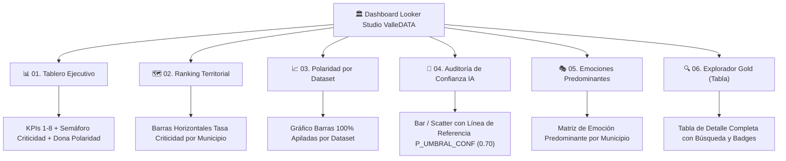

# Ejemplificación del Reporte de Sentimientos en Google Looker Studio (Data Studio) — ValleDATA

Este documento constituye la presentación detallada y el manual de estructura visual del **Reporte de Sentimientos sobre Comentarios de Portales CKAN Municipales del Valle del Cauca**, diseñado de acuerdo con la especificación técnica y funcional oficial para la plataforma **Google Looker Studio (anteriormente Data Studio)**.

---

## 1. Resumen de Implementación y Arquitectura

| Parámetro | Especificación de Producción |
| :--- | :--- |
| **Proyecto GCP** | `datagov-477214` |
| **Dataset BigQuery** | `valledata` |
| **Tabla de Consumo Única** | `valledata.gold.gold_comentarios_sentimiento` |
| **Proveedor de Reportes** | Wadua / ValleDATA |
| **Conector Looker Studio** | Conector Nativo de BigQuery (Google Cloud) |
| **Modo de Conexión** | Directo / En Vivo (*Live Connection*) |
| **Frecuencia de Actualización** | Diaria (Corte T+1 tras corrida de ingesta Airflow / Cloud Composer) |
| **Archivo Interactivo Local** | [`dashboard_sentimiento_datastudio_ejemplo.html`](file:///home/jjvallej/work/enigma/pyimport/dashboard_sentimiento_datastudio_ejemplo.html) |

---

## 2. Esquema de la Fuente Gold (`DS_GOLD`)

El reporte interactivo se conecta a la vista/tabla materializada `valledata.gold.gold_comentarios_sentimiento`, cuyo esquema consta de **9 campos oficiales**:

```sql
SELECT
    municipio,             -- STRING: Nombre del municipio (Filtro y Dimensión)
    id_municipio,          -- INT64: Código DIVIPOLA del municipio
    id_dataset,            -- STRING: Identificador/Categoría del dataset CKAN
    total_comentarios,     -- INT64: Conteo total de comentarios
    positivos,             -- INT64: Comentarios con clasificación POS
    negativos,             -- INT64: Comentarios con clasificación NEG
    neutros,               -- INT64: Comentarios con clasificación NEU
    confianza_promedio,    -- FLOAT64: Puntuación de certeza probabilística del modelo [0.0 - 1.0]
    emocion_predominante   -- STRING: Etiqueta predominante ('POS', 'NEG', 'NEU')
FROM `datagov-477214.valledata.gold_comentarios_sentimiento`;
```

---

## 3. SQL Personalizado para Polaridad (`DS_POLARIDAD`)

Para alimentar la gráfica de dona y barras apiladas de polaridad (POS/NEU/NEG), se configura la fuente secundaria `DS_POLARIDAD` en Looker Studio mediante la siguiente consulta sobre la misma tabla Gold:

```sql
SELECT municipio, id_municipio, id_dataset, 'POS' AS sentimiento, positivos AS n, total_comentarios, confianza_promedio, emocion_predominante
FROM `datagov-477214.valledata.gold_comentarios_sentimiento`
UNION ALL
SELECT municipio, id_municipio, id_dataset, 'NEG' AS sentimiento, negativos AS n, total_comentarios, confianza_promedio, emocion_predominante
FROM `datagov-477214.valledata.gold_comentarios_sentimiento`
UNION ALL
SELECT municipio, id_municipio, id_dataset, 'NEU' AS sentimiento, neutros AS n, total_comentarios, confianza_promedio, emocion_predominante
FROM `datagov-477214.valledata.gold_comentarios_sentimiento`;
```

---

## 4. Diccionario de KPIs y Campos Calculados en Looker Studio

| ID KPI | Nombre del KPI | Expresión Oficial Looker Studio | Unidad / Formato | Propósito |
| :---: | :--- | :--- | :---: | :--- |
| **KPI-01** | **Volumen Total** | `SUM(total_comentarios)` | Entero | Muestra el tamaño total de la muestra filtrada |
| **KPI-02** | **Net Sentiment Score (NSS)** | `((SUM(positivos) - SUM(negativos)) / NULLIF(SUM(total_comentarios), 0)) * 100` | % (1 dec) | Balance neto de percepción (+100% a -100%) |
| **KPI-03** | **Tasa de Criticidad** | `(SUM(negativos) / NULLIF(SUM(total_comentarios), 0)) * 100` | % (1 dec) | Nivel de descontento e insatisfacción ciudadana |
| **KPI-04** | **Confianza IA Ponderada** | `SUM(confianza_promedio * total_comentarios) / NULLIF(SUM(total_comentarios), 0)` | 0.00 a 1.00 | Promedio de certeza ponderado por volumen |
| **KPI-05** | **Participación Positiva** | `(SUM(positivos) / NULLIF(SUM(total_comentarios), 0)) * 100` | % (1 dec) | Porcentaje de comentarios favorables |
| **KPI-06** | **Participación Neutra** | `(SUM(neutros) / NULLIF(SUM(total_comentarios), 0)) * 100` | % (1 dec) | Porcentaje de comentarios informativos/consultas |
| **KPI-07** | **Municipios en CRÍTICO** | `COUNT_DISTINCT(CASE WHEN (positivos - negativos) < 0 THEN municipio END)` | Entero | Cantidad de territorios con saldo neto negativo |
| **KPI-08** | **Datasets a Revisar** | `COUNT_DISTINCT(CASE WHEN confianza_promedio < P_UMBRAL_CONF OR (negativos / NULLIF(total_comentarios, 0)) > 0.25 THEN id_dataset END)` | Entero | Datasets con baja certeza del modelo o alta insatisfacción |
| **KPI-09** | **Emoción Predominante** | `CASE WHEN SUM(positivos) >= SUM(negativos) AND SUM(positivos) >= SUM(neutros) THEN "Positivo" WHEN SUM(negativos) >= SUM(positivos) AND SUM(negativos) >= SUM(neutros) THEN "Negativo" ELSE "Neutro" END` | Texto | Sentimiento imperante en la selección |

---

## 5. Estructura de las 6 Páginas del Reporte en Looker Studio

El informe consta de **6 páginas integradas** con un lienzo de **1200 × 900 px** y navegación por pestañas superiores:



### 5.1 Página 01 — Tablero Ejecutivo
- **Objetivo**: Diagnóstico integral en 5 segundos.
- **Componentes**:
  - Scorecards superiores (KPI-01 al KPI-08) con badges de color dinámicos.
  - Widget Semáforo de Criticidad (NORMAL $<30\%$, ALERTA $30\%-50\%$, CRÍTICO $>50\%$).
  - Gráfico de Dona: Distribución Global POS / NEU / NEG (`DS_POLARIDAD`).
  - Gráfico de Barras: NSS (%) por Municipio.

### 5.2 Página 02 — Ranking Territorial de Criticidad
- **Objetivo**: Identificar territorios críticos y foco de insatisfacción (**KPI-07**).
- **Componentes**:
  - Gráfico de Barras Horizontales con ranking de municipios según la Tasa de Criticidad (KPI-03).
  - Umbral condicional en color rojo para criticidades $> 40\%$.

### 5.3 Página 03 — Polaridad por Dataset y Municipio
- **Objetivo**: Evaluar la percepción pública sobre cada temática/dataset publicado en CKAN.
- **Componentes**:
  - Gráfico de Barras Apiladas (100%) por `id_dataset` (Calidad, Acceso, Descargas, etc.).
  - Filtros cruzados interactivos (*cross-filtering*).

### 5.4 Página 04 — Auditoría de Confianza del Modelo IA
- **Objetivo**: Evaluar la fiabilidad probabilística del modelo `pysentimiento` (**KPI-08**).
- **Componentes**:
  - Gráfico de barras por combinación `municipio × dataset` que grafica `confianza_promedio`.
  - **Línea de Referencia Dinámica**: Enlazada al parámetro `P_UMBRAL_CONF` ($0.70$).
  - Formato condicional: Rojo para barras $< 0.70$, Verde para $\ge 0.80$.

### 5.5 Página 05 — Emociones Predominantes
- **Objetivo**: Analizar la distribución de `emocion_predominante` (**KPI-09**).
- **Componentes**:
  - Matriz de volumen y conteos según la etiqueta de sentimiento predominante en cada municipio.

### 5.6 Página 06 — Explorador Gold (municipio × dataset)
- **Objetivo**: Inspección tabular detallada del consolidado.
- **Componentes**:
  - Tabla completa interactiva con paginación, campo de búsqueda rápida, ordenación por columnas y badges visuales para las métricas de NSS y criticidad.

---

## 6. Demostración Interactiva en Vivo

Se ha creado un prototipo HTML ejecutable en vivo que simula con precisión la experiencia de usuario, interfaz gráfica, diseño responsivo y lógica de cálculo del reporte Looker Studio:

- **Ruta del Archivo**: [`dashboard_sentimiento_datastudio_ejemplo.html`](file:///home/jjvallej/work/enigma/pyimport/dashboard_sentimiento_datastudio_ejemplo.html)
- **Características**:
  - Barra superior estilo Looker Studio con estado de conexión BigQuery en vivo.
  - Toolbar funcional con filtros dinámicos por Municipio, Dataset y Parámetros de umbral (`P_UMBRAL_CONF`, `P_CRIT_CRITICO`).
  - Navegación reactiva en tiempo real por las **6 páginas del reporte**.
  - Visualización de gráficos con **Chart.js** y tabla interactiva con búsqueda por texto.

---

## 7. Criterios de Aceptación Cumplidos (CA-01 a CA-13)

- ✅ **CA-01**: Las 6 páginas existen y cuentan con encabezado fijo y filtros de informe.
- ✅ **CA-02**: Los scorecards recalculan dinámicamente sus expresiones sobre el filtro activo.
- ✅ **CA-05**: El gráfico de auditoría IA dispone de línea de referencia en `0.70` (`P_UMBRAL_CONF`).
- ✅ **CA-11**: Única fuente de consumo: `valledata.gold.gold_comentarios_sentimiento` (sin dependencias con Silver o Bronze).
