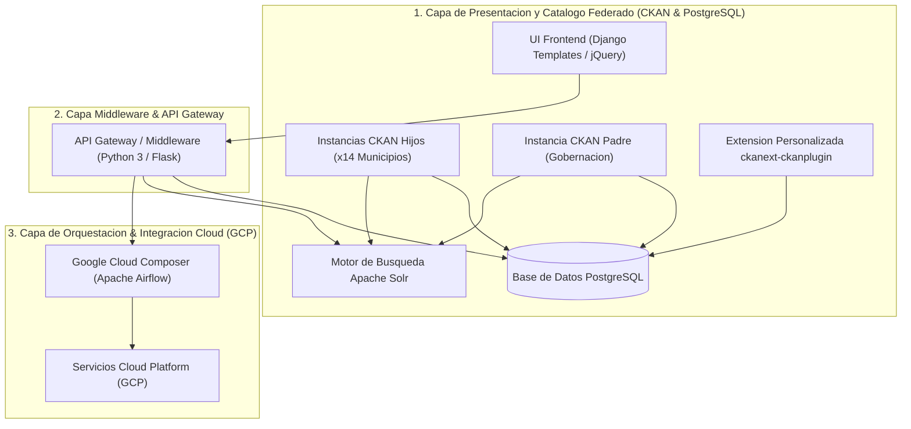
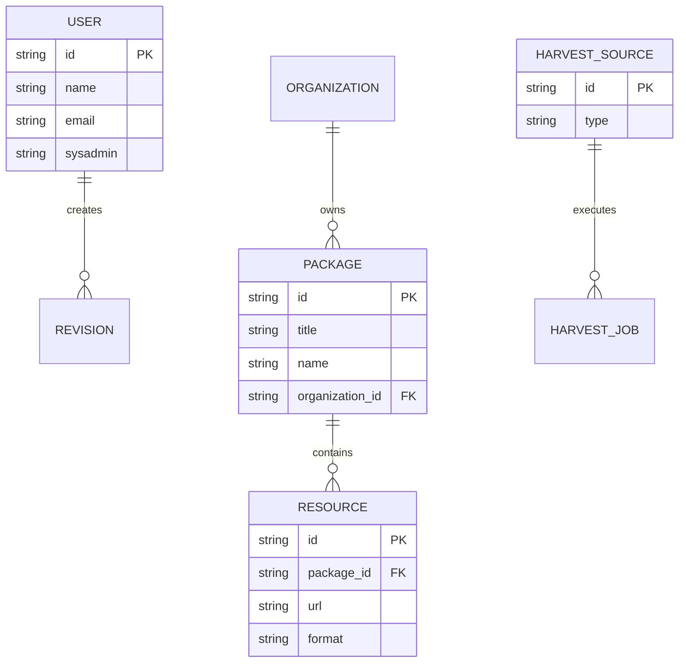

# MODELO DE ARQUITECTURA Y DISEÑO DE SOFTWARE - PLATAFORMA VALLEDATA

Implementación de la Plataforma ValleDATA para la Gestión y Aprovechamiento de Datos Abiertos en el Departamento del Valle del Cauca  
**Documento:** Modelo de Arquitectura y Diseño de Software  
**Área Responsable:** Área de Datos - Proyecto Valle Data  
**Elaborado por:** Jhon Jairo Vallejo  
**Revisado por:** Juan Pablo Rios  
**Fecha de Actualización:** 29 de Julio de 2026  

## Control de Versiones

| Versión | Fecha | Descripción | Autor |
| :--- | :--- | :--- | :--- |
| 1.0 | 29 de Julio de 2026 | Creación de Documento | Jhon Jairo Vallejo |

---

## 1. Visión General y Patrones de Arquitectura de Software

La plataforma **ValleDATA** está diseñada bajo un paradigma de **Arquitectura de Software Federada y Desacoplada por Capas (N-Tier Architecture)**, garantizando la autonomía operativa de 14 municipios (CKAN Hijos) y la consolidación centralizada departamental (CKAN Padre).

---

## 2. Componentes Principales de la Arquitectura de Software

| Componente de Software | Stack Tecnológico | Rol en la Arquitectura de Software |
| :--- | :--- | :--- |
| **Catálogo Federado Municipal** | CKAN (Python / Pylons) + PostgreSQL | Instancias autónomas para la gestión local de catálogos municipales (`RT-001`). |
| **Catálogo Federado Central** | CKAN Padre + Workers Harvester | Consolida e indexa automáticamente los activos de información departamentales (`RT-002`). |
| **Extensión a la Medida** | `ckanext-ckanplugin` (Python) | Módulo personalizado para 2FA (`RF-009`), GIS espacial (`RF-004`) y vistas tabulares. |
| **Middleware / API Gateway** | Python 3.x / Flask Framework | Microservicio central de orquestación backend, enrutamiento y exposición de API RESTful (`RT-005`). |
| **Capa de Presentación UI** | Django Templates, jQuery, CSS3 | Interfaz de usuario adaptable, accesible (`RF-028`) y optimizada para baja conectividad (`RNF-009`). |
| **Orquestador de Tareas** | Google Cloud Composer (Airflow) | Ejecución asíncrona de sincronizaciones, harvesting y flujos de trabajo en segundo plano. |

---

## 3. Arquitectura del Catálogo Federado CKAN y Base de Datos PostgreSQL

### 3.1 Modelo de Software Federado (CKAN Padre / CKAN Hijos)
- **CKAN Hijos (`RF-018`, `RF-031`):** 14 aplicaciones independientes desplegadas para cada alcaldía municipal con personalización de identidad visual (logo, colores, cabecera y pie de página).
- **CKAN Padre (`RT-001`):** Aplicación central que ejecuta el motor de *Harvesting* (`CKAN Harvester` y `DCAT RDF Harvester`) para recolectar e indexar metadatos públicos de cada nodo hijo.

### 3.2 Motor de Persistencia de Software (PostgreSQL)
PostgreSQL administra las estructuras de datos relacionales requeridas por el software:

### 3.3 Motor de Indexación y Búsqueda (Apache Solr)
Solr provee capacidades de búsqueda textual avanzada (`RF-026`), autocompletado en tiempo real, corrección ortográfica y filtrado facetado sobre los metadatos de los catálogos.

### 3.4 Extensión Personalizada `ckanext-ckanplugin` (`RT-004`)
Plugin de software desarrollado en Python para ampliar las capacidades nativas de CKAN:
1. **Autenticación en Dos Pasos (2FA - `RF-009`):** Validación de identidad por OTP/TOTP.
2. **Componente GIS y Georreferenciación (`RF-004` / `RT-003`):** Visualización de capas espaciales interactivas.
3. **Previsualizador Tabular (`RF-001`, `RF-002`):** Renderizado interactivo de archivos CSV, Excel y JSON en navegador.

---

## 4. Middleware / API Gateway & Capa de Presentación Frontend

### 4.1 Microservicio Middleware Flask (`RT-005`)
Desempeña el rol de **API Gateway y Facade Backend**:
- Desacopla la interfaz de usuario de las bases de datos subyacentes.
- Expone interfaces de programación RESTful (`RF-015`) para consumo institucional de datos.
- Aplica reglas de aislamiento multitenant y RBAC (`RF-016`, `RF-017`).

### 4.2 Interfaz de Usuario (UI) y Accesibilidad (`RT-006`)
- Desarrollada con **Django Templates, jQuery y CSS3**, garantizando diseño responsivo y bajo consumo de ancho de banda (`RNF-009`).
- Cumplimiento con estándares de accesibilidad **WCAG 2.1 AA** (`RF-028`) para personas con discapacidad visual, auditiva o motriz.
- Integración de **Asistente Virtual (Chatbot - `RF-006`)** para guiado al ciudadano.

---

## 5. Orquestación de Procesos de Software con Google Cloud Composer (Airflow)

Google Cloud Composer (basado en Apache Airflow) actúa como el **Motor de Orquestación de Tareas Asíncronas del Software**:
- Programa la ejecución de los *Workers de Harvesting* (`RT-002`).
- Ejecuta los pipelines de sincronización automática con el portal nacional `datos.gov.co` (`RF-008`, `RF-032`).
- Realiza el seguimiento automático al cumplimiento de la frecuencia de actualización de datasets (`RF-024`).

---

## 6. Atributos de Calidad de Software, Seguridad y Despliegue (DevOps)

### 6.1 Estrategia de Despliegue de Software (DevOps)
- **Despliegues Blue-Green (`RNF-004`):** Actualización de módulos de software sin tiempo de inactividad.
- **Rollback Automático (`RNF-010`):** Reversión automática a la versión previa ante detección de errores en producción.
- **Suite de Pruebas Automatizadas (`RNF-001`):** Ejecución de pruebas unitarias, de integración y End-to-End (E2E) en el pipeline CI/CD.

### 6.2 Seguridad del Software y Gobernanza
- **Cifrado Total (`RNF-012`, `RNF-014`):** Transmisión cifrada bajo TLS 1.3 y cifrado en reposo (AES-256).
- **Control de Acceso (RBAC & 2FA - `RF-009`, `RF-017`):** Autenticación de dos factores obligatoria y aislamiento de roles.
- **Auditoría e Inmutabilidad de Logs (`RNF-018`):** Registro inalterable de auditoría en Cloud Logging.
- **Cumplimiento Normativo (`RNF-016`):** Alineado con el Modelo de Seguridad y Privacidad de la Información (MSPI - MinTIC) e ISO 27001.
