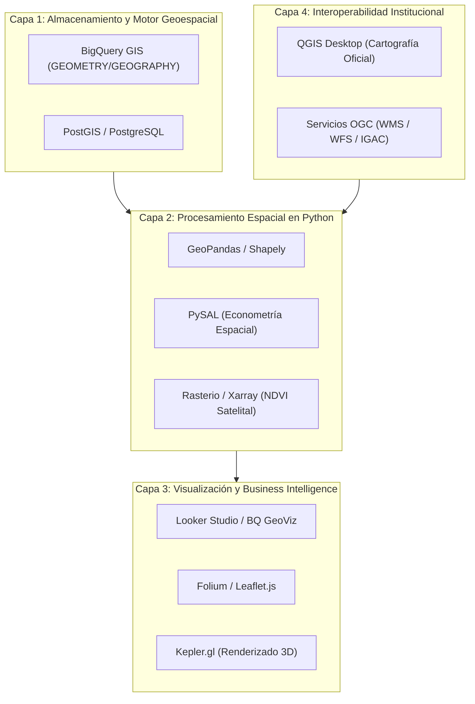

# PROPUESTA DE ANÁLISIS GEORREFERENCIADOS Y HERRAMIENTAS GEOESPACIALES

Implementación de la Plataforma ValleDATA para la Gestión y Aprovechamiento de Datos Abiertos en el Departamento del Valle del Cauca  
**Documento:** Propuesta de Análisis Georreferenciados Espaciales y Herramientas Geoespaciales (GIS Stack)  
**Área Responsable:** Área de Datos - Proyecto Valle Data  
**Elaborado por:** Jhon Jairo Vallejo  
**Revisado por:** Juan Pablo Rios  
**Versión:** 1.0  
**Fecha de Actualización:** 25 de Agosto de 2026  

## Control de Versiones

| Versión | Fecha | Descripción | Autor |
| :--- | :--- | :--- | :--- |
| 1.0 | 25 de Agosto de 2026 | Versión 1.0 - Creación de la propuesta integral de análisis georreferenciados, reportes gráficos y stack de herramientas geoespaciales | Jhon Jairo Vallejo |

---

## 1. Visión General de la Propuesta

El objetivo de esta propuesta es evolucionar la plataforma **ValleDATA** mediante la integración de capacidades de **Análisis Espacial Avanzado y Georreferenciación (GIS)**. 

Al combinar los polígonos geográficos de los 42 municipios del Valle del Cauca con el dataset consolidado de producción agrícola, variables de pisos térmicos, índice climático ONI (El Niño/La Niña) y precios mayoristas SIPSA DANE, se habilita la toma de decisiones gubernamentales e institucionales basada en la ubicación geográfica precisa.

---

## 2. Clasificación de Análisis y Vistas Geoespaciales que Utilizan el Mapa

Para justificar técnicamente la ingesta y enriquecimiento del **Dataset Gold Georreferenciado**, es fundamental diferenciar entre **Análisis Tabulares/Estadísticos** (que pueden obtenerse únicamente a partir de agregaciones del dataset CSV plano sin coordenadas) y las **Vistas y Reportes Geoespaciales Auténticos** (que dependen estrictamente del mapa, la georreferenciación, coordenadas `(lat, lon)`, polígonos `GeoJSON/WKT` y motores GIS).

---

### 2.1 Diferenciación Técnica: Análisis Tabular vs. Análisis Geoespacial

| Tipo de Reporte | Requiere Mapa / GIS | Fuentes de Datos Utilizadas | Justificación Geoespacial |
| :--- | :---: | :--- | :--- |
| **Análisis Tabular / Estadístico** | ❌ No | Dataset plano CSV / SQL (`municipio`, `anio`, `produccion_toneladas`) | Se calcula mediante agrupaciones estándar (`GROUP BY`). No requiere conocer coordenadas ni límites territoriales. |
| **Vista Geoespacial / Mapa Coroplético** | ✅ **Sí** | Dataset Gold + Polígonos Municipales `GeoJSON/WKT` | Mapea variables continuas sobre el territorio real mediante gradientes de color y contigüidad espacial. |
| **Análisis de Autocorrelación Espacial (Hotspots)** | ✅ **Sí** | Matriz de Contigüidad Espacial (Polígonos vecinos) | Determina si la alta producción de un municipio influye en sus vecinos (*Moran $I$* / *Getis-Ord $Gi^*$*). |
| **Corredores y Isocronas Logísticas** | ✅ **Sí** | Coordenadas Centroides `(lat, lon)` + Nodo Cavasa `(3.42158, -76.5205)` | Calcula distancias geométricas, vectores de transporte y fricción logística espacial. |
| **Visor Web Interactivo Georreferenciado** | ✅ **Sí** | Capas Vectoriales `GeoJSON` + Leaflet.js / Folium | Renderizado dinámico cliente en mapa base (tiles CartoDB/OpenStreetMap) con interacción espacial. |

---

### 2.2 Vistas y Reportes Geoespaciales que Utilizan el Mapa

#### Vista/Mapa 1: Mapa Coroplético de Rendimiento Agrícola Municipal
- **Requerimiento Espacial:** Requiere la capa vectorial de polígonos `GeoJSON/WKT` de los 42 municipios para proyectar geográficamente la densidad de rendimiento promedio ($t/ha$).
- **Uso del Mapa:** Permite a la Gobernación identificar visualmente regiones de alta productividad agrícola (norte vs centro vs sur del Valle) mediante un gradiente térmico de color sobre el mapa del departamento.
- **Artefacto Georreferenciado:**


---

#### Vista/Mapa 2: Mapa Temático de Pisos Térmicos y Zonificación Agroecológica
- **Requerimiento Espacial:** Utiliza las coordenadas decimales y la elevación SNM asociadas a las geometrías municipales para superponer la distribución geográfica de pisos térmicos (Cálido, Medio, Frío, Páramo).
- **Uso del Mapa:** Facilita la delimitación de zonas aptas para cultivos de clima frío en la cordillera vs. cultivos agroindustriales en el valle geográfico del Río Cauca.
- **Artefacto Georreferenciado:**


---

#### Vista/Mapa 3: Mapa de Autocorrelación Espacial y Clústeres Productivos (*Hotspots*)
- **Requerimiento Espacial:** Requiere la matriz de vecindad y contigüidad territorial derivada de los bordes poligonales de los municipios (análisis mediante *PySAL* / *Getis-Ord $Gi^*$*).
- **Uso del Mapa:** Identifica espacialmente conglomerados territoriales (*Hotspots* productivos o zonas frías vulnerables a fenómenos climáticos como El Niño / La Niña) que comparten fronteras municipales.

---

#### Vista/Mapa 4: Mapa de Isocronas Logísticas y Fricción de Distancia a Cavasa
- **Requerimiento Espacial:** Requiere el punto espacial de origen de cada municipio `(latitud_dec, longitud_dec)` y la ubicación geográfica del nodo central Cavasa en Cali `(3.42158, -76.5205)` para trazar anillos de accesibilidad y costo de flete.
- **Uso del Mapa:** Visualiza espacialmente el aislamiento o cercanía de los municipios productores con respecto al principal mercado de abastos departamental.

---

#### Vista/Mapa 5: Visor Web Interactivo Georreferenciado Multi-Capa (Folium / Leaflet)
- **Requerimiento Espacial:** Integra el 100% de las geometrías `GeoJSON`, marcadores de centroides, popup informativos y controles de conmutación de capas vectoriales en un entorno de mapa interactivo HTML.
- **Uso del Mapa:** Herramienta de consulta pública e institucional en tiempo real integrable en el portal web de la Gobernación del Valle.
- **Archivos Generados:**
  - **Mapa Interactivo General:** [mapa_rendimiento_cultivos_valle.html](file:///home/jjvallej/work/enigma/pyimport/data/mapa_rendimiento_cultivos_valle.html)
  - **Mockup Autónomo Ejecuto (Single-File / Listo para enviar por Correo):** [mockup_mapa_interactivo_valledata.html](file:///home/jjvallej/work/enigma/pyimport/data/mockup_mapa_interactivo_valledata.html) (No requiere llaves de API, librerías locales ni servidores web; funciona al hacer doble clic sobre el archivo en cualquier navegador).

---

### 2.3 Reportes Estadísticos Complementarios (Extraíbles sin Georreferenciación)

Para complementar la propuesta, los siguientes reportes analíticos se procesan directamente sobre el dataset tabular sin requerir capas GIS:

1. **Reporte Tabular de Rendimiento por Municipio y Cultivo:**
   
2. **Reporte Tabular de Aptitud por Piso Térmico:**
   
3. **Reporte de Sensibilidad a El Niño / La Niña (ONI):**
   
4. **Reporte de Margen Implícito de Flete a Cavasa:**
   

---

## 3. Propuesta de Herramientas de Análisis Geoespacial (GIS Stack)

Para garantizar la escalabilidad, interoperabilidad y rendimiento en el procesamiento de datos espaciales, se propone una arquitectura de herramientas geoespaciales estructurada en 4 capas funcionales:



### 3.1 Capa 1: Motor de Consultas y Almacenamiento Geoespacial
1. **BigQuery GIS (Google Cloud Platform):**
   - **Función:** Motor principal de almacenamiento y análisis espacial en la nube.
   - **Tipos de Datos:** Soporte nativo para tipos `GEOMETRY` (plano) y `GEOGRAPHY` (esférico WGS84).
   - **Funciones SQL Clave:** `ST_CONTAINS`, `ST_INTERSECTS`, `ST_DISTANCE`, `ST_BUFFER`, `ST_CENTROID`, `ST_CLUSTERDBSCAN`.
   - **Ventajas:** Procesamiento analítico masivo en segundos sin necesidad de gestionar servidores espaciales dedicados.
2. **PostGIS / PostgreSQL:**
   - **Función:** Base de datos espacial relacional para almacenamiento de alta frecuencia de datos transaccionales municipales.

### 3.2 Capa 2: Procesamiento y Modelado Espacial en Python
1. **GeoPandas & Shapely:**
   - **Función:** Manipulación vectorial de polígonos geográficos, uniones espaciales (*Spatial Joins*) y reproyección de sistemas de coordenadas (CRS).
2. **PySAL (Python Spatial Analysis Library):**
   - **Función:** Análisis de autocorrelación espacial global y local (Índice de Moran $I$) y delimitación estadística de clústeres agrícolas (*Hotspots* mediante $Gi^*$ de Getis-Ord).
3. **Rasterio & Xarray (Sensoramiento Remoto):**
   - **Función:** Habilitación para la futura ingesta y procesamiento de imágenes satelitales (Sentinel-2 / Landsat 8) para el cálculo de índices de vegetación (NDVI) y humedad del suelo.

### 3.3 Capa 3: Visualización Interactiva y Tableros Ejecutivos
1. **Looker Studio / BigQuery GeoViz:**
   - **Función:** Construcción de tableros de control ejecutivos y mapas de calor con filtros dinámicos por municipio, cultivo y año.
2. **Folium / Leaflet.js / Mapbox GL JS:**
   - **Función:** Visor de mapas interactivos livianos con renderizado cliente en HTML/JavaScript para integración en el portal web institucional.
3. **Kepler.gl (Uber Open Source):**
   - **Función:** Herramienta de exploración visual 3D con aceleración por GPU para análisis multivariable de gran volumen.

### 3.4 Capa 4: Herramientas de Escritorio e Interoperabilidad Institucional
1. **QGIS (Quantum GIS):**
   - **Función:** Software cartográfico libre utilizado por el personal técnico de la Gobernación para la edición manual de polígonos, diseño de mapas oficiales en alta resolución y conversión de capas (SHP, GeoJSON, GeoTIFF).
2. **Estándares OGC (Open Geospatial Consortium):**
   - **Función:** Servicios web `WMS` (Web Map Service) y `WFS` (Web Feature Service) para la integración transparente con la infraestructura de datos espaciales del Instituto Geográfico Agustín Codazzi (IGAC) y la Gobernación del Valle.

---

## 4. Arquitectura del Pipeline Espacial y Artefactos

El pipeline espacial se ha integrado como un componente modular de la arquitectura Medallion en Airflow:

1. **DAG de Orquestación:** `src_transform_spatial` ([src_transform_spatial.py](file:///home/jjvallej/work/enigma/pyimport/dags/gdv_general_dbt_dag/dags_valledata/src_transform_spatial.py)).
2. **Dataset Gold Georreferenciado:** [gold_cultivos_valle_geo.csv](file:///home/jjvallej/work/enigma/pyimport/data/gold_cultivos_valle_geo.csv) (33,634 registros).
3. **Tabla Final BigQuery GIS Gold:** `datagov-477214.valledata.gold_cultivos_valle_geo`
4. **Geometría Municipios:** [municipios_valle_poligono_geojson.json](file:///home/jjvallej/work/enigma/pyimport/data/municipios_valle_poligono_geojson.json).

---

## 5. Guía de Ejecución

Para regenerar todos los datos, gráficos y reportes visuales de la propuesta:

```bash
cd /home/jjvallej/work/enigma/pyimport
.venv/bin/python scripts/generate_proposal_charts.py
.venv/bin/python scripts/generate_spatial_maps.py
.venv/bin/python generate_docx.py
```
