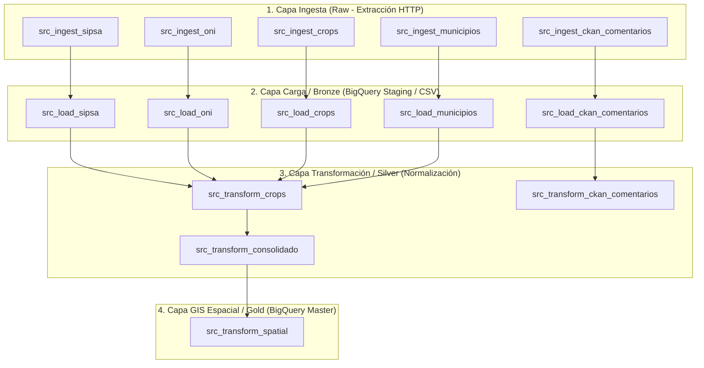

# Documentación Técnica Completa de DAGs y Pipeline de Orquestación

**Proyecto:** `pyimport` / `airflow` (Plataforma ValleDATA — Sistema Integrado de Cultivos, Precios SIPSA, Clima ONI y Comentarios Ciudadanos)  
**Versión:** 1.2.0  
**Fecha de Actualización:** 30 de Septiembre de 2026  
**Entorno de Orquestación:** Apache Airflow / Google Cloud Composer 2 & 3 / Astronomer CLI (Astro CLI)  
**Ubicación en Repositorio:** `dags/gdv_general_dbt_dag/dags_valledata/`

---

## 1. Visión General y Arquitectura Medallón

El sistema de pipelines de Apache Airflow coordina la extracción, limpieza, consolidación y enriquecimiento espacial de 5 fuentes de datos estratégicas para el departamento del Valle del Cauca. 

El diseño sigue una arquitectura **Medallón (Raw -> Bronze -> Silver -> Gold)**, garantizando trazabilidad, calidad agronómica e integración geográfica.



---

## 2. Matriz Resumen de Conexiones de Airflow

Las tareas de ingesta consumen parámetros dinámicos desde `connections.yaml` o las Conexiones configuradas en la interfaz de Airflow (`Admin -> Connections`).

| ID Conexión (`Conn ID`) | Tipo | Host / URL Base | Entidad Propietaria | Propósito y Uso en Negocio |
| :--- | :--- | :--- | :--- | :--- |
| `sipsa_dane` | `http` | `https://www.dane.gov.co` | DANE (Colombia) | Descarga automática de anexos en Excel de precios mensuales de alimentos en la plaza mayorista Cavasa de Cali. |
| `noaa_oni` | `http` | `https://www.cpc.ncep.noaa.gov` | NOAA (Estados Unidos) | Extracción HTML de la tabla histórica del Índice Oceánico del Niño (ONI v5). |
| `gobernacion_valle` | `http` | `https://datosabiertos.valledelcauca.gov.co` | Gobernación del Valle | Descarga de datasets CSV de cultivos permanentes y transitorios municipales. |
| `datos_gov` | `http` | `https://www.datos.gov.co` | MinTIC (Colombia) | Consulta del catálogo maestro de municipios colombianos y códigos DIVIPOLA. |
| `ckan_valle` | `http` | `https://datosabiertos.valledelcauca.gov.co/api/3` | Gobernación del Valle | API CKAN para consulta de comentarios y participación ciudadana. |

---

## 3. Especificación Detallada de DAGs por Capa Medallón

---

### 3.1 Capa Ingesta (Raw)

Los DAGs de Ingesta extraen archivos crudos desde APIs REST o scraping HTTP y los almacenan en `data/raw/`.

#### 1. `src_ingest_sipsa`
- **Archivo:** [`src_ingest_sipsa.py`](file:///home/jjvallej/work/enigma/pyimport/dags/gdv_general_dbt_dag/dags_valledata/src_ingest_sipsa.py)
- **Frecuencia / Schedule:** Mensual (`@monthly` / `0 0 1 * *`)
- **Descripción:** Conecta con la API/HTTP de DANE SIPSA a través de la conexión `sipsa_dane` y descarga los archivos de Excel con precios mayoristas en Cali.
- **Entrada:** HTTP REST / Excel DANE.
- **Salida (`Output`):** `data/raw/sipsa/anex_mensual_*.xlsx`
- **Tags:** `['valledata', 'ingest', 'sipsa', 'raw']`

#### 2. `src_ingest_oni`
- **Archivo:** [`src_ingest_oni.py`](file:///home/jjvallej/work/enigma/pyimport/dags/gdv_general_dbt_dag/dags_valledata/src_ingest_oni.py)
- **Frecuencia / Schedule:** Mensual (`@monthly` / `0 0 1 * *`)
- **Descripción:** Scrapea la tabla pública de la NOAA CPC vía la conexión `noaa_oni` conteniendo los valores históricos del índice térmico del Pacífico ONI v5.
- **Entrada:** HTTP Scrape / NOAA CPC.
- **Salida (`Output`):** `data/raw/oni_v5.html`
- **Tags:** `['valledata', 'ingest', 'oni', 'clima', 'raw']`

#### 3. `src_ingest_crops`
- **Archivo:** [`src_ingest_crops.py`](file:///home/jjvallej/work/enigma/pyimport/dags/gdv_general_dbt_dag/dags_valledata/src_ingest_crops.py)
- **Frecuencia / Schedule:** Mensual (`@monthly` / `0 0 1 * *`)
- **Descripción:** Descarga los microdatos en formato CSV de cultivos permanentes y cultivos transitorios desde el portal de la Gobernación del Valle.
- **Entrada:** Conexión `gobernacion_valle`.
- **Salida (`Output`):** `data/raw/cultivos_permanentes.csv` y `data/raw/cultivos_transitorios.csv`
- **Tags:** `['valledata', 'ingest', 'crops', 'cultivos', 'raw']`

#### 4. `src_ingest_municipios`
- **Archivo:** [`src_ingest_municipios.py`](file:///home/jjvallej/work/enigma/pyimport/dags/gdv_general_dbt_dag/dags_valledata/src_ingest_municipios.py)
- **Frecuencia / Schedule:** Semestral (`0 0 1 */6 *`)
- **Descripción:** Extrae el catálogo nacional de municipios con coordenadas y códigos DIVIPOLA oficial del portal `datos.gov.co`.
- **Entrada:** API Socrata / `datos.gov.co`.
- **Salida (`Output`):** `data/raw/municipios_valle.csv`
- **Tags:** `['valledata', 'ingest', 'municipios', 'divipola', 'raw']`

#### 5. `src_ingest_ckan_comentarios`
- **Archivo:** [`src_ingest_ckan_comentarios.py`](file:///home/jjvallej/work/enigma/pyimport/dags/gdv_general_dbt_dag/dags_valledata/src_ingest_ckan_comentarios.py)
- **Frecuencia / Schedule:** Diaria / Mensual (Plantilla activa según disponibilidad de API)
- **Descripción:** Ingesta registros de comentarios y sugerencias ciudadanas desde la API CKAN institucional.
- **Entrada:** Conexión `ckan_valle`.
- **Salida (`Output`):** `data/raw/ckan_comentarios.json`
- **Tags:** `['valledata', 'ingest', 'ckan', 'comentarios', 'raw']`

---

### 3.2 Capa Carga / Bronze

Estandarizan formatos, parsean codificaciones (Latin-1 / UTF-8) y cargan las tablas staging en BigQuery y archivos locales en `data/processed/`.

#### 6. `src_load_sipsa`
- **Archivo:** [`src_load_sipsa.py`](file:///home/jjvallej/work/enigma/pyimport/dags/gdv_general_dbt_dag/dags_valledata/src_load_sipsa.py)
- **Frecuencia / Schedule:** A demanda (`schedule=None`)
- **Descripción:** Parsea los libros Excel de SIPSA DANE, calcula precios promedios anuales por kilogramo en Cavasa (Cali) y carga la tabla `stg_sipsa`.
- **Salida (`Output`):** Tabla BigQuery `stg_sipsa` / `data/processed/sipsa_valle.csv`

#### 7. `src_load_oni`
- **Archivo:** [`src_load_oni.py`](file:///home/jjvallej/work/enigma/pyimport/dags/gdv_general_dbt_dag/dags_valledata/src_load_oni.py)
- **Frecuencia / Schedule:** A demanda (`schedule=None`)
- **Descripción:** Procesa el HTML de la NOAA, clasifica el trimestre móvil y la intensidad del evento (El Niño / La Niña / Neutro) y calcula promedios anuales.
- **Salida (`Output`):** Tabla BigQuery `stg_oni` / `data/processed/oni_promedio_anual.csv`

#### 8. `src_load_crops`
- **Archivo:** [`src_load_crops.py`](file:///home/jjvallej/work/enigma/pyimport/dags/gdv_general_dbt_dag/dags_valledata/src_load_crops.py)
- **Frecuencia / Schedule:** A demanda (`schedule=None`)
- **Descripción:** Consolida los archivos permanentes y transitorios, unifica nombres de columnas y aplica la primera limpieza de caracteres especiales.
- **Salida (`Output`):** Tabla BigQuery `stg_crops` / `data/processed/cultivos_valle.csv`

#### 9. `src_load_municipios`
- **Archivo:** [`src_load_municipios.py`](file:///home/jjvallej/work/enigma/pyimport/dags/gdv_general_dbt_dag/dags_valledata/src_load_municipios.py)
- **Frecuencia / Schedule:** A demanda (`schedule=None`)
- **Descripción:** Normaliza nombres de los 42 municipios del Valle del Cauca, ajusta códigos DIVIPOLA a 5 dígitos y carga la tabla staging.
- **Salida (`Output`):** Tabla BigQuery `stg_municipios` / `data/processed/municipios_valle.csv`

#### 10. `src_load_ckan_comentarios`
- **Archivo:** [`src_load_ckan_comentarios.py`](file:///home/jjvallej/work/enigma/pyimport/dags/gdv_general_dbt_dag/dags_valledata/src_load_ckan_comentarios.py)
- **Frecuencia / Schedule:** A demanda (`schedule=None`)
- **Descripción:** Extrae el JSON de comentarios crudos y carga la estructura plana en Bronze.
- **Salida (`Output`):** Tabla BigQuery `bronze_comentarios`

---

### 3.3 Capa Transformación (Silver)

Aplica reglas de negocio agronómicas, limpia inconsistencias de digitación, calcula el valor de venta estimado ($COP$) y unifica las 4 fuentes en un dataset consolidador maestro.

#### 11. `src_transform_crops`
- **Archivo:** [`src_transform_crops.py`](file:///home/jjvallej/work/enigma/pyimport/dags/gdv_general_dbt_dag/dags_valledata/src_transform_crops.py)
- **Frecuencia / Schedule:** A demanda (`schedule=None`)
- **Descripción:** Aplica transformaciones Silver sobre la tabla agrícola, validando que $0 < \text{Rendimiento (Ton/Ha)} \le 100$.

#### 12. `src_transform_consolidado`
- **Archivo:** [`src_transform_consolidado.py`](file:///home/jjvallej/work/enigma/pyimport/dags/gdv_general_dbt_dag/dags_valledata/src_transform_consolidado.py)
- **Frecuencia / Schedule:** A demanda (`schedule=None`)
- **Descripción:** Cruza en BigQuery / Pandas la información de cultivos (`stg_crops`), precios SIPSA (`stg_sipsa`), clima ONI (`stg_oni`) y geografía (`stg_municipios`).
- **Fórmula de Valor Venta ($COP$):**
  $$\text{valor\_venta} = (\text{produccion\_toneladas} \times 1,000) \times \text{precio\_promedio\_anual\_sipsa}$$
- **Salida (`Output`):** Tabla BigQuery `silver_agri_consolidado` / `dataset_consolidado_valle.csv`

#### 13. `src_transform_ckan_comentarios`
- **Archivo:** [`src_transform_ckan_comentarios.py`](file:///home/jjvallej/work/enigma/pyimport/dags/gdv_general_dbt_dag/dags_valledata/src_transform_ckan_comentarios.py)
- **Frecuencia / Schedule:** A demanda (`schedule=None`)
- **Descripción:** Procesa el texto de comentarios mediante un pipeline NLP de Análisis de Sentimiento (positivo, neutro, negativo) y extrae entidades nombradas de cultivos y municipios.
- **Salida (`Output`):** Tabla BigQuery `silver_comentarios`

---

### 3.4 Capa GIS Espacial & Analítica (Gold)

#### 14. `src_transform_spatial`
- **Archivo:** [`src_transform_spatial.py`](file:///home/jjvallej/work/enigma/pyimport/dags/gdv_general_dbt_dag/dags_valledata/src_transform_spatial.py)
- **Frecuencia / Schedule:** A demanda (`schedule=None`)
- **Descripción:** Enriquece la tabla `silver_agri_consolidado` con geometrías poligonales (GeoJSON / WKT) para los 42 municipios del Valle del Cauca. Prepara la vista analítica espacial para sistemas SIG y dashboards interactivos.
- **Salida (`Output`):** Tabla BigQuery `gold_cultivos_valle_geo` / `data/processed/gold_cultivos_valle_geo.json`

---

### 3.5 Orquestadores Maestros

#### 15. `src_orchestrator_master`
- **Archivo:** [`src_orchestrator.py`](file:///home/jjvallej/work/enigma/pyimport/dags/gdv_general_dbt_dag/dags_valledata/src_orchestrator.py)
- **DAG ID:** `src_orchestrator_master`
- **Frecuencia / Schedule:** Manual / Trigger (`schedule=None`)
- **Descripción:** DAG Orquestador Maestro que coordina la ejecución paralela y secuencial de todo el flujo Medallón utilizando `TriggerDagRunOperator` con `wait_for_completion=True`.
- **Flujo de Ejecución:**
  ```mermaid
  flowchart LR
      S([Start]) --> I[Ingesta Paralela: Mun, Crops, SIPSA, ONI]
      I --> B[Carga Bronze: Mun, Crops, SIPSA, ONI]
      B --> C[Transformación Silver Crops & Consolidado]
      C --> G[Transformación Gold GIS Espacial]
      G --> E([End])
  ```

#### 16. `src_importacion_cultivos`
- **Archivo:** [`src_importacion_cultivos.py`](file:///home/jjvallej/work/enigma/pyimport/dags/gdv_general_dbt_dag/dags_valledata/src_importacion_cultivos.py)
- **DAG ID:** `src_importacion_cultivos`
- **Frecuencia / Schedule:** Anual (`@yearly` / `0 0 1 1 *`)
- **Descripción:** Pipeline de ejecución anual automatizada. Ejecuta en orden estricto: Cultivos -> SIPSA Precios -> ONI Clima -> Geografía Municipios -> Consolidado Silver -> Capa Gold GIS.

#### 17. `src_importacion_sentimiento`
- **Archivo:** [`src_importacion_sentimiento.py`](file:///home/jjvallej/work/enigma/pyimport/dags/gdv_general_dbt_dag/dags_valledata/src_importacion_sentimiento.py)
- **DAG ID:** `src_importacion_sentimiento`
- **Frecuencia / Schedule:** Diaria (`@daily`)
- **Estado:** Pausado por defecto (`is_paused_upon_creation=True`).
- **Descripción:** Executa el ciclo continuo de procesamiento de comentarios CKAN y clasificación de sentimiento NLP.

#### 18. `gdv_general_dbt_dag`
- **Archivo:** [`cultivos.py`](file:///home/jjvallej/work/enigma/pyimport/dags/gdv_general_dbt_dag/dags_valledata/cultivos.py)
- **DAG ID:** `gdv_general_dbt_dag`
- **Frecuencia / Schedule:** A demanda / Semanal
- **Descripción:** Orquesta las transformaciones adicionales de dbt sobre las tablas analíticas en BigQuery.

---

## 4. Soporte Dual Composer 2 y Composer 3 (Compatibilidad Airflow 2/3)

Todos los DAGs del proyecto incluyen un bloque de importación defensivo con fallback automático entre el nuevo SDK de Airflow 3 (`airflow.sdk`) y los decoradores tradicionales de Airflow 2 (`airflow.decorators`):

```python
try:
    try:
        from airflow.sdk import dag as _af_dag, task as _af_task
    except ImportError:
        from airflow.decorators import dag as _af_dag, task as _af_task
    from airflow.operators.trigger_dagrun import TriggerDagRunOperator
    from airflow.operators.empty import EmptyOperator
except ImportError:
    _af_dag = _af_task = None
```

Esto garantiza que el código sea 100% portable y ejecutable tanto en entorno local Python CLI, como en **Cloud Composer 2 (Airflow 2.x)** y **Cloud Composer 3 (Airflow 3.x)** sin realizar cambios de sintaxis.

---

## 5. Alarmas, Monitoreo y Resiliencia (`src_common.py`)

Las ejecuciones de tareas en todos los DAGs invocan `run_with_airflow_alarm()` definido en `src_common.py`. 

### Capacidades del Módulo de Alarmas:
1. **Reintentos Automáticos (`retries`):** Configurado globalmente en 2 reintentos con un retraso exponencial (`retry_delay=300s`).
2. **Alertas por Fallo (`on_failure_callback`):** Notifica automáticamente a canales de Webhook (Slack, Microsoft Teams, Google Chat) enviando el nombre del DAG, la tarea fallida, la fecha de ejecución y el enlace directo al log de Composer.
3. **Manejo de Tiempos de Espera (`execution_timeout`):** Límite máximo de ejecución de 60 minutos por tarea.
