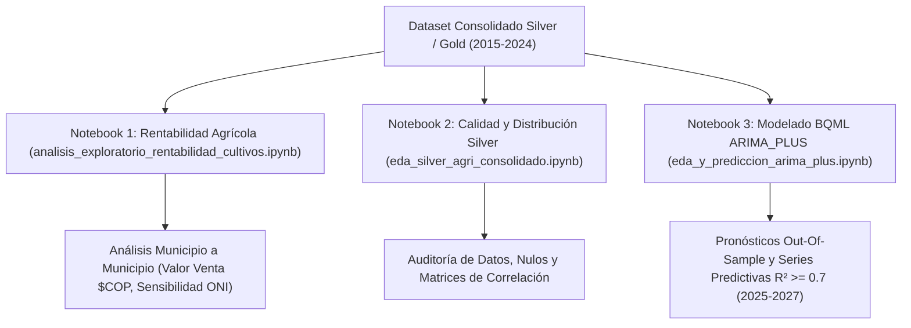

# Documentación Técnica Completa de Notebooks de EDA y Modelado Predictivo BQML

**Proyecto:** `pyimport` / `notebooks` (Plataforma ValleDATA — Sistema Integrado de Cultivos, Precios SIPSA, Clima ONI y Comentarios Ciudadanos)  
**Entidad:** Gobernación del Valle del Cauca  
**Versión:** 1.2.0  
**Fecha de Actualización:** 30 de Septiembre de 2026  
**Ubicación en Repositorio:** `notebooks/` y `dags/gdv_general_dbt_dag/dags_valledata/EDA/`

---

## 1. Resumen Ejecutivo de los Notebooks

La plataforma ValleDATA cuenta con **3 Jupyter Notebooks interactivos (`.ipynb`)** diseñados para realizar el Análisis Exploratorio de Datos (EDA) del sector agrícola del Valle del Cauca (período 2015–2024) y la inferencia predictiva de producción agrícola a 3 años (período 2025–2027) mediante modelos **BigQuery ML ARIMA_PLUS**.

---

## 2. Especificación Detallada por Notebook

---

### 2.1 Notebook 1: `analisis_exploratorio_rentabilidad_cultivos.ipynb`

- **Ruta:** [`notebooks/analisis_exploratorio_rentabilidad_cultivos.ipynb`](file:///home/jjvallej/work/enigma/pyimport/notebooks/analisis_exploratorio_rentabilidad_cultivos.ipynb)
- **Propósito:** Análisis económico y agronómico **municipio a municipio** estudiando la interacción entre volumen producido, precios mayoristas de alimentos (SIPSA DANE) y anomalías de temperatura marina (ONI NOAA).
- **Filtros Agronómicos Aplicados:**
  1. **Rendimiento Válido:** $0 < \text{Rendimiento (Ton/Ha)} \le 100$, descartando ceros e inconsistencias por errores de digitación en las evaluaciones agropecuarias.
  2. **Cálculo de Valor de Venta Estimado ($COP$):**
     $$\text{valor\_venta} = (\text{produccion\_toneladas} \times 1,000) \times \text{precio\_promedio\_anual\_sipsa}$$

#### Estructura Interna y Secciones:
1. **Sección 1: Valor de Venta Estimado por Parejas Municipio - Cultivo:**
   - Identificación de los polos agrícolas de mayores ingresos en el departamento: **Tuluá**, **Candelaria**, **Palmira**, **Sevilla** y **Dagua**.
   - Contrastación entre cultivos permanentes agroindustriales (Caña de Azúcar, Plátano, Aguacate, Café) y cultivos transitorios (Tomate, Habichuela, Maíz).
   - *Gráfico generado:* `notebooks/figures/top_ingreso_municipio_producto.png`

2. **Sección 2 & 3: Diagramas de Dispersión Municipio a Municipio:**
   - **Kilos Cosechados vs. Valor de Venta Estimado:** Muestra la escala económica por municipio y producto. (*Imagen:* `notebooks/figures/dispersion_kilos_vs_valor_venta_municipio.png`).
   - **Rendimiento Agrícola (Ton/Ha) vs. Precio SIPSA ($/Kg):** Modula la elasticidad precio-rendimiento. Frutas de ladera (Granadilla, Maracuyá) presentan menor tonelaje por hectárea pero cotizaciones mayoristas más altas. (*Imagen:* `notebooks/figures/dispersion_rendimiento_vs_precio_municipio.png`).
   - **Hectáreas Cosechadas vs. Producción Total (Ton):** Relación de escala de área vs. rendimiento físico. (*Imagen:* `notebooks/figures/dispersion_sembradas_vs_produccion_municipio.png`).

3. **Sección 4: Sensibilidad Climática ONI por Municipio:**
   - Cruce del rendimiento agrícola contra el Índice Oceánico del Niño (ONI v5).
   - Categorización del clima: **El Niño** ($\text{ONI} > +0.5^\circ\text{C}$), **La Niña** ($\text{ONI} \le -0.5^\circ\text{C}$) y **Neutro**.
   - Identificación de alta vulnerabilidad en municipios de ladera (**Dagua**, **Versalles**) en cultivos de ciclo corto durante sequías por El Niño.
   - *Gráficos generados:* `notebooks/figures/dispersion_oni_vs_rendimiento_municipio.png` y `notebooks/figures/boxplot_rendimiento_oni_municipios.png`.

4. **Sección 5: Matrices de Correlación Multivariable por Municipio:**
   - Evaluación de la matriz de coeficientes de Pearson ($r$) sobre variables de área, volumen, precio y clima. (*Imagen:* `notebooks/figures/matrices_correlacion_municipios.png`).

5. **Sección 6: Conclusiones y Resumen del EDA:**
   - Síntesis de hallazgos para la formulación de políticas públicas agrícolas departamentales.

---

### 2.2 Notebook 2: `eda_silver_agri_consolidado.ipynb`

- **Ruta:** [`notebooks/eda_silver_agri_consolidado.ipynb`](file:///home/jjvallej/work/enigma/pyimport/notebooks/eda_silver_agri_consolidado.ipynb)
- **Propósito:** Auditoría técnica de calidad de datos y análisis estadístico desglosado sobre la tabla `silver_agri_consolidado`.

#### Estructura Interna y Secciones:
1. **Sección 0: Panorama y Calidad de Datos:** Auditoría de distribuciones nulas, valores fuera de rango, coherencia de tipos de datos y duplicados.
2. **Sección 1: Consolidado por Municipio:** Métricas agregadas de los 42 municipios del Valle del Cauca (volumen total, diversidad de productos, hectáreas).
3. **Sección 2: Consolidado por Cultivo:** Comparativa entre cultivos Permanentes y Transitorios.
4. **Sección 3: Cruce Municipio $\times$ Cultivo:** Análisis matricial de todas las combinaciones registradas en el decenio.
5. **Sección 4 & 5: Análisis de Dispersión y Correlación:** Generación del Mapa de Calor global de correlación de Pearson. (*Imagen:* `notebooks/figures/eda_correlacion_pearson_heatmap.png`).
6. **Sección 6: Hallazgos Principales:** Confirmación de la estabilidad estructural del dataset consolidado para consumo en tableros analíticos.

---

### 2.3 Notebook 3: `eda_y_prediccion_arima_plus.ipynb`

- **Ruta:** [`notebooks/eda_y_prediccion_arima_plus.ipynb`](file:///home/jjvallej/work/enigma/pyimport/notebooks/eda_y_prediccion_arima_plus.ipynb)
- **Propósito:** Implementación del modelo econométrico predictivo de series temporales con **BigQuery ML `ARIMA_PLUS`** (AutoARIMA con ajuste de estacionalidad, detección de outliers e intervalos de confianza).

#### Estructura Interna y Secciones:
1. **Sección 1, 2 & 3: EDA Preparatorio para Modelado:**
   - Selección de las series temporales con suficiencia histórica ($\ge 5$ años de registros continuos).
   - Evaluación del Coeficiente de Variación ($\text{CV}\%$) de la producción.

2. **Sección 4 & 5: Modelo ARIMA_PLUS, Backtesting y Evaluación:**
   - **Entrenamiento y Validación Out-Of-Sample:** Período histórico de entrenamiento (2000–2021) y prueba en el trienio (2022–2024).
   - **Métricas de Evaluación Calculadas:**
     - Coeficiente de Determinación: $R^2$
     - Error Cuadrático Medio: $\text{RMSE}$
     - Error Absoluto Medio: $\text{MAE}$
     - Error Porcentual Absoluto Medio: $\text{MAPE}$
   - **Filtro de Selección de Modelos Óptimos:** Se seleccionan y despliegan únicamente aquellas series temporales que cumplen con $R^2 \ge 0.7$.
   - *Gráfico de Grid de Pronósticos:* `notebooks/figures/arima_plus_grid_pronosticos_municipios.png`

3. **Sección 6: Predicción a 3 Años (2025–2027):**
   - Inferencia predictiva out-of-sample proyectando el volumen de producción agrícola en toneladas para el período 2025-2027.
   - Generación de bandas e intervalos de confianza al 80% (`prediction_interval_lower_bound` y `prediction_interval_upper_bound`).
   - *Gráfico generado:* `notebooks/figures/arima_plus_top_pronosticos_3_anos.png`

---

## 3. Catálogo Completo de Figuras e Imágenes Generadas

Todas las imágenes producidas por los notebooks se almacenan en `notebooks/figures/` y son referenciadas directamente en los reportes ejecutivos:

| Archivo de Imagen | Título / Descripción Visual |
| :--- | :--- |
| [`top_ingreso_municipio_producto.png`](file:///home/jjvallej/work/enigma/pyimport/notebooks/figures/top_ingreso_municipio_producto.png) | Top 15 Parejas Municipio - Cultivo por Valor de Venta Estimado ($COP$). |
| [`dispersion_kilos_vs_valor_venta_municipio.png`](file:///home/jjvallej/work/enigma/pyimport/notebooks/figures/dispersion_kilos_vs_valor_venta_municipio.png) | Dispersión Kilos Cosechados vs. Valor de Venta por Municipio y Cultivo. |
| [`dispersion_rendimiento_vs_precio_municipio.png`](file:///home/jjvallej/work/enigma/pyimport/notebooks/figures/dispersion_rendimiento_vs_precio_municipio.png) | Dispersión Rendimiento (Ton/Ha) vs. Precio Mayorista SIPSA por Municipio. |
| [`dispersion_sembradas_vs_produccion_municipio.png`](file:///home/jjvallej/work/enigma/pyimport/notebooks/figures/dispersion_sembradas_vs_produccion_municipio.png) | Dispersión Hectáreas Cosechadas vs. Producción Total por Municipio. |
| [`dispersion_oni_vs_rendimiento_municipio.png`](file:///home/jjvallej/work/enigma/pyimport/notebooks/figures/dispersion_oni_vs_rendimiento_municipio.png) | Sensibilidad Climática: ONI vs. Rendimiento Agrícola por Municipio. |
| [`boxplot_rendimiento_oni_municipios.png`](file:///home/jjvallej/work/enigma/pyimport/notebooks/figures/boxplot_rendimiento_oni_municipios.png) | Diagrama de Cajas del Rendimiento Agrícola por Municipio según Fase Climática. |
| [`matrices_correlacion_municipios.png`](file:///home/jjvallej/work/enigma/pyimport/notebooks/figures/matrices_correlacion_municipios.png) | Matrices de Correlación de Pearson Multivariable por Municipio. |
| [`eda_correlacion_pearson_heatmap.png`](file:///home/jjvallej/work/enigma/pyimport/notebooks/figures/eda_correlacion_pearson_heatmap.png) | Heatmap Global de Correlación de Pearson sobre `silver_agri_consolidado`. |
| [`arima_plus_grid_pronosticos_municipios.png`](file:///home/jjvallej/work/enigma/pyimport/notebooks/figures/arima_plus_grid_pronosticos_municipios.png) | Grid de Backtesting de Modelos BQML ARIMA_PLUS por Municipio. |
| [`arima_plus_top_pronosticos_3_anos.png`](file:///home/jjvallej/work/enigma/pyimport/notebooks/figures/arima_plus_top_pronosticos_3_anos.png) | Pronósticos a 3 Años (2025-2027) con Intervalos de Confianza al 80%. |
