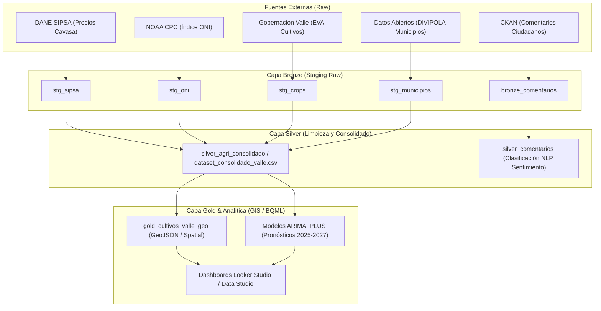

# Portal Principal de Documentación — Plataforma ValleDATA

**Proyecto:** `pyimport` / `airflow` (Plataforma ValleDATA — Sistema Integrado de Cultivos, Precios SIPSA, Clima ONI y Comentarios Ciudadanos)  
**Entidad:** Gobernación del Valle del Cauca  
**Versión:** 1.2.0  
**Fecha de Actualización:** 30 de Septiembre de 2026  
**Ubicación de Documentación:** `documentacion/` (al mismo nivel que `config/`)

---

## 1. Visión General de la Plataforma

La **Plataforma ValleDATA** es el sistema centralizado de orquestación, ingestión, transformación analítica y modelado predictivo del sector agrícola para el departamento del Valle del Cauca. 

El repositorio implementa una arquitectura **Medallón (Raw -> Bronze -> Silver -> Gold)** gestionada mediante **Apache Airflow / Google Cloud Composer / Astronomer CLI**, integrada con **BigQuery ML** para predicciones de series temporales (ARIMA_PLUS) y análisis de sensibilidad frente a variaciones climáticas globales (El Niño / La Niña).



---

## 2. Estructura de Documentación

Esta carpeta contiene la especificación oficial y completa del sistema, organizada en los siguientes documentos especializados:

| Documento | Descripción Completa |
| :--- | :--- |
| [DOCUMENTACION_DAGS.md](file:///home/jjvallej/work/enigma/pyimport/documentacion/DOCUMENTACION_DAGS.md) | Especificación técnica detallada de todos los 17+ DAGs de Airflow across Medallion layers, orquestadores maestros, grafos de dependencia, variables, parámetros y compatibilidad Airflow 2/3. |
| [DOCUMENTACION_NOTEBOOKS_EDA.md](file:///home/jjvallej/work/enigma/pyimport/documentacion/DOCUMENTACION_NOTEBOOKS_EDA.md) | Documentación técnica completa de los 3 notebooks de Análisis Exploratorio de Datos (EDA) y modelado predictivo ARIMA_PLUS, metodología municipio a municipio, filtros agronómicos, gráficos de dispersión, análisis térmico ONI y evaluación de métricas ($R^2 \ge 0.7$). |
| [MATRIZ_DE_EVENTOS_ALARMAS_DAGS.md](file:///home/jjvallej/work/enigma/pyimport/documentacion/MATRIZ_DE_EVENTOS_ALARMAS_DAGS.md) | Matriz completa de monitoreo, eventos de error, hooks de alerta Webhook (Slack/Teams/Google Chat), políticas de reintento (`retries`) y resiliencia en Composer. |
| [DOCUMENTACION_CONEXIONES_AIRFLOW.md](file:///home/jjvallej/work/enigma/pyimport/documentacion/DOCUMENTACION_CONEXIONES_AIRFLOW.md) | Guía técnica de conexiones de Airflow (`sipsa_dane`, `noaa_oni`, `gobernacion_valle`, `datos_gov`, `ckan_valle`), hooks HTTP/GCP y gestión de secretos. |

---

## 3. Resumen Ejecutivo de DAGs y Notebooks

### 3.1 Resumen de DAGs por Capa

- **Ingesta (Raw):** `src_ingest_sipsa`, `src_ingest_oni`, `src_ingest_crops`, `src_ingest_municipios`, `src_ingest_ckan_comentarios`.
- **Carga (Bronze):** `src_load_sipsa`, `src_load_oni`, `src_load_crops`, `src_load_municipios`, `src_load_ckan_comentarios`.
- **Transformación (Silver/Gold):** `src_transform_crops`, `src_transform_ckan_comentarios`, `src_transform_consolidado`, `src_transform_spatial`.
- **Orquestadores:** `src_orchestrator_master`, `src_importacion_cultivos`, `src_importacion_sentimiento`, `gdv_general_dbt_dag`.

### 3.2 Resumen de Notebooks de EDA y BQML

- **`analisis_exploratorio_rentabilidad_cultivos.ipynb`:** Estudio municipio a municipio de valor de venta estimado ($COP$), dispersión de kilos cosechados vs. ingresos, relación rendimiento (Ton/Ha) vs. precio SIPSA, y boxplots de sensibilidad ONI por municipio.
- **`eda_silver_agri_consolidado.ipynb`:** Calidad de datos, auditoría de nulos, distribuciones por tipo de cultivo (permanente vs. transitorio), y matriz de correlación de Pearson sobre `silver_agri_consolidado`.
- **`eda_y_prediccion_arima_plus.ipynb`:** Modelado econométrico y de series de tiempo con BigQuery ML ARIMA_PLUS. Backtesting out-of-sample (2022-2024), selección de series óptimas ($R^2 \ge 0.7$), e inferencia predictiva a 3 años (2025-2027) con intervalos de confianza del 80%.

---

## 4. Guía Rápida de Operación

### 4.1 Ejecución Local via Python CLI
```bash
# Activar entorno virtual
source .venv/bin/activate

# Ejecutar pipeline completo desde el Orquestador Maestro
python dags/gdv_general_dbt_dag/dags_valledata/src_orchestrator.py

# Ejecutar orquestador de importación anual
python dags/gdv_general_dbt_dag/dags_valledata/src_importacion_cultivos.py
```

### 4.2 Despliegue en Cloud Composer / Astronomer
```bash
# Iniciar entorno local Astro CLI
astro dev start

# Desplegar DAGs al bucket de Cloud Composer
gcloud composer environments storage dags import \
    --environment=composer-valledata-prod \
    --location=us-central1 \
    --source=dags/gdv_general_dbt_dag/dags_valledata/
```
